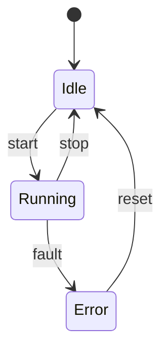
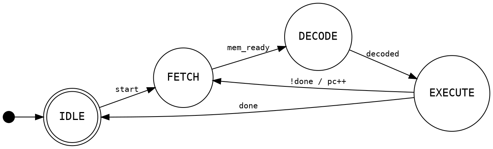
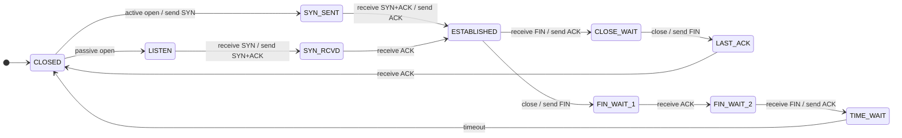

Title: FSM Diagrams in Pelican and Claude Code
Date: 2026-02-22 18:00
Category: Engineering
Tags: fsm, pelican, mermaid, graphviz, claude, ai
Author: morganp
Status: published

Finite state machines turn up everywhere: protocol implementations, hardware controllers, UI flows, parsers. Drawing them well is useful but tedious. This post covers two tools I've built: a Pelican plugin that renders FSM diagrams at build time so they appear as images in published posts, and a Claude Code skill that generates diagrams from plain-English descriptions.

The pattern is identical to the [WaveDrom plugin and skill]({filename}2026-02-20_WaveDrom_Test.md): describe what you want, get a fenced code block, paste it into a post, and the build renders it to SVG automatically.

## The Pelican plugin

The plugin is at [github.com/morganp/pelican-fsm](https://github.com/morganp/pelican-fsm), cloned to `~/Code/pelican-fsm` (a sibling directory to the blog repo). It intercepts fenced ` ```mermaid ``` ` and ` ```dot ``` ` code blocks before Pelican's standard Markdown processing, renders each one to an SVG using the appropriate CLI tool, caches the result by content hash in `content/images/fsm/`, and replaces the block with a standard image reference. Pelican then copies the SVG to `output/images/fsm/` as a static asset.

SVGs are cached across builds, so only diagrams whose source has changed are re-rendered.

### Requirements

- [Mermaid CLI](https://github.com/mermaid-js/mermaid-cli) for `mermaid` blocks:

```bash
npm install -g @mermaid-js/mermaid-cli
```

- [Graphviz](https://graphviz.org/) for `dot` blocks:

```bash
brew install graphviz      # macOS
sudo apt install graphviz  # Debian/Ubuntu
```

Both tools are optional. If one is missing, blocks for that type fall back gracefully to a fenced `text` block without failing the build.

### Installation

Clone the plugin alongside your Pelican project and install it into the Pelican virtualenv in editable mode:

```bash
git clone https://github.com/morganp/pelican-fsm ../pelican-fsm
source venv/bin/activate
pip install -e ../pelican-fsm --config-settings editable_mode=compat
```

The `editable_mode=compat` flag is required. Without it, modern setuptools editable installs use a path-hook mechanism that prevents Pelican's namespace plugin auto-discovery from finding the plugin.

Pelican 4.5+ auto-discovers namespace plugins, so no changes to `pelicanconf.py` are needed.

### Optional config

If `mmdc` or `dot` are not on your `PATH` during the build, set their full paths in `pelicanconf.py`:

```python
FSM_MERMAID_CLI = '/opt/homebrew/bin/mmdc'
FSM_DOT_CLI = '/opt/homebrew/bin/dot'
```

### Using it in a post

Write a fenced code block with the language set to `mermaid` or `dot`:

````markdown

````

At build time this becomes an SVG embedded in the page:


Graphviz DOT works the same way, and is a better fit for hardware and RTL documentation where the compact box-and-arrow style is conventional:



If the CLI is not found or rendering fails, the block falls back to fenced `text` — the post still builds, you just see the raw source instead of a diagram.

## The Claude Code skill

The skill lives at [github.com/morganp/dotfiles/tree/main/config/claude/skills/fsm](https://github.com/morganp/dotfiles/tree/main/config/claude/skills/fsm). Claude Code auto-discovers skills from `~/.claude/skills/` and loads them on demand.

The skill triggers automatically when you describe anything involving states, transitions, or control flow: protocol implementations, UI flows, hardware FSMs, parsers, game logic. You describe the system in plain English and Claude generates the diagram.

The skill knows:

- Full Mermaid `stateDiagram-v2` syntax: plain states, display labels, transitions with events/guards/actions, composite (nested) states, choice pseudostates, fork/join for parallel regions, concurrent regions (`--`), notes, direction, and classDef styling
- Graphviz DOT FSM conventions: Moore vs Mealy annotation, initial pseudostate arrow, accepting states as double circles
- When to prefer each format: Mermaid for software/web docs, DOT for hardware/RTL

### Example workflow

Describe the system:

> "Draw the states for a TCP connection"

Claude produces:



Because the skill outputs a `mermaid` fenced block, you can paste it directly into a blog post and the Pelican plugin renders it automatically.

### Installing the skill

```bash
mkdir -p ~/.claude/skills/fsm
curl -o ~/.claude/skills/fsm/SKILL.md \
  https://raw.githubusercontent.com/morganp/dotfiles/main/config/claude/skills/fsm/SKILL.md
```

Or clone the dotfiles repo and symlink:

```bash
git clone https://github.com/morganp/dotfiles ~/dotfiles
ln -s ~/dotfiles/config/claude/skills/fsm ~/.claude/skills/fsm
```

## Syntax quick reference

Both formats can express the same FSM concepts, but use different syntax. The table below maps them side by side.

| Concept | Mermaid `stateDiagram-v2` | Graphviz DOT |
|---------|--------------------------|--------------|
| Graph declaration | `stateDiagram-v2` | `digraph FSM { ... }` |
| Default node style | automatic | `node [shape=circle]` |
| Left-to-right layout | `direction LR` | `rankdir=LR` |
| Comment | `%% comment` | `// comment` |
| Plain state | `StateName` | `StateName` |
| State with display label | `state "Label" as Name` | `Name [label="Label"]` |
| Initial pseudostate | `[*] --> State` | `__start [shape=point width=0.2]` + `__start -> State` |
| Final/accepting state | `State --> [*]` | `State [shape=doublecircle]` |
| Transition | `A --> B` | `A -> B` |
| Transition with event | `A --> B : event` | `A -> B [label="event"]` |
| Transition with action | `A --> B : event / action()` | `A -> B [label="event / action()"]` |
| Guarded transition | `A --> B : [guard]` | `A -> B [label="[guard]"]` |
| Composite (nested) state | `state S { ... }` | `subgraph cluster_S { ... }` |
| Choice pseudostate | `state C <<choice>>` | `C [shape=diamond]` |
| Fork pseudostate | `state F <<fork>>` | invisible node + multiple outgoing edges |
| Join pseudostate | `state J <<join>>` | invisible node + multiple incoming edges |
| Concurrent regions | `--` inside composite | parallel `subgraph` blocks |

## Project structure

```
~/Code/
├── morganp.github.io/              # blog source (main branch)
│   └── content/images/fsm/         # SVG cache (persists across make clean)
└── pelican-fsm/                    # github.com/morganp/pelican-fsm
    └── pelican/plugins/fsm_renderer/
        ├── __init__.py             # plugin entry point, signal registration
        └── preprocessor.py        # Markdown extension + preprocessor

~/.claude/skills/
└── fsm/
    └── SKILL.md                    # Claude Code skill definition
```

The combination is useful for any documentation that involves control flow: describe the behaviour, get the diagram from Claude, drop it into a post, and the plugin renders it at build time. No manual editing of diagram syntax, no copy-pasting between browser tabs.
