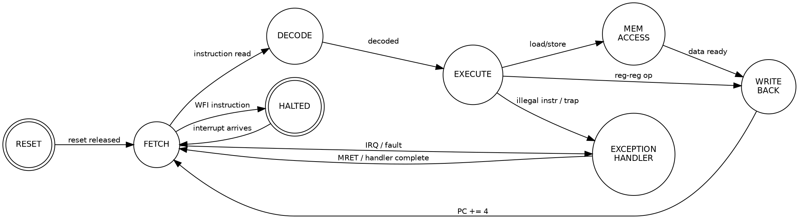

Title: SoC Article 04: Processor Cores - CPU, DSP, GPU and Hardware Accelerators
Date: 2026-03-27
Category: Engineering
Tags: SoC, Hardware, Computer Architecture, Electronics, Embedded Systems, CPU, DSP, GPU, NPU, RISC-V, ARM
Slug: soc-article-04-processor-cores
Author: morganp
Summary: A survey of the main processor types in modern SoCs: CPUs for general-purpose code, DSPs for signal processing, GPUs for parallel workloads, and hardware accelerators for AI, video, and cryptography.
Status: published

*Series: Introduction to SoC Design | Article 4 of 11*

---

## Introduction

The processor is the heart of any SoC. But "processor" is a broad term that covers a remarkably diverse family of designs, each optimised for a different class of computation. A modern smartphone SoC may contain a dozen or more distinct processing engines - general-purpose CPUs, a graphics processor, a signal processing cluster, a neural network accelerator, and several smaller microcontrollers managing power and connectivity.

This article surveys the main classes of processor used in SoCs, explains what makes each suited to its domain, and introduces the key architectural concepts every SoC designer needs to understand.

---

## The Processing Landscape

Different computational tasks have different shapes. Some are sequential and unpredictable (parsing a web page). Others are massively parallel and regular (multiplying a matrix). Still others require precisely timed, low-latency responses (handling a radio frame). These different "shapes" of computation call for different processor architectures.

[]({attach}/images/SoC/Article04/04-task-taxonomy-HQ.png)

---

## General-Purpose CPU Cores

### Architecture Fundamentals

A CPU core executes a sequential stream of instructions: fetch, decode, execute, access memory, write back. The efficiency of this loop determines performance.

Modern CPU cores in SoCs are overwhelmingly **RISC** (Reduced Instruction Set Computer) designs. The dominant ISA is **ARM**, with **RISC-V** growing rapidly in open-source and embedded applications.

The key subsystems inside a CPU core are:

[]({attach}/images/SoC/Article04/04-cpu-core-internals-HQ.png)

### Pipeline Stages

A five-stage pipeline is the canonical teaching model:

```wavedrom
{
  "signal": [
    {"name": "clk",         "wave": "P........."},
    {"name": "IF (Instr1)", "wave": "x2x.......", "data": ["FETCH"]},
    {"name": "ID (Instr1)", "wave": "x.2x......", "data": ["DECODE"]},
    {"name": "EX (Instr1)", "wave": "x..2x.....", "data": ["EXECUTE"]},
    {"name": "MA (Instr1)", "wave": "x...2x....", "data": ["MEM"]},
    {"name": "WB (Instr1)", "wave": "x....2x...", "data": ["WRITEBACK"]},
    {},
    {"name": "IF (Instr2)", "wave": "x.2x......", "data": ["FETCH"]},
    {"name": "ID (Instr2)", "wave": "x..2x.....", "data": ["DECODE"]},
    {"name": "EX (Instr2)", "wave": "x...2x....", "data": ["EXECUTE"]}
  ],
  "head": {"text": "5-Stage Pipeline - Two Overlapping Instructions"}
}
```

### The Big-Little Concept

For power-sensitive SoCs (smartphones, wearables), ARM developed the **big.LITTLE** architecture, which pairs high-performance "big" cores with energy-efficient "little" cores on the same die:

[]({attach}/images/SoC/Article04/04-big-little-cluster-HQ.png)

The OS scheduler assigns heavy tasks (video decoding, gaming) to the big cores, and lightweight tasks (receiving notifications, idle polling) to the little cores. This can reduce energy consumption by 10x or more compared to running everything on the big cores.

### Key Performance Metrics

- **IPC (Instructions Per Cycle)** - how much useful work a core does per clock cycle
- **Clock frequency** - cycles per second (GHz)
- **Performance = IPC x Frequency**
- **CPI (Cycles Per Instruction)** = 1/IPC; lower is better

Modern high-performance cores achieve IPC values of 4-8 by executing multiple instructions simultaneously (superscalar) and speculatively executing future instructions.

---

## Soft vs Hard CPU Cores

An important distinction for SoC designers is between **soft** and **hard** processor cores:

**Hard cores** are transistor-level implementations physically embedded in the silicon - you cannot change them. They are highly optimised for performance and area. The ARM Cortex-A cores in a smartphone SoC are hard cores licensed from ARM.

**Soft cores** are RTL descriptions that you synthesise yourself onto the target process or onto FPGA fabric. They are portable and configurable but less efficient. Examples include:
- **ARM Cortex-M0** (available as soft core for ASIC/FPGA)
- **RISC-V** cores (PicoRV32, VexRiscv, BOOM, Rocket)
- **MicroBlaze** (Xilinx/AMD FPGA soft core)
- **Nios II** (Altera/Intel FPGA soft core)

SoC designers on FPGAs (see Article 09) almost always use soft cores since they are placing logic into reconfigurable fabric.

---

## Digital Signal Processors (DSPs)

A **DSP** is a processor specialised for signal processing algorithms. Its architecture is tuned for two operations that appear constantly in such algorithms: **multiply-accumulate (MAC)** and **data movement**.

### The MAC Operation

The core of almost all digital signal processing is the **dot product**: multiply pairs of numbers and sum the results. This appears in:
- **FIR filters**: y[n] = h[0]x[n] + h[1]x[n-1] + ... + h[N]x[n-N]
- **FFT** (Fast Fourier Transform)
- **Convolution** in image processing and neural networks

A MAC operation computes: **Accumulator += A x B** in a single cycle.

[]({attach}/images/SoC/Article04/04-dsp-mac-unit-HQ.png)

### DSP Architecture Features

DSPs include hardware features that a general-purpose CPU lacks:

- **Hardware loopers** - zero-overhead loops without branch penalty
- **Dual-MAC units** - two multiply-accumulate operations per cycle
- **Circular addressing** - automatic modulo addressing for filter delay lines
- **Bit-reverse addressing** - essential for FFT butterfly operations
- **SIMD instructions** - Single Instruction Multiple Data, processing several samples simultaneously

DSPs are commonly found in SoCs handling audio codecs, cellular modem baseband processing, image signal processing (ISPs), and radar systems.

---

## Graphics Processing Units (GPUs)

A GPU is architected around **massive parallelism**. Instead of a few powerful, complex cores, a GPU contains hundreds or thousands of simple **shader cores** that execute in lockstep on large datasets.

The programming model is based on the observation that rendering a 3D scene, applying a filter to an image, or training a neural network involves applying the **same operation** to **many different data points** independently.

[]({attach}/images/SoC/Article04/04-gpu-vs-cpu-HQ.png)

In mobile SoCs, GPUs are used for:
- 3D gaming and UI rendering
- Video encode/decode
- Computer vision and augmented reality
- Machine learning inference (alongside or instead of dedicated NPUs)

Common mobile GPU families include **ARM Mali**, **Qualcomm Adreno**, and **Apple's own GPU** (unnamed, integrated in A-series chips).

---

## Hardware Accelerators

As compute-intensive AI workloads have become dominant, SoC vendors have added **dedicated hardware accelerators** - fixed-function silicon blocks that execute one type of computation extremely efficiently.

### Neural Processing Unit (NPU / Neural Engine)

An NPU accelerates neural network inference - the process of running a trained model on new input data. The core operation is matrix-vector multiplication (essentially a large MAC array).

[]({attach}/images/SoC/Article04/04-systolic-array-HQ.png)

In a systolic array, data flows through the processing elements rhythmically (like blood through a heart - hence "systolic"). Weights are pre-loaded; activations and partial sums flow through, with each PE performing one MAC per cycle. This achieves very high utilisation of the multiplication hardware.

### Video Codec Engine

Encoding and decoding H.264/H.265/AV1 video in software is extremely CPU-intensive. A dedicated hardware codec can process 4K video at 30+ frames per second while drawing milliwatts, compared to watts for a software implementation. Modern SoCs include fixed-function codec blocks that implement the specific algorithms of each video standard.

### Cryptographic Accelerator

AES encryption, SHA hashing, RSA/ECC public-key operations, and True Random Number Generation (TRNG) are all candidates for hardware acceleration. Performing AES-128 in hardware can be 50-100x more energy-efficient than software.

### Image Signal Processor (ISP)

The camera pipeline - demosaicing, noise reduction, white balance, tone mapping, HDR merging - runs in a dedicated ISP. This is a DSP-like block hardwired to the specific algorithms of computational photography.

---

## The Processor Cluster: Putting It Together

A high-end mobile SoC might contain the following processing elements:

[]({attach}/images/SoC/Article04/04-soc-processor-subsystem-HQ.png)

---

## Processor State Machine: A Simplified View

Every processor can be modelled as a state machine. Here is a simplified view of a CPU's states in a typical embedded SoC context:



---

## Choosing the Right Processor for Your SoC

The processor choice depends critically on the application:

| Application | Primary Processor | Rationale |
|-------------|------------------|-----------|
| IoT sensor node | Cortex-M0+ (soft/hard) | Ultra-low power, simple code |
| RTOS control system | Cortex-M4 / M7 | Real-time response, DSP extensions |
| Automotive ADAS | Cortex-A + DSP cluster | Linux needed + CV workloads |
| Smartphone | big.LITTLE Cortex-A | Variable load, battery priority |
| Edge AI inference | ARM + NPU | Dominates workload |
| 5G baseband | Multi-DSP cluster | Fixed-point signal processing |
| FPGA prototyping | RISC-V soft core | Open, configurable, no licence fee |

---

## Summary

SoC processing subsystems are not monolithic: they combine CPUs for general-purpose code, DSPs for signal processing, GPUs for parallel/graphics workloads, and hardware accelerators for specific high-demand functions like AI inference, video coding, and cryptography. Each architecture is optimised for its domain. The RISC philosophy underpins most modern SoC CPUs, while the systolic array and SIMD principles dominate accelerators. Understanding the trade-offs between these options is one of the core competencies of SoC architecture.

---

## Intermediate Articles This Topic Connects To

- *Pipeline Design and Hazards* - Data, structural, and control hazards; forwarding networks
- *Cache Coherency Protocols* - How multiple CPU cores agree on the state of shared memory
- *AI Accelerator Architecture (Advanced)* - Dataflow, weight stationarity, memory bandwidth

---

*Previous: [Article 03 -- The SoC Design Stack]({filename}../2026-03-21_SoC_Article_03_Design_Stack/2026-03-21_SoC_Article_03_Design_Stack.md)*
*Next: [Article 05 -- Memory Architecture: Caches, DRAM, and On-chip Storage]({filename}../2026-04-04_SoC_Article_05_Memory_Architecture/2026-04-04_SoC_Article_05_Memory_Architecture.md)*
