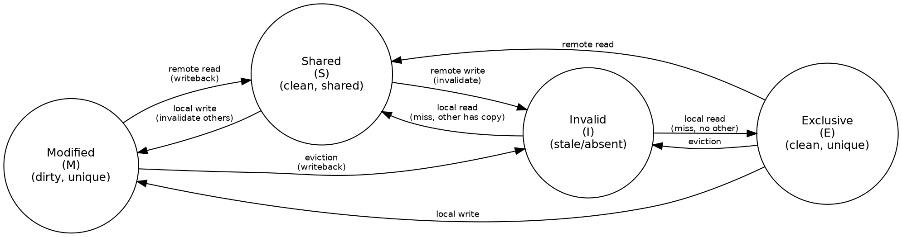

Title: SoC Article 05: Memory Architecture - Caches, DRAM, and On-chip Storage
Date: 2026-04-04
Category: Engineering
Tags: SoC, Hardware, Computer Architecture, Electronics, Embedded Systems, Memory, DRAM, SRAM, Cache, ARM
Slug: soc-article-05-memory-architecture
Author: morganp
Summary: How modern SoCs bridge the speed gap between fast CPU cores and slow external DRAM through cache hierarchies, SRAM, and DRAM controllers. Covers cache organisation, MESI coherency, the MMU, and on-chip storage.
Status: published

*Series: Introduction to SoC Design | Article 5 of 11*

---

## Introduction

Of all the factors that determine a SoC's real-world performance, **memory** is often the most important and the most overlooked by beginners. A modern CPU core can theoretically execute billions of operations per second, but most of that potential is wasted if data cannot be delivered fast enough.

The art of SoC memory architecture is bridging the massive speed gap between the processor (which wants data in nanoseconds) and the external DRAM (which takes tens of nanoseconds to respond) in the most energy-efficient way possible.

---

## The Memory Speed Gap

The problem starts with a fundamental mismatch in technology:

[]({attach}/images/SoC/Article05/05-memory-technology-comparison-HQ.png)

Notice the gap: a CPU register delivers data in under a nanosecond, while external DRAM takes 50-70 ns - roughly 100x slower. Without a caching strategy, the CPU would spend most of its time waiting for memory.

---

## The Memory Hierarchy

The solution is a **hierarchy** of storage technologies, organised by speed, cost, and distance from the processor:

[]({attach}/images/SoC/Article05/05-memory-hierarchy-HQ.png)

The hierarchy works because of **locality** - the observation that most programs access the same data repeatedly over a short period (*temporal locality*) and access data at adjacent addresses in sequence (*spatial locality*). Caches exploit both properties.

---

## How Caches Work

A cache is a small, fast SRAM that stores copies of recently-used data from slower memory. When the CPU reads an address, it first checks the cache:

- **Cache hit** - the data is in the cache; it is returned immediately (low latency)
- **Cache miss** - the data is not in the cache; it must be fetched from a slower level

```wavedrom
{
  "signal": [
    {"name": "clk",          "wave": "P......."},
    {"name": "cpu_req",      "wave": "010....."},
    {"name": "cache_hit",    "wave": "0.10....", "node": "..A"},
    {"name": "data_valid",   "wave": "0.10....", "node": "..B"},
    {"name": "mem_req",      "wave": "0....10.", "node": ".....C"},
    {"name": "mem_data_vld", "wave": "0......1", "node": ".......D"}
  ],
  "edge": ["A~>B Cache Hit (1-3 cycles)", "C~>D DRAM Miss (40-70 cycles)"],
  "head": {"text": "Cache Hit vs DRAM Miss Latency"}
}
```

### Cache Organisation

A cache is organised into **lines** (also called blocks) - the minimum unit of transfer between memory levels. A typical cache line is **64 bytes**.

Three important cache parameters:

**Capacity** - total amount of data the cache can hold.

**Associativity** - how many possible cache locations a given memory address can map to. A *direct-mapped* cache is simplest: each address maps to exactly one line. A *fully-associative* cache can hold any address in any line. A *4-way set-associative* cache is a compromise: each address maps to a set of 4 lines.

[]({attach}/images/SoC/Article05/05-cache-organisation-HQ.png)

**Write policy** - what happens when the CPU writes to a cached address:

- *Write-through*: simultaneously update both cache and memory (simple, but uses memory bandwidth)
- *Write-back*: update only the cache, mark the line "dirty", and write to memory only when the line is evicted (more efficient)

---

## Static RAM (SRAM): The Cache Technology

Caches are built from **SRAM** (Static RAM). Each bit is stored in a **six-transistor cell** (6T SRAM) - two cross-coupled inverters and two access transistors.

SRAM retains data as long as power is applied (it is *volatile*). It is fast (sub-nanosecond access) but uses significant area - roughly 100-150 F per bit (where F is the minimum feature size). This is why caches are small relative to DRAM.

---

## DRAM: The Main Memory Technology

External DRAM uses a **one-transistor, one-capacitor** (1T1C) cell. The charge on a capacitor represents the bit value.

[]({attach}/images/SoC/Article05/05-sram-dram-cells-HQ.png)

The 1T1C cell is much smaller than a 6T SRAM cell, enabling much higher density - today's DRAM stores tens of gigabits per die. However, the capacitor leaks charge over time, so each cell must be **refreshed** (read and rewritten) thousands of times per second. This refresh activity consumes power and introduces brief periods where the memory cannot be accessed.

### DRAM Organisation

DRAM is organised into **banks**, **rows**, and **columns**. Accessing data requires:

1. **Activate** (open) a row - copies the row into a row buffer (sense amplifiers)
2. **Read/Write** column - access the desired column from the row buffer
3. **Precharge** - close the row (prepare for the next row activation)

```wavedrom
{
  "signal": [
    {"name": "clk",       "wave": "P........."},
    {"name": "command",   "wave": "x3x.3x.3x.", "data": ["ACT","RD","PRE"]},
    {"name": "address",   "wave": "x2x.2x....", "data": ["Row A","Col B"]},
    {"name": "data_out",  "wave": "x.....2x..", "data": ["D[63:0]"]},
    {"name": "bank_state","wave": "x.333...2x", "data": ["Opening","Open","","Prechg"]}
  ],
  "head": {"text": "DDR DRAM Read Cycle - ACT + RD + PRE"},
  "config": {"hscale": 1.5}
}
```

Key timing parameters:

- **tRCD** - Row-to-Column Delay (time after ACT before a column can be accessed)
- **CL** - CAS Latency (time after READ command before data appears)
- **tRP** - Row Precharge time (time to precharge before next ACT)
- **tRAS** - Row Active time (minimum time row must be open)

---

## On-chip SRAM (Tightly Coupled Memory)

In addition to caches, many SoCs include blocks of **Tightly Coupled Memory (TCM)** - SRAM directly connected to the processor core, accessed through a dedicated bus rather than through the cache hierarchy. TCM provides:

- **Guaranteed latency** - always one cycle, no possibility of a cache miss
- **Deterministic behaviour** - essential for real-time systems
- **DMA-accessible storage** - used for buffers shared with peripherals

This is particularly common in ARM Cortex-M microcontrollers, where code critical for interrupt service routines may be placed in ITCM (Instruction TCM) to ensure it always executes at maximum speed.

---

## The DRAM Controller

Between the SoC's system bus and the DRAM package sits the **DRAM controller** - a complex piece of hardware that:

- Translates read/write requests from the bus into DRAM-specific command sequences (ACT, RD, WR, PRE, REF)
- Schedules requests to maximise row-buffer hit rate and memory bandwidth
- Issues periodic **refresh** commands to prevent data loss
- Manages multiple banks and ranks for parallel access
- Implements **QoS (Quality of Service)** to ensure latency-sensitive initiators (e.g., display engines) get priority

[]({attach}/images/SoC/Article05/05-dram-controller-HQ.png)

---

## Non-Volatile Storage

Beyond volatile DRAM, SoCs interface with non-volatile storage where data must persist after power-off:

**eMMC (embedded MultiMediaCard)** - flash memory in a BGA package, soldered to the board. Used in mid-range phones and single-board computers.

**UFS (Universal Flash Storage)** - faster, lower-latency serial protocol with command queuing. Used in high-end smartphones.

**NOR Flash** - byte-addressable, execute-in-place (XIP) capable. Often used for bootloaders on embedded systems.

**NAND Flash** - high density, page/block-based access. Requires a flash translation layer (FTL) to manage wear levelling.

The SoC connects to these through dedicated controller IP blocks: eMMC controller on AHB/APB, UFS controller on AXI, QSPI controller on APB for NOR flash, and NAND controller on AHB.

---

## Memory Mapping: The Software View

From software's perspective, all memory - SRAM, DRAM, memory-mapped registers, flash - appears as a flat **address space**. The processor simply reads and writes to 32-bit or 64-bit addresses; the hardware decides which memory or peripheral handles each range.

[]({attach}/images/SoC/Article05/05-address-map-HQ.png)

The **memory map** is one of the first things a firmware developer consults when writing code for a new SoC. It is typically documented in the SoC's **Technical Reference Manual (TRM)**.

---

## Cache Coherency: The Multi-Core Problem

When multiple CPU cores share a memory system, a challenge arises: **what happens if two cores have different cached copies of the same address?**

This is the **cache coherency problem**. If Core 0 writes to address A and Core 1 has a stale cached copy of A, Core 1 will read incorrect data.

Hardware cache coherency protocols solve this. The most common is **MESI** (Modified, Exclusive, Shared, Invalid):



Each cache line has a state tag (M, E, S, or I) that determines how it may be used. A bus snooping mechanism or directory protocol ensures all cores agree on the current state.

---

## Memory Management Unit (MMU)

The **MMU** translates **virtual addresses** (used by software) into **physical addresses** (used by hardware). This translation enables:

- **Process isolation** - each process has its own virtual address space
- **Memory protection** - preventing processes from accessing each other's memory
- **Virtual memory** - presenting more memory than is physically available

Translation is performed via a **page table** hierarchy stored in DRAM. To avoid the latency of a full table walk for every access, the CPU caches recent translations in the **TLB (Translation Lookaside Buffer)**:

[]({attach}/images/SoC/Article05/05-mmu-translation-HQ.png)

The ARM SMMU (System Memory Management Unit) extends this concept to non-CPU masters (DMA engines, GPU), ensuring that peripheral DMA transfers are also constrained to authorised memory regions.

---

## Summary

The SoC memory architecture is a carefully designed hierarchy that bridges the speed gap between fast-but-small on-chip SRAM and slow-but-large external DRAM. Caches exploit locality to keep frequently-used data close to the processor. DRAM controllers manage the complex command sequencing needed to drive modern LPDDR memory. The MMU virtualises the address space to enable protection and isolation. Together, these components are often the primary determinant of real-world SoC performance.

---

## Intermediate Articles This Topic Connects To

- *Cache Coherency Protocols* - MESI, MOESI, directory-based coherency in detail
- *DRAM Subsystem Timing (Advanced)* - tRCD, tCL, CWL, refresh, power states, LPDDR5
- *Memory-Mapped I/O and Linux Device Drivers* - How software talks to hardware registers

---

*Previous: [Article 04 -- Processor Cores]({filename}../2026-03-27_SoC_Article_04_Processor_Cores/2026-03-27_SoC_Article_04_Processor_Cores.md)*
*Next: [Article 06 -- Interconnects and Bus Protocols]({filename}../2026-04-09_SoC_Article_06_Interconnects_and_Bus_Protocols/2026-04-09_SoC_Article_06_Interconnects_and_Bus_Protocols.md)*
