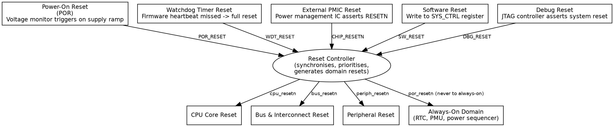
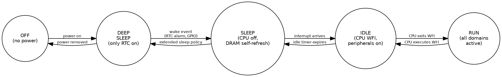

Title: SoC Article 07: Clocking, Reset, and Power Domains
Date: 2026-04-18
Category: Engineering
Tags: SoC, Hardware, Computer Architecture, Electronics, Embedded Systems, ARM, Clocking, Power Management, DVFS, PLL
Slug: soc-article-07-clocking-reset-and-power-domains
Author: morganp
Summary: The infrastructure that makes a SoC run correctly and efficiently: PLLs for frequency synthesis, clock trees for low-skew distribution, clock domain crossings and metastability, reset sources and synchronisation, and power domains with gating and DVFS.
Status: published

*Series: Introduction to SoC Design | Article 7 of 11*

---

## Introduction

Every digital circuit needs a clock: a periodic signal that synchronises all the flip-flops in a System-on-Chip (SoC), causing them to sample their inputs and update their outputs in a coordinated fashion. Designing, distributing, and managing the clock is an entire sub-discipline of SoC engineering.

**Reset** places a chip in a known initial state. **Power management** dynamically controls which blocks are active and at what voltage. Both are critical infrastructure topics that every SoC designer must understand.

---

## Why clocking is hard

Generating a clock signal that oscillates at a precise frequency seems straightforward. The real challenge is delivering that signal to millions of flip-flops distributed across a die that may be 100 mm² or larger, all arriving at exactly the same time (to within picoseconds), despite:

- **Wire resistance and capacitance:** signals are delayed differently depending on path length.
- **Process variation:** transistors at different corners of the die behave slightly differently.
- **Temperature gradients:** hot areas near power-hungry cores have slower transistors.
- **Voltage droop:** areas with high switching activity momentarily drop in supply voltage.

This collection of problems is called **clock skew** (spatial variation) and **clock jitter** (temporal variation). Both reduce the timing margin available for logic between flip-flops.

---

## The clock distribution tree

The solution is a carefully engineered **clock tree**: a hierarchical network of buffers that distributes the clock signal from a single source to all destinations. Engineers size each branch so that all paths have approximately equal delay.

[]({attach}/images/SoC/Article07/07-clock-tree-HQ.png)

All paths from source to leaf flip-flops are equal length, giving equal delay and low skew.

**Clock tree synthesis (CTS)** is an automated step in the physical design flow that constructs this tree. It is one of the most critical steps in achieving timing closure.

---

## Phase-locked loops

SoCs do not use their raw crystal oscillator frequency (typically 24--100 MHz from an external crystal) directly. Instead, a **phase-locked loop (PLL)** multiplies and divides this reference to generate the precise frequencies needed by each subsystem.

[]({attach}/images/SoC/Article07/07-pll-block-HQ.png)

Output frequency = Ref × (N/M) where N and M are programmable dividers.

A PLL is an **analog circuit** embedded in the otherwise digital SoC. Its output frequency is controlled by a digital divider, but the loop filter and VCO (Voltage-Controlled Oscillator) are analog. This makes PLLs sensitive to supply noise: they have their own isolated power supply on-chip.

A typical large SoC has 4--12 PLLs:
- Central processing unit (CPU) PLL (0.8--3.5 GHz)
- Graphics processing unit (GPU) PLL
- Double data rate (DDR) PLL (matched to dynamic RAM (DRAM) frequency)
- Peripheral PLL (100--400 MHz for buses)
- Universal Serial Bus (USB) and PCI Express (PCIe) PLLs (specific protocol reference frequencies)

---

## Multiple clock domains

Different parts of a SoC operate at different frequencies, and often from different clocks. A **clock domain** is a group of flip-flops all clocked by the same source.

[]({attach}/images/SoC/Article07/07-clock-domains-HQ.png)

When data must cross from one clock domain to another, a **Clock Domain Crossing (CDC)** circuit is required. For example, the CPU domain and the peripheral Advanced Peripheral Bus (APB) domain run at different frequencies. Failure to handle CDCs correctly is one of the most common sources of functional bugs in SoC designs.

### The metastability problem

When a flip-flop's input changes near its sampling edge, the flip-flop may enter a **metastable** state: neither a clean 0 nor a clean 1. If the metastable state propagates, it can corrupt data or cause unexpected behaviour.

The probability of metastability resolving correctly increases with time. A **two-stage synchroniser** provides enough time in most situations for resolution before the signal is used:

```wavedrom
{
  "signal": [
    {"name": "SRC_CLK",  "wave": "p......."},
    {"name": "DST_CLK",  "wave": "p...", "period": 2},
    {"name": "DATA_IN",  "wave": "01......"},
    {"name": "FF1_Q",    "wave": "0.x1....", "node": "..A....."},
    {"name": "FF2_Q",    "wave": "0...1...", "node": "....B..."},
    {"name": "SYNC_OUT", "wave": "0...1..."}
  ],
  "edge": ["A metastable (resolves to 1)", "B safe to use"],
  "head": {"text": "Two-Stage Synchroniser for CDC"}
}
```

The two-stage synchroniser adds **two destination-clock cycles of latency** but reduces the probability of a metastability-induced failure to negligible levels. More complex CDCs (for multi-bit signals or first-in first-out (FIFO) buffers) use more sophisticated structures.


---

## Reset: Getting to a known state

**Reset** is the mechanism that places all flip-flops in their initial, known state. Without reset, the behaviour of a digital circuit after power-up is undefined: flip-flops can power up in either state.

### Reset sources

A SoC typically has several reset sources:



### Synchronous vs asynchronous reset

Register transfer level (RTL) designers must choose between two reset styles:

**Asynchronous reset:** the flip-flop resets immediately when RST is asserted, regardless of the clock. Fast response, but the reset de-assertion must be synchronised to avoid metastability.

**Synchronous reset:** the flip-flop only resets on the next rising clock edge after RST is asserted. Requires a clean clock, but avoids de-assertion timing issues.

In practice, most SoC designs use **asynchronous assert, synchronous de-assert** (ASAD): the reset asserts immediately for reliability, and de-asserts through a synchroniser to prevent metastability.

```wavedrom
{
  "signal": [
    {"name": "clk",       "wave": "P........."},
    {"name": "rst_n_raw", "wave": "0..1......"},
    {"name": "rst_n_sync","wave": "0....1...."},
    {"name": "FF_Q",      "wave": "0....2....", "data": ["Normal"]}
  ],
  "head": {"text": "Asynchronous Assert, Synchronous De-assert (ASAD) Reset"}
}
```

---

## Power domains and power management

A modern SoC is not a single block of silicon that is either fully on or fully off. It is divided into **power domains** -- regions that can be independently powered up or down. This enables enormous power savings by only energising the blocks that are currently needed.

### Power states

A typical SoC power state machine:



### Power gating

**Power gating** uses header or footer switches (large p-type (PMOS) or n-type (NMOS) transistors) to physically disconnect a domain from its supply rail, reducing leakage current to near zero:

[]({attach}/images/SoC/Article07/07-power-gating-HQ.png)

When the block is gated off, its internal state is lost. If the state must be preserved (for example, cache contents or CPU registers), **retention registers**: special flip-flops with a separate, always-powered supply, save critical state before power-down.

### DVFS

**Dynamic Voltage and Frequency Scaling (DVFS)** reduces power consumption by lowering both the supply voltage and clock frequency when full performance is not needed. Power consumption of complementary metal-oxide-semiconductor (CMOS) logic scales approximately as:

```
P_dynamic ≈ α × C × V² × f

Where:
  α = activity factor (fraction of gates switching per cycle)
  C = total capacitance
  V = supply voltage
  f = clock frequency
```

Since power scales with V², halving the voltage reduces dynamic power by 4×. Modern SoC CPUs support many operating points, and the operating system (OS) uses a **DVFS governor** to select the appropriate operating point based on workload.

[]({attach}/images/SoC/Article07/07-dvfs-HQ.png)

### Clock gating

A lighter-weight alternative to power gating is **clock gating**: stopping the clock to a region of logic. With the clock stopped, flip-flops no longer switch, and dynamic power drops to near zero (though leakage continues). Clock gating is implemented with an **integrated clock gating cell (ICG)**:

[]({attach}/images/SoC/Article07/07-clock-gating-HQ.png)

When EN = 0, GATED_CLK is held low (no switching). When EN = 1, GATED_CLK follows CLK normally.

Modern synthesis tools automatically insert clock gating cells throughout the design, reducing dynamic power by 20--40% with no architect effort.

---

## The always-on domain

Even in the deepest sleep state, some logic must remain powered. This includes the real-time clock (RTC) to wake the system at a scheduled time, the power management unit to manage power-up sequencing, and retention registers holding critical context. This collection of always-powered logic is the **Always-On (AO) domain**: it draws power from a supply that is never switched off while the battery is present.

---

## Summary

Clocking, reset, and power management are the infrastructure that makes a SoC run correctly and efficiently. PLLs generate the precise, stable frequencies required by each subsystem. The clock tree distributes the clock signal with minimal skew. Clock domain crossings require careful synchronisation to prevent metastability. Reset places all logic in a known initial state, with the source and polarity carefully considered. Power domains, gating, and DVFS together reduce energy consumption dramatically, enabling always-on devices to run for days or years on a small battery.

---

## Intermediate articles this topic connects to

- *Clock Domain Crossing Techniques:* Metastability in depth, multi-bit CDC, async FIFOs
- *Power Management Techniques:* DVFS, retention, power sequencing, PMU firmware
- *Physical Design: Floorplanning and Place-and-Route (Advanced):* CTS, IR drop analysis

---

*Previous: [Article 06 -- Interconnects and Bus Protocols]({filename}../2026-04-09_SoC_Article_06_Interconnects_and_Bus_Protocols/2026-04-09_SoC_Article_06_Interconnects_and_Bus_Protocols.md)*
*Next: [Article 08 -- Peripherals and I/O: Connecting the SoC to the World]({filename}../2026-04-18_SoC_Article_08_Peripherals_and_IO/2026-04-18_SoC_Article_08_Peripherals_and_IO.md)*
