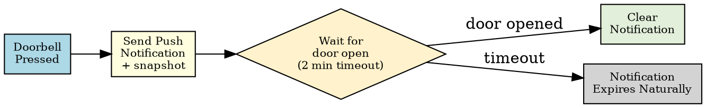

Title: Smart Doorbell Notifications with Home Assistant, Reolink and Sonoff
Date: 2026-04-18
Category: Hardware & Homelab
Tags: Home Assistant, Smart Home, Reolink, Sonoff, Automation, Notifications, Zigbee
Slug: home-assistant-reolink-doorbell-smart-notifications
Author: morganp
Summary: How to wire up a Reolink doorbell and a Sonoff door sensor in Home Assistant to send a camera snapshot push notification when someone rings, then automatically dismiss it the moment the door is opened.
Status: draft

The problem with most doorbell automations is that the notification lingers on your phone long after you have already answered the door. This post sets up an automation that sends a push notification with a doorbell camera snapshot when someone rings, then automatically clears it the moment the door is opened -- so your notification shade stays clean.

---

## Components

- **Reolink doorbell** (PoE or Wi-Fi) -- integrated via the official [Reolink integration](https://www.home-assistant.io/integrations/reolink/)
- **Sonoff SNZB-04 door/window sensor** -- a Zigbee sensor paired via Zigbee2MQTT or ZHA
- **Home Assistant** with the mobile companion app installed on your phone (iOS or Android)

---

## Push Notification Setup

Install the **Home Assistant Companion App** on each phone that should receive doorbell alerts (available on iOS and Android). Once logged in to your HA instance, the app registers a notify service automatically.

To find your service name go to **Developer Tools > Actions**, search for `notify.mobile_app` and you will see one entry per registered device -- for example `notify.mobile_app_morgan_iphone`. Use this name in the automation below.

### Notifying Multiple People

To send to several phones, define a notification group in `configuration.yaml`:

```yaml
notify:
  - platform: group
    name: household
    services:
      - service: mobile_app_phone_one
      - service: mobile_app_phone_two
```

Then use `notify.household` in the automation. The clear notification must also target the group so it dismisses on all devices.

---

## Integrations Setup

### Reolink

Add the Reolink integration from **Settings > Devices & Services > Add Integration**. Enter the doorbell's IP address, username, and password. Once added it exposes:

- `binary_sensor.<name>_visitor` -- goes `on` when the doorbell button is pressed
- `camera.<name>` -- live and snapshot camera feed

Set a static IP for the doorbell on your router so the integration never loses it.

### Sonoff SNZB-04 via Zigbee2MQTT

Pair the sensor by holding the reset button until the LED flashes. In Zigbee2MQTT it appears as a contact sensor. Home Assistant autodiscovers it as:

- `binary_sensor.<name>_contact` -- `off` = closed, `on` = open

If you are using ZHA the entity name follows the same pattern.

---

## How the Automation Works



1. Doorbell button pressed -- triggers the automation
2. Push notification sent immediately with a camera snapshot attached
3. Automation waits up to 2 minutes for the door sensor to report open
4. If the door opens -- a second notification with the same `tag` clears the first from the device
5. If nobody answers within 2 minutes -- the notification stays until manually dismissed

---

## The Automation YAML

In Home Assistant go to **Settings > Automations > New Automation > Edit in YAML** and paste:

```yaml
alias: Doorbell -- Smart Notification
description: >
  Send a doorbell snapshot notification. Clear it automatically if the door
  is opened within 2 minutes.
mode: single
max_exceeded: silent

triggers:
  - trigger: state
    entity_id: binary_sensor.reolink_doorbell_visitor
    to: "on"

actions:
  - action: notify.mobile_app_your_phone
    data:
      title: "Doorbell"
      message: "Someone is at the door"
      data:
        tag: doorbell_alert
        image: /api/camera_proxy/camera.reolink_doorbell
        ttl: 0
        priority: high

  - wait_for_trigger:
      - trigger: state
        entity_id: binary_sensor.front_door_contact
        to: "on"
    timeout:
      minutes: 2
    continue_on_timeout: true

  - if:
      - condition: template
        value_template: "{{ not wait.timed_out }}"
    then:
      - action: notify.mobile_app_your_phone
        data:
          message: "clear_notification"
          data:
            tag: doorbell_alert
```

Replace `notify.mobile_app_your_phone` with your actual notify service name and `binary_sensor.front_door_contact` with your Sonoff sensor entity.

---

## Camera Snapshot in the Notification

The `image` field uses the HA camera proxy URL. This serves a still image from the camera at the moment the notification is generated. On iOS the image appears as a thumbnail; long-press expands it. On Android it appears in the expanded notification view.

If you want a fresh snapshot captured at doorbell-press time rather than the proxy serving a cached frame, take an explicit snapshot first:

```yaml
actions:
  - action: camera.snapshot
    target:
      entity_id: camera.reolink_doorbell
    data:
      filename: /config/www/doorbell_snapshot.jpg

  - action: notify.mobile_app_your_phone
    data:
      title: "Doorbell"
      message: "Someone is at the door"
      data:
        tag: doorbell_alert
        image: /local/doorbell_snapshot.jpg
```

`/config/www/` maps to `/local/` in the HA web server, making the image accessible to the companion app.

---

## mode: single

The automation uses `mode: single` with `max_exceeded: silent`. This means if the doorbell is pressed again while the automation is already waiting (someone rings twice), the second press is ignored. This prevents duplicate notifications and competing clear triggers.

If you want each ring to send a fresh notification, use `mode: restart` instead -- the wait timer resets on each press.

---

## Testing

1. Press the doorbell button -- notification should arrive within a second or two with the camera image
2. Open the front door -- notification should disappear from your lock screen and notification shade
3. Press the doorbell but wait 2 minutes without opening the door -- notification should remain

Check **Settings > Automations**, open the automation, and use **Traces** to step through exactly what happened on each trigger.

---

## Extending the Automation

- **Announce on smart speakers** -- add a `media_player` TTS action before the `wait_for_trigger`
- **Record a clip** -- trigger `camera.record` on the Reolink entity when the bell rings
- **Night mode** -- wrap the notify action in a condition that checks `input_boolean.night_mode` to suppress notifications after midnight
- **Actionable notifications** -- add action buttons to the notification (Unlock door, Ignore) using the companion app's actionable notification feature
