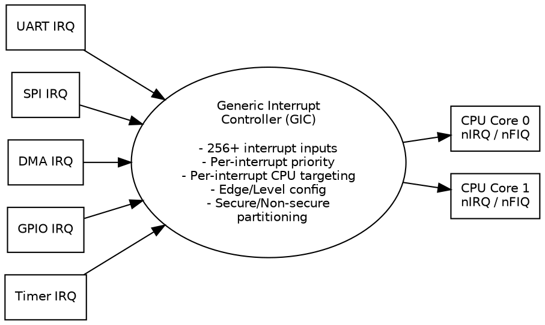

Title: SoC Article 08: Peripherals and I/O -- Connecting the SoC to the World
Date: 2026-04-18
Category: Engineering
Tags: SoC, Hardware, Computer Architecture, Electronics, Embedded Systems, Peripherals, I/O, UART, SPI, I2C, USB, Ethernet, DMA, GPIO
Slug: soc-article-08-peripherals-and-io
Author: morganp
Summary: A survey of the most common peripheral types found in SoCs -- GPIO, UART, SPI, I2C, USB, Ethernet, DMA, and interrupt controllers -- and how they connect the digital logic inside the chip to the physical world outside it.
Status: draft

*Series: Introduction to SoC Design | Article 8 of 11*

---

## Introduction

A SoC without I/O is a black box -- no matter how powerful its processors or how fast its memory, it has no way to receive information from the world or send results back out. **Peripherals** are the hardware blocks that bridge the gap between the digital logic inside the chip and the physical world outside it: sensors, displays, storage, networks, and human interfaces.

This article surveys the most common peripheral types found in SoCs, explains the protocols they use, and shows how they connect to the rest of the chip.

---

## The Peripheral Landscape

Peripherals vary enormously in bandwidth, latency, and complexity:

```text
SoC Peripheral Classification

  High Speed                                   Low Speed
  High Bandwidth     <- Bandwidth ->         Low Bandwidth
  +------------------------------------------------------+
  | PCIe   | USB3 | Ethernet | USB2 | SPI | I2C | UART  |
  | 32GB/s |5Gb/s |  1Gb/s   |480Mb/s|50Mb/s|4Mb/s|115kb/s|
  +--------+------+----------+-------+-----+-----+-------+
     NVMe,    USB    Network   USB1.1  Flash, Sensors, Debug
     GPU      3.0    packets   devices OLED   IMU     console

  On AXI/AHB fabric                     On APB / slow bus
```

---

## GPIO -- General Purpose Input/Output

**GPIO** is the simplest peripheral: a set of pins that can be individually configured as either digital inputs or digital outputs, under software control.

```text
GPIO Port Architecture (8-bit example):

  Software Registers:
  +-------------------------------------------------+
  | GPIO_DIR   [7:0] -- 1=Output, 0=Input per pin  |
  | GPIO_OUT   [7:0] -- Value to drive on output    |
  | GPIO_IN    [7:0] -- Current value on input pins |
  | GPIO_IE    [7:0] -- Interrupt enable per pin    |
  | GPIO_ITYPE [7:0] -- Edge/Level trigger type     |
  +-------------------------------------------------+
           |
    +------+----------------------------------------------+
    |  GPIO Controller                                     |
    |  +---+ +---+ +---+ +---+ +---+ +---+ ...            |
    |  |Pin| |Pin| |Pin| |Pin| |Pin| |Pin|                 |
    |  | 0 | | 1 | | 2 | | 3 | | 4 | | 5 |                |
    |  +-+-+ +-+-+ +-+-+ +-+-+ +-+-+ +-+-+                 |
    +----+-----+-----+-----+-----+-----+-------------------+
         |     |     |     |     |     |
        IO0   IO1   IO2   IO3   IO4   IO5    <- Physical pins
```

GPIO pins on modern SoCs are typically multiplexed -- the same physical pin can serve as GPIO or as a dedicated function for a peripheral like UART or SPI. The **IOMUX (I/O Multiplexer)** hardware block selects which function a pin serves:

```text
Pin Multiplexing (IOMUX):

  Physical Pin ---- IOMUX --+-- GPIO controller
                             +-- UART TX
                             +-- SPI CLK
                             +-- I2C SDA

  Selection controlled by IOMUX_CFG register (written during boot)
```

---

## UART -- Universal Asynchronous Receiver/Transmitter

**UART** is the oldest and simplest serial communication protocol. It is asynchronous (no shared clock between sender and receiver) and full-duplex (simultaneous send and receive on separate wires).

### UART Frame Format

A UART frame consists of: start bit, 7-9 data bits, optional parity bit, and 1-2 stop bits.

```wavedrom
{
  "signal": [
    {"name": "TX_line",   "wave": "1.0.22222221.", "data": ["D0","D1","D2","D3","D4","D5","D6","D7"]},
    {"name": "RX_sample", "wave": "0....1........"},
    {"name": "Frame",     "wave": "x.2.3333333.4.", "data": ["Start","Data bits (LSB first)","Stop"]}
  ],
  "head": {"text": "UART Frame: 1 Start + 8 Data + 1 Stop (8N1)"},
  "config": {"hscale": 1.5}
}
```

The receiver **samples** the line at 16x the baud rate to detect the start bit edge, then samples each data bit at the midpoint of its period. Both sides must be configured to the same baud rate (e.g., 115200 bps).

UARTs are used primarily for **debug consoles** -- they are the "printf over hardware" of embedded systems. Almost every SoC has at least one UART that provides a serial terminal during boot.

---

## SPI -- Serial Peripheral Interface

**SPI** is a synchronous serial protocol (master provides the clock) designed for short-distance communication between a SoC and peripheral ICs such as flash memory, sensors, DACs, and displays.

### SPI Signals

```text
SPI Connection (4-wire, single slave):

  SoC (Master)                   Device (Slave)
  +--------------+               +--------------+
  |   SCLK ---------------------------------> SCLK         |
  |   MOSI ---------------------------------> MOSI (SDI)   |
  |   MISO <--------------------------------- MISO (SDO)   |
  |   CS   ---------------------------------> CS (active   |
  |        |               |                  low)         |
  +--------------+               +--------------+

  SCLK = Serial Clock (from master)
  MOSI = Master Out, Slave In
  MISO = Master In, Slave Out
  CS   = Chip Select (one per slave)
```

### SPI Timing

```wavedrom
{
  "signal": [
    {"name": "CS",   "wave": "1.0............1"},
    {"name": "SCLK", "wave": "0..HLHLHLHLHLHL."},
    {"name": "MOSI", "wave": "x.2.2.2.2.2.2.x.", "data": ["B7","B6","B5","B4","B3","B2"]},
    {"name": "MISO", "wave": "x..2.2.2.2.2.2x.", "data": ["D7","D6","D5","D4","D3","D2"]}
  ],
  "head": {"text": "SPI Mode 0 Transfer (CPOL=0, CPHA=0)"}
}
```

SPI supports four **modes** (combinations of CPOL -- clock polarity and CPHA -- clock phase), allowing compatibility with different devices. Most flash memories and sensors use Mode 0 or Mode 3.

SPI has no addressing scheme -- the chip select line selects the target device. Multiple slaves require one CS line per slave. **Quad-SPI (QSPI)** uses four data lines instead of one, quadrupling throughput.

---

## I2C -- Inter-Integrated Circuit

**I2C** is a two-wire synchronous protocol supporting multiple masters and multiple slaves on the same bus. It uses **7-bit or 10-bit addressing** to select which device a transaction targets.

### I2C Signals

```text
I2C Bus (multiple devices on same two wires):

  SoC (Master)
  +----------------+
  |           SCL  +--------------------------------------------------
  |  I2C           |              |           |           |
  |  Controller    |              |           |           |
  |           SDA  +--------------------------------------------------
  +----------------+              |           |           |
                              [Sensor]    [PMIC]     [EEPROM]
                              Addr:0x48   0x58        0x50

  Both lines have pull-up resistors (open-drain bus)
  Any device can pull low; no device drives high
```

### I2C Transaction Format

```wavedrom
{
  "signal": [
    {"name": "SCL",   "wave": "1.HLHLHLHLHLHLHLHL1"},
    {"name": "SDA",   "wave": "1.0.2.2.2.2.2.2.2.1", "data": ["A6","A5","A4","A3","A2","A1","A0","R/W"]},
    {"name": "Phase", "wave": "x.2.3.3.3.3.3.3.3.4.", "data": ["START","Address (7 bits)","R/W","ACK"]}
  ],
  "head": {"text": "I2C Start + 7-bit Address + R/W Bit"}
}
```

The **START** condition (SDA falls while SCL is high) begins every transaction. The master sends 7 address bits + a R/W bit, then waits for an **ACK** (the addressed slave pulls SDA low for one clock cycle). Data bytes follow, each acknowledged by the receiver.

I2C standard speeds: 100 kHz (standard), 400 kHz (fast), 1 MHz (fast-plus), 3.4 MHz (high-speed). Used for: temperature sensors, IMUs, PMICs, cameras, EEPROM, displays.

---

## USB -- Universal Serial Bus

**USB** is the dominant PC-to-peripheral protocol, and is increasingly common on embedded SoCs. A complete USB implementation includes:

- **USB PHY (Physical Layer)** -- analog front-end handling differential signalling
- **USB Controller / IP** -- protocol stack implementation (USB 2.0 at 480 Mb/s, USB 3.x up to 20 Gb/s)
- **USB Hub / Root Hub logic** -- in host-mode SoCs

USB 2.0 uses a tiered star topology with a single host, supporting 127 devices. USB communication is always **host-initiated** -- a device can never spontaneously send data; it must wait to be polled or for the host to grant a transfer.

USB transfers are classified into four types:

| Transfer Type | Description | Use Case |
|---------------|-------------|----------|
| Control | Enumeration, configuration | Device setup |
| Bulk | Large data, guaranteed delivery | Storage (USB flash) |
| Interrupt | Small, time-bounded data | HID (mouse, keyboard) |
| Isochronous | Time-sensitive, no retry | Audio, video streaming |

USB 3.x adds **SuperSpeed** lanes with completely different physical layer (8b/10b -> 128b/132b coding, separate TX and RX differential pairs) while maintaining backward compatibility with USB 2.0.

---

## Ethernet MAC

**Ethernet** connectivity requires two hardware blocks:

**MAC (Media Access Control)** -- implements the Ethernet frame format, collision detection (for legacy half-duplex), flow control, and FIFO management. The MAC lives on-chip.

**PHY (Physical Layer)** -- converts between the digital MAC signals and the analog signals on the twisted-pair cable. The PHY is usually a separate chip, connected to the MAC via the **RGMII** or **SGMII** interface.

```text
Ethernet Path:

  CPU -- AXI -- [Ethernet MAC] -- RGMII/SGMII -- [PHY chip] -- RJ45 jack
                      |
               [DMA Engine] -- (packet DMA to/from DRAM buffers)
```

The MAC operates as a **DMA master**: when a packet arrives, the MAC's DMA engine writes it to a pre-allocated buffer in DRAM and signals the CPU via interrupt. Outgoing packets are described by descriptors pointing to DRAM buffers, and the MAC fetches and transmits them independently.

---

## DMA Controller

Almost all high-bandwidth peripherals include or connect to a **Direct Memory Access (DMA)** engine. DMA allows peripherals to transfer large blocks of data to/from memory without the CPU being involved for every byte.

```text
DMA Transfer Flow:

  1. CPU programs DMA:
     - Source address
     - Destination address
     - Transfer size
     - Peripheral ID / channel
     -> writes to DMA controller registers

  2. DMA takes over:
     CPU --------- (free to run other code) --------
     DMA reads from peripheral FIFO using AXI reads
     DMA writes to DRAM using AXI writes
     (all autonomously, CPU not involved)

  3. DMA signals completion:
     DMA asserts interrupt to CPU -> "transfer done"
     CPU processes the data
```

DMA is essential for audio streaming, video capture, USB bulk transfers, UART high-speed data, and anything involving moving more than a few bytes at a time.

---

## Interrupt Controller

Peripherals signal the CPU when they need attention using **interrupts** -- electrical signals that cause the CPU to temporarily halt its current task, save state, run an **Interrupt Service Routine (ISR)**, and resume.

A SoC may have dozens of interrupt sources (UART received a byte, SPI transfer complete, GPIO edge, timer expired, DMA done). The **interrupt controller** collects these signals, prioritises them, and presents the highest-priority pending interrupt to the CPU.



ARM's **GIC (Generic Interrupt Controller)** is the standard interrupt controller for Cortex-A SoCs. It supports up to 1020 interrupt sources, 8 priority levels, and can target interrupts to specific CPU cores (useful for load balancing in multi-core systems).

---

## Timer and Watchdog

**Timers** are counter circuits that count clock cycles and generate an interrupt when they reach a preset value. They are used for:

- OS tick (e.g., 1 ms period for task scheduling)
- PWM generation (Pulse Width Modulation for motor control, LEDs)
- Capture (measuring pulse widths on GPIO inputs)
- Timeouts

```wavedrom
{
  "signal": [
    {"name": "timer_clk",  "wave": "P........."},
    {"name": "count[3:0]", "wave": "2222222222", "data": ["0","1","2","3","4","5","6","7","8","9"]},
    {"name": "match",      "wave": "0.......10"},
    {"name": "IRQ",        "wave": "0.......10"},
    {"name": "Note",       "wave": "x.......2x", "data": ["Count==8: IRQ"]}
  ],
  "head": {"text": "Timer: Count to Match Value, Generate IRQ"}
}
```

A **watchdog timer** is a specific timer that must be periodically "kicked" (reset) by firmware. If the firmware crashes or hangs, the watchdog expires and resets the entire system -- essential for reliable embedded operation.

---

## Summary

Peripherals are the interface between a SoC and the physical world. GPIO provides flexible single-bit I/O. Serial protocols like UART, SPI, and I2C provide low-to-medium bandwidth connections to sensors and devices. USB provides standardised high-speed connectivity to external devices. Ethernet connects the SoC to networks. DMA engines free the CPU from data movement tasks. The interrupt controller efficiently manages asynchronous events from all these sources. Together, these blocks are what allow a SoC to run in a real product.

---

## Further Reading

- *DMA Controller Architecture* -- Descriptor chains, scatter-gather, channel arbitration
- *Interrupt Controllers* -- Nested vectored interrupts, GIC architecture, priority grouping
- *Memory-Mapped I/O and Linux Device Drivers* -- Writing kernel drivers for these peripherals

---

*Previous: [Article 07 -- Clocking, Reset, and Power Domains]({filename}../2026-04-11_SoC_Article_07_Clocking_Reset_and_Power_Domains/2026-04-11_SoC_Article_07_Clocking_Reset_and_Power_Domains.md)*
