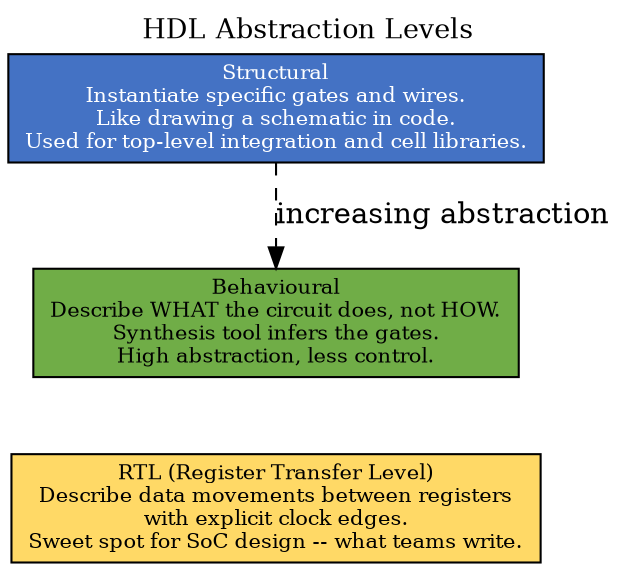
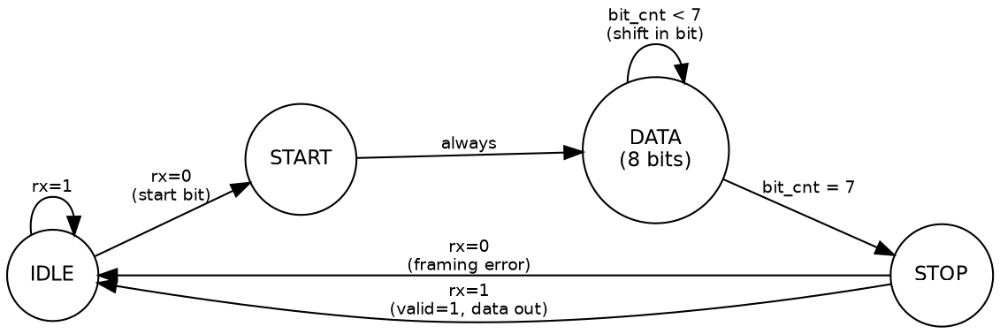
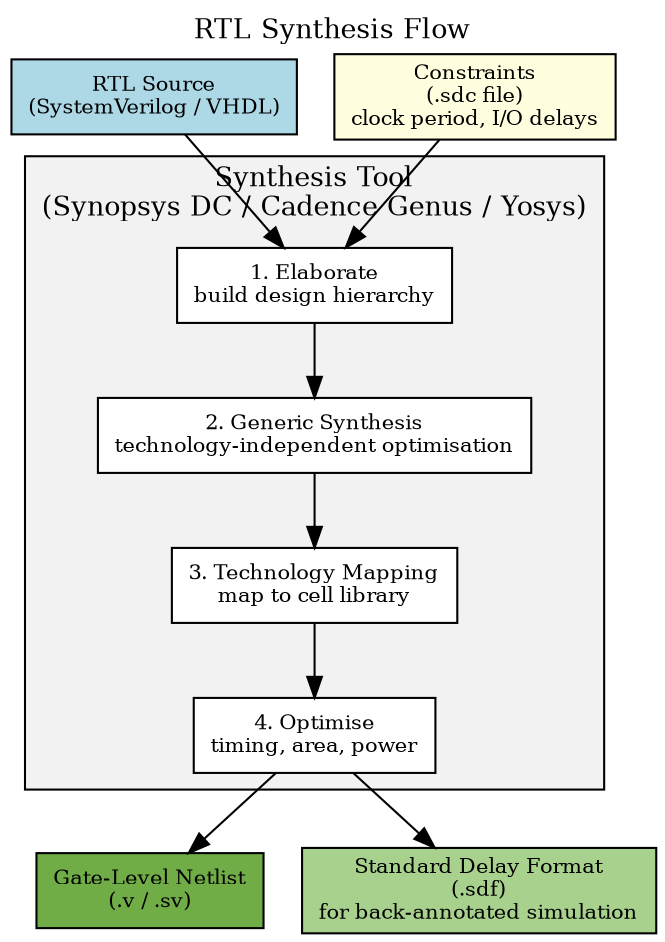

Title: SoC Article 09: Hardware Description Languages and RTL Design
Date: 2026-05-01
Category: Engineering
Tags: SoC, Hardware, Computer Architecture, Electronics, Embedded Systems, Verilog, SystemVerilog, VHDL, RTL, HDL, FPGA, Synthesis
Slug: soc-article-09-hardware-description-languages-rtl-design
Author: morganp
Summary: How SoC hardware is described in code: the fundamental difference between sequential software and parallel hardware, RTL vs behavioural vs structural design, SystemVerilog key constructs, FSMs, testbenches, assertions, and the synthesis step that turns RTL into gates.
Status: published

*Series: Introduction to SoC Design | Article 9 of 11*

---

## Introduction

Hardware does not appear from nowhere. Before manufacturing a single transistor, engineers must describe the behaviour of a System-on-Chip (SoC). They use a language that both humans and tools can process: simulating, verifying, and ultimately synthesising the design into real logic gates.

**Hardware Description Languages (HDLs)** are that language. They look superficially like programming languages. In reality they describe hardware: circuits that exist and operate in parallel, not sequential lists of instructions. Understanding this distinction is the single most important step in learning HDL design.

---

## The fundamental difference: parallelism

In a software program, statements execute one after another:

```python
# Software: sequential execution
a = read_sensor()
b = process(a)
c = output(b)      # c is calculated AFTER b is calculated
```

In hardware, all blocks of logic are always active simultaneously. Every combinational logic path is constantly computing its output from its inputs, every clock edge triggers every flip-flop at once:

```verilog
// Hardware: everything runs concurrently
// All these assignments happen in PARALLEL, every clock cycle
always_ff @(posedge clk) begin
    reg_a <= input_a;      // This flip-flop samples input_a
    reg_b <= reg_a + 1;    // This flip-flop samples reg_a + 1
    reg_c <= reg_b << 2;   // This flip-flop samples reg_b shifted left
end
// All three updates happen simultaneously on every rising clock edge
```

This parallel nature is what makes hardware description language (HDL) design difficult for software engineers at first: there is no "sequence of operations". There is a network of logic gates and registers, all computing simultaneously.

---

## The two major HDLs: Verilog and VHDL

The industry is divided between two hardware description languages (HDLs), both established in the 1980s and both standardised by the Institute of Electrical and Electronics Engineers (IEEE):

**Verilog:** C-like syntax, concise, originally designed for simulation. Extended into **SystemVerilog** (IEEE 1800), which adds object-oriented programming (OOP) features, assertions, and randomised verification constructs.

**VHDL** (VHSIC Hardware Description Language): Ada-like syntax, strongly typed, verbose. Historically dominant in Europe, aerospace, and defence.

For this series, examples use **SystemVerilog** for hardware design and VHDL where instructive for comparison. The concepts are identical.

---

## RTL vs behavioural vs structural

Hardware description language (HDL) code can be written at different levels of abstraction:



**Structural:** instantiate specific gates and connect them with wires:

```verilog
// Structural: instantiate specific primitives
and_gate U0 (.a(in_a), .b(in_b), .y(wire_and));
or_gate  U1 (.a(wire_and), .c(in_c), .y(out));
```

**Behavioural:** describe *what* the circuit does:

```verilog
// Behavioural: synthesis tool decides the gates
assign out = (in_a & in_b) | in_c;
```

**Register transfer level (RTL):** explicit registers and data paths:

```verilog
// RTL: explicit registers and data paths
always_ff @(posedge clk or negedge rst_n) begin
    if (!rst_n)   data_reg <= '0;
    else          data_reg <= data_in;
end
assign data_out = data_reg + offset;
```

---

## SystemVerilog key constructs

### Modules

The **module** is the fundamental building block: equivalent to a function or class in software, but representing a hardware block with defined ports:

```verilog
module adder #(
    parameter WIDTH = 8          // configurable width
) (
    input  logic [WIDTH-1:0] a,
    input  logic [WIDTH-1:0] b,
    input  logic             cin,
    output logic [WIDTH-1:0] sum,
    output logic             cout
);
    assign {cout, sum} = a + b + cin;
endmodule
```

Modules are **instantiated** to create the structural hierarchy of a SoC:

```verilog
module alu (
    input  logic [31:0] src_a, src_b,
    input  logic [3:0]  op,
    output logic [31:0] result,
    output logic        zero
);
    logic [31:0] add_result;
    logic        add_carry;

    adder #(.WIDTH(32)) u_adder (
        .a    (src_a),
        .b    (src_b),
        .cin  (1'b0),
        .sum  (add_result),
        .cout (add_carry)
    );

    always_comb begin
        case (op)
            4'b0000: result = add_result;          // ADD
            4'b0001: result = src_a - src_b;       // SUB
            4'b0010: result = src_a & src_b;       // AND
            4'b0011: result = src_a | src_b;       // OR
            4'b0100: result = src_a ^ src_b;       // XOR
            4'b0101: result = src_a << src_b[4:0]; // SLL
            default: result = '0;
        endcase
        zero = (result == '0);
    end
endmodule
```

### Sequential Logic: always_ff

The `always_ff` block describes registers. It executes on every rising (or falling) clock edge:

```verilog
// 8-entry FIFO with synchronous read and write
module fifo8 (
    input  logic       clk, rst_n,
    input  logic [7:0] wdata,
    input  logic       wen, ren,
    output logic [7:0] rdata,
    output logic       full, empty
);
    logic [7:0] mem [0:7];
    logic [2:0] wptr, rptr;
    logic [3:0] count;

    always_ff @(posedge clk or negedge rst_n) begin
        if (!rst_n) begin
            wptr  <= '0;
            rptr  <= '0;
            count <= '0;
        end else begin
            if (wen && !full) begin
                mem[wptr] <= wdata;
                wptr      <= wptr + 1'b1;
                count     <= count + 1'b1;
            end
            if (ren && !empty) begin
                rptr  <= rptr + 1'b1;
                count <= count - 1'b1;
            end
        end
    end

    assign rdata = mem[rptr];
    assign full  = (count == 4'd8);
    assign empty = (count == 4'd0);
endmodule
```

### Combinational Logic: always_comb

The `always_comb` block describes purely combinational logic: it re-evaluates whenever any of its inputs change:

```verilog
// Priority encoder: find the index of the highest-priority set bit
module priority_enc (
    input  logic [7:0] req,
    output logic [2:0] grant_id,
    output logic       valid
);
    always_comb begin
        valid    = |req;
        grant_id = '0;
        if      (req[7]) grant_id = 3'd7;
        else if (req[6]) grant_id = 3'd6;
        else if (req[5]) grant_id = 3'd5;
        else if (req[4]) grant_id = 3'd4;
        else if (req[3]) grant_id = 3'd3;
        else if (req[2]) grant_id = 3'd2;
        else if (req[1]) grant_id = 3'd1;
        else             grant_id = 3'd0;
    end
endmodule
```

---

## Finite state machines in RTL

The **Finite State Machine (FSM)** is one of the most important patterns in digital design. An FSM transitions between a finite set of states based on inputs and the current state. Each state produces outputs based on that state.

### Example: simple UART receiver FSM

A universal asynchronous receiver/transmitter (UART) receiver reads serial data one bit at a time. The FSM below controls the bit sampling and framing logic:

```verilog
typedef enum logic [1:0] {
    IDLE  = 2'b00,
    START = 2'b01,
    DATA  = 2'b10,
    STOP  = 2'b11
} uart_state_t;

module uart_rx (
    input  logic       clk, rst_n,
    input  logic       rx,
    output logic [7:0] data,
    output logic       valid
);
    uart_state_t state;
    logic [2:0]  bit_cnt;
    logic [7:0]  shift_reg;

    always_ff @(posedge clk or negedge rst_n) begin
        if (!rst_n) begin
            state     <= IDLE;
            bit_cnt   <= '0;
            shift_reg <= '0;
            valid     <= 1'b0;
        end else begin
            valid <= 1'b0;
            case (state)
                IDLE:  if (!rx)            state <= START;
                START: begin
                    bit_cnt <= '0;
                    state   <= DATA;
                end
                DATA: begin
                    shift_reg <= {rx, shift_reg[7:1]};
                    if (bit_cnt == 3'd7) state <= STOP;
                    else                 bit_cnt <= bit_cnt + 1'b1;
                end
                STOP: begin
                    if (rx) begin
                        data  <= shift_reg;
                        valid <= 1'b1;
                    end
                    state <= IDLE;
                end
            endcase
        end
    end
endmodule
```

The corresponding state diagram:



---

## Simulation and testbenches

Hardware description language (HDL) code is verified by **simulation**: running the design against a set of inputs (a **testbench**) and checking the outputs.

A testbench is not synthesisable. Its job is to:
1. Instantiate the **DUT (Device Under Test)**.
2. Generate stimulus (clock, inputs).
3. Check outputs against expected values.
4. Report pass/fail.

```verilog
`timescale 1ns/1ps
module tb_counter;
    logic       clk, rst_n, en;
    logic [3:0] count;

    counter #(.WIDTH(4)) dut (.*);

    initial clk = 0;
    always #5 clk = ~clk;

    initial begin
        rst_n = 0; en = 0;
        @(posedge clk); #1;
        rst_n = 1;
        @(posedge clk); #1;
        en = 1;
        repeat(20) @(posedge clk);
        en = 0;
        repeat(5) @(posedge clk);

        if (count !== 4'd4)
            $error("FAIL: expected 4, got %0d", count);
        else
            $display("PASS");
        $finish;
    end

    initial begin
        $dumpfile("counter_tb.vcd");
        $dumpvars(0, tb_counter);
    end
endmodule
```

---

## SystemVerilog assertions

**Assertions** are formal, self-checking properties embedded directly in the design or testbench using SystemVerilog Assertions (SVA). They check that the hardware obeys its specification throughout simulation.

```verilog
// Assert: write enable must not be asserted when full
property no_overflow;
    @(posedge clk) disable iff (!rst_n)
    (full |-> !wen);
endproperty
assert property (no_overflow)
    else $error("FIFO overflow attempted!");

// Assert: data must be stable while valid and not yet consumed
property data_stable;
    @(posedge clk) disable iff (!rst_n)
    (valid && !ready) |=> $stable(data);
endproperty
assert property (data_stable)
    else $error("Data changed while valid/!ready");

// Cover: verify the full condition is exercised in tests
cover property (@(posedge clk) full);
```

Assertions serve as **executable specifications**: they document intended behaviour and catch violations automatically during simulation.

---

## Common RTL pitfalls

### Unintended Latches

If a `case` or `if` statement in `always_comb` does not cover all possible input combinations, synthesis infers a **latch**: level-sensitive storage that was not intended:

```verilog
// BAD: missing default -> inferred latch on 'out'
always_comb begin
    case (sel)
        2'b00: out = a;
        2'b01: out = b;
        // 2'b10 and 2'b11 not covered -> LATCH!
    endcase
end

// GOOD: add default assignment before the case
always_comb begin
    out = '0;
    case (sel)
        2'b00: out = a;
        2'b01: out = b;
    endcase
end
```

### Simulation-Synthesis Mismatch

Some SystemVerilog constructs simulate differently from how they synthesise. `initial` blocks, delays (`#100`), and complex data types exist only for simulation and are ignored or unsupported during synthesis. Always verify that RTL synthesises to the intended hardware, not just simulates correctly.

---

## The synthesis step

**Synthesis** transforms register transfer level (RTL) code into a **gate-level netlist**: a description in terms of actual standard cells (AND, OR, flip-flop, multiplexer cells) from a technology library.



The synthesis tool reads the RTL plus a **constraints file** (`.sdc`) that specifies the target clock frequency and I/O timing budgets, then maps to whatever cell library the target process provides.

---

## Summary

Hardware description languages (HDLs) are the foundation of SoC design. SystemVerilog and VHDL describe digital logic at the register transfer level (RTL): specifying registers and the combinational logic that transfers data between them. The key mental model shift from software is parallelism: all RTL executes simultaneously, not sequentially. Modules provide the structural hierarchy for building large designs from smaller, verifiable blocks. Finite state machines (FSMs) are a core design pattern for controlling sequential behaviour. Simulation and assertions verify correctness before committing to silicon. Synthesis transforms RTL into gate-level hardware.

---

## Further reading

- *RTL Synthesis and Timing Closure:* Constraint writing, static timing analysis, ECO flows
- *SoC Verification with UVM:* SystemVerilog class-based testbench architecture
- *Formal Verification Methods:* SVA property specification, model checking

---

*Previous: [Article 08 -- Peripherals and I/O]({filename}../2026-04-18_SoC_Article_08_Peripherals_and_IO/2026-04-18_SoC_Article_08_Peripherals_and_IO.md)* | *Next: [Article 10 -- The SoC Design Flow]({filename}../2026-04-24_SoC_Article_10_Design_Flow/2026-04-24_SoC_Article_10_Design_Flow.md)*
