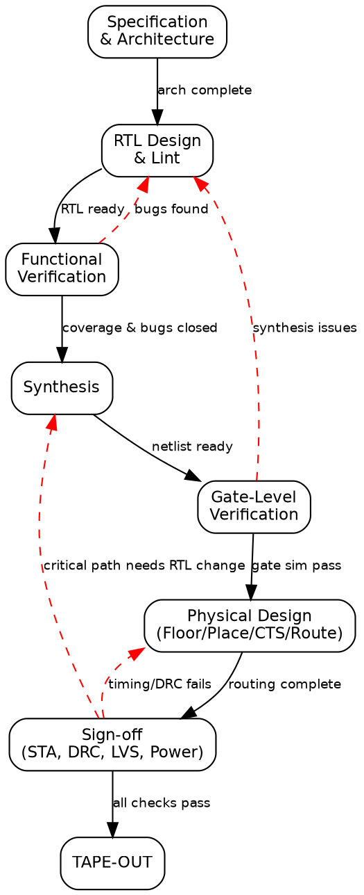

Title: SoC Article 10: The SoC design flow - From specification to silicon
Date: 2026-06-03
Category: Engineering
Tags: SoC, Hardware, Computer Architecture, Electronics, Embedded Systems, RTL, Verification, Synthesis, Physical Design, Tape-out, VLSI
Slug: soc-article-10-design-flow
Author: morganp
Summary: A complete walkthrough of the SoC design flow, from specification and architecture through RTL coding, functional verification, synthesis, physical design, and sign-off to tape-out and fabrication.
Status: published

*Series: Introduction to SoC Design | Article 10 of 11*

---

## Introduction

Designing a System-on-Chip (SoC) is not a single act of creation. It is a disciplined, iterative engineering process. A team of hundreds, sometimes thousands, of engineers spends one to three years completing it. The **design flow** is the structured sequence of phases, tools, and verification checkpoints that transforms an initial concept into a physical chip ready for manufacture.

This article walks through the entire flow, from the first line of specification to the GDSII file sent to the foundry, explaining what happens at each stage and why each step is necessary.

---

## Why the flow matters

Semiconductor manufacturing is extraordinarily expensive and irreversible. Taping out a 7 nm chip can cost $20--50 million in NRE (Non-Recurring Engineering) costs. A single bug that reaches silicon can require a complete re-spin, delaying the product by 6--12 months and costing tens of millions of dollars. Examples include a wrong bit in a register address or a timing path that fails at high temperature.

The design flow exists to make bugs cheap to find early and impossible to reach silicon. Every stage adds more confidence that the design will work correctly when manufactured.

---

## Overview of the flow

[]({attach}/images/SoC/Article10/10-design-flow-HQ.png)

---

## Stage 1: Specification

The design begins with a **specification document**: a detailed description of what the chip must do, including:

- **Functional requirements:** what operations it must support
- **Performance targets:** minimum operating frequency, latency, throughput
- **Power budget:** maximum active power, standby power
- **Area budget:** die size constraint (directly affects cost)
- **Interface requirements:** which external protocols must be supported
- **Operating conditions:** voltage range, temperature range, process corners

System architects and product managers write specifications. Specifications are often imprecise at first. The design process refines them as constraints become clearer.

---

## Stage 2: Architecture

The architecture phase translates requirements into a block-level design. Key decisions:

**IP selection:** Which CPU core? Which bus protocol? Which memory interface? Purchased intellectual property (IP), such as an ARM Cortex-A core or Synopsys DesignWare USB, or custom-designed?

**Hardware/software (HW/SW) partitioning:** Which functions are implemented in fixed hardware and which run in software on the CPU? Hardware is faster and more energy-efficient but inflexible; software is flexible but slower.

**Memory map:** Where in the 32-bit or 64-bit address space does each block live? The memory map is fundamental: once set, changing it breaks all software.

**Block diagram and interface specification:** Defining the ports of each block and how they connect to the bus.

The output of the architecture phase is an **architecture specification**: a document that all downstream engineers work from.

---

## Stage 3: RTL Design

Each block in the architecture is coded in SystemVerilog or VHDL at register transfer level (RTL). This phase is typically the longest and involves the most engineers.

**IP integration:** Licensed IP is delivered as RTL source files or encrypted IP. They are instantiated in the top-level integration and connected to the bus fabric.

**Custom RTL:** Blocks that do not exist as purchasable IP are designed from scratch by the team's RTL engineers.

**Lint checking:** Automated tools scan the RTL for common coding mistakes (undriven signals, unintended latches, undeclared ports) before simulation.

```
RTL Lint Checks (examples):

  ✗ Combinational loop -- combinational path with no register
  ✗ Multi-driven net -- two drivers connected to same wire
  ✗ Unintended latch -- missing default in always_comb case
  ✗ Width mismatch -- 8-bit signal assigned to 16-bit port
  ✗ Reset missing -- flip-flop has no reset path
  ✗ X-propagation risk -- uninitialized signal used in logic
```

---

## Stage 4: Functional Verification

Verification is the process of proving (to sufficient confidence) that the RTL correctly implements the specification. It is the biggest investment in a modern SoC project, typically consuming 60--70% of total design effort and schedule.

### Simulation

Engineers simulate the RTL against a **testbench** that models the SoC's environment. Most modern SoC testbenches use the Universal Verification Methodology (UVM), a standardised framework for building reusable verification components:

[]({attach}/images/SoC/Article10/10-verification-uvm-HQ.png)

### Coverage-Driven Verification

Engineers define **coverage metrics**: measurable goals that indicate whether enough of the design space has been tested:

**Code coverage:** Has every line and branch of the RTL been exercised?

**Functional coverage:** Have all interesting combinations of inputs occurred? For example: FIFO full during reset, all AXI burst lengths, or all interrupt priority combinations.

Verification is complete when coverage goals are met, all bugs have been fixed and re-verified, and a formal sign-off review has been passed.

### Formal Verification

**Formal verification** uses mathematical techniques to prove properties about the design, rather than testing with specific inputs. It can exhaustively check all possible input sequences (up to a bounded depth).

```
Formal vs Simulation:

  Simulation:         Tests specific sequences chosen by engineers
                      → Can miss corner cases
                      → Fast for common cases

  Formal:             Mathematically proves properties hold for ALL inputs
                      → Complete for bounded depth
                      → Can find bugs simulation never would
                      → Slower, limited to smaller blocks
```

Formal verification tools (Cadence JasperGold, Synopsys VC Formal) are used for:
- Block-level property checking
- Clock domain crossing analysis
- Security property verification
- Register model consistency

### Hardware Emulation

For large SoCs, simulation is too slow to run real software. **Hardware emulators** (Cadence Palladium, Synopsys ZeBu) compile the RTL into custom field-programmable gate arrays (FPGAs) or application-specific integrated circuits (ASICs) that run 100--1000x faster than software simulation. This allows booting Linux, running real drivers, and executing application-level tests before silicon is available.

---

## Stage 5: Synthesis

Once RTL verification is complete, **synthesis** converts the RTL into a gate-level netlist using a specific technology's standard cell library.

### Synthesis Constraints

The synthesis tool needs to know the timing requirements, expressed in **Synopsys Design Constraints (SDC)** format:

```tcl
# SDC constraint example
create_clock -name "cpu_clk" -period 0.5 [get_ports clk_in]  ; # 2 GHz clock
set_input_delay  0.1 -clock cpu_clk [all_inputs]
set_output_delay 0.1 -clock cpu_clk [all_outputs]
set_max_fanout   20  [all_registers]
```

The tool then maps each RTL construct to available cells from the **standard cell library**: a characterised set of gates (AND2, OR3, DFF, MUX2, ...) provided by the foundry or cell library vendor.

### Gate-Level Netlist

The output is a **gate-level netlist**: a flat or hierarchical description of the design in terms of specific cell instances and their interconnections:

```verilog
// Example gate-level netlist fragment (post-synthesis)
module counter_synth (clk, rst_n, en, count);
  // Cell instances from the standard cell library:
  DFF_X1 FF0 (.D(n12), .CK(clk), .Q(count[0]));
  DFF_X1 FF1 (.D(n14), .CK(clk), .Q(count[1]));
  AND2_X1 U1 (.A1(en), .A2(count[0]), .ZN(n12));
  XOR2_X1 U2 (.A(count[1]), .B(n12), .Z(n14));
  // ... hundreds or thousands of cells
endmodule
```

---

## Stage 6: Physical design (back-end)

Physical design transforms the logical netlist into a physical layout: geometric shapes on the silicon used to manufacture the chip. This is the "back-end" of the design flow.

### Floorplanning

The die is partitioned into regions, and major blocks are placed at approximate locations. Phase-locked loops (PLLs), physical layer interfaces (PHYs), static RAM (SRAM), and IP hard macros are placed at fixed locations first.

[]({attach}/images/SoC/Article10/10-physical-design-HQ.png)

### Placement

The automatic **placement** tool places all standard cells within each block's area, minimising wire length and ensuring timing constraints can be met.

### Clock tree synthesis

Clock tree synthesis (CTS) builds the clock distribution tree that delivers the clock signal with minimal skew and jitter to every flip-flop. As discussed in Article 06, CTS is one of the most critical and time-consuming back-end steps.

### Routing

**Routing** connects all cell inputs and outputs with metal wires according to the netlist. Modern designs have 10--15 metal layers; the router must find paths for millions of wires without violations.

### Verification After Routing: Sign-off Checks

```
Physical Verification Checks:

  DRC (Design Rule Check)
      ✓ Minimum wire width, spacing, via rules
      ✓ Antenna rules (charge accumulation during manufacture)
      ✓ Process-specific rules from the foundry

  LVS (Layout vs Schematic)
      ✓ Does the physical layout match the netlist?
      ✓ No extra or missing connections?

  ERC (Electrical Rule Check)
      ✓ Short circuits, open nets
      ✓ Floating inputs, missing power connections
```

---

## Stage 7: Sign-off

Before tape-out, the design must pass a series of **sign-off checks** that confirm it works correctly after fabrication:

**Static Timing Analysis (STA):** Verifies that every logic path in the design meets the required timing, across all process corners (fast/slow transistors), voltages (nominal/low), and temperatures (cold/hot):

```
STA Timing Path Example:

  Launch FF               Capture FF
      │                       │
  clk→[FF1]──[Comb Logic]──►[FF2]←clk
              (delay = 0.35 ns)

  Setup check:
    Required time = Clock period - Setup time
                  = 0.5 ns - 0.03 ns = 0.47 ns
    Data arrival  = Launch clock edge + buffer delay + logic delay
                  = 0 + 0.10 ns + 0.35 ns = 0.45 ns
    Slack         = 0.47 - 0.45 = +0.02 ns ✓ (positive = PASS)

  If slack were negative, the path would need to be fixed
  (by resizing cells, restructuring logic, or relaxing the clock).
```

**Power Analysis:** Estimates active and leakage power consumption across typical and worst-case workloads.

**IR Drop Analysis:** Verifies that the power distribution network delivers sufficient voltage to every cell, accounting for resistive drops through the metal power rails.

---

## Stage 8: Tape-out and fabrication

**Tape-out** is the formal submission of the Graphic Design System II (GDSII) file to the foundry: the geometric database of every polygon on every mask layer used to manufacture the chip.

After tape-out:

1. **Mask making:** The foundry converts GDSII into photomasks (~$1M--$5M per mask set for advanced nodes).
2. **Wafer fabrication:** An 8--24 week process, typically 400--900 process steps.
3. **Wafer probing:** Each die is tested electrically before dicing.
4. **Dicing:** The wafer is cut into individual dies.
5. **Packaging:** Each die is bonded into a package such as a ball grid array (BGA) or quad flat package (QFP).
6. **Final test:** Packaged devices are tested at speed and temperature.
7. **Characterisation:** A sample of devices is measured to build a statistical model of the process.

---

## State machine of the design flow



---

## Tools of the trade

| Phase | Industry Tools |
|-------|---------------|
| RTL Lint | Mentor Questa Lint, Synopsys Spyglass |
| Simulation | Synopsys VCS, Cadence Xcelium, Mentor Questa |
| Formal Verification | Cadence JasperGold, Synopsys VC Formal |
| Emulation | Cadence Palladium, Synopsys ZeBu |
| Synthesis | Synopsys Design Compiler / Fusion Compiler, Cadence Genus |
| Physical Design | Cadence Innovus, Synopsys IC Compiler II |
| STA Sign-off | Synopsys PrimeTime, Cadence Tempus |
| Physical Verification | Siemens Calibre, Cadence PVS |
| Open-Source Alternatives | Yosys (synthesis), OpenROAD (PD), KLayout (viewing GDSII) |

---

## Summary

The SoC design flow is a rigorous, multi-stage process designed to catch errors at the cheapest possible point: before they reach silicon. It begins with specification and architecture, progresses through RTL coding and verification, then synthesis, physical design, and sign-off, culminating in tape-out. Verification is the largest time investment, spanning simulation, assertion-based checking, and formal methods. Physical design transforms the logical netlist into real geometry on the wafer. Every phase generates new insights that may require revisiting earlier phases. The flow is iterative, not linear.

---

## Advanced articles this topic connects to

- *RTL Synthesis and Timing Closure:* Constraint writing, ECO, multi-corner STA
- *Physical Design: Floorplanning and Place-and-Route:* In-depth CTS, routing, signoff
- *Post-Silicon Debug and Validation:* What happens when the chip comes back from the foundry

---

*Previous: [Article 09 -- Hardware Description Languages]({filename}../2026-04-18_SoC_Article_09_HDL_RTL_Design/2026-04-18_SoC_Article_09_HDL_RTL_Design.md)* | *Next: [Article 11 -- HW/SW Co-Design]({filename}../2026-05-01_SoC_Article_11_HW_SW_Co_Design/2026-05-01_SoC_Article_11_HW_SW_Co_Design.md)*
