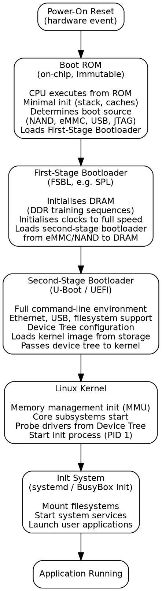

Title: SoC Article 11: HW/SW co-design, bridging software and silicon
Date: 2026-05-01
Category: Engineering
Tags: SoC, Hardware, Computer Architecture, Electronics, Embedded Systems, Linux, Firmware, Boot, Device Drivers, RTOS
Slug: soc-article-11-hw-sw-co-design
Author: morganp
Summary: How hardware and software are designed together on a SoC: the boot process from reset to running OS, device drivers, the HW/SW partitioning decision, virtual platforms, and the RTOS vs Linux choice.
Status: draft

*Series: Introduction to SoC Design | Article 11 of 11*

---

[]({attach}hw-sw-co-design-HQ.png)

## Introduction

Throughout this series, we have focused primarily on the hardware side of SoC design: the processors, memory, buses, and physical implementation. But a SoC without software is inert. The firmware that boots it, the operating system that manages its resources, the drivers that talk to its peripherals, and the applications that use it are just as important as the hardware itself.

**HW/SW Co-Design** is the discipline of designing hardware and software together, recognising that they are inseparable aspects of the same system. This article brings together the software side of the SoC story, covering the boot process, device drivers, the OS interface, and the co-design trade-offs that shape every product decision.

---

## The HW/SW interface: where they meet

Hardware and software communicate through a small number of well-defined mechanisms:

[]({attach}hwsw-interface-HQ.png)

### Memory-Mapped Registers

The primary interface between software and hardware on a SoC is **memory-mapped I/O**: every hardware block exposes a set of control and status registers (CSRs) at fixed addresses in the physical address space.

```
Typical UART Register Map (base address: 0x4000_0000):

  Offset  Register  Access  Description
  --------------------------------------------------------
  0x00    THR       WO      Transmit Holding Register
  0x00    RBR       RO      Receive Buffer Register
  0x04    IER       RW      Interrupt Enable Register
  0x08    IIR       RO      Interrupt Identification
  0x0C    LCR       RW      Line Control (baud, parity)
  0x10    MCR       RW      Modem Control
  0x14    LSR       RO      Line Status (TX ready, RX data)
  0x18    MSR       RO      Modem Status
  0x1C    SCR       RW      Scratch Register
```

To send a byte over UART, firmware:
1. Read LSR to check that the TX FIFO is not full.
2. Write the byte to THR.
3. Hardware takes over and drives the UART TX pin.

This read-modify-write register interface is the universal pattern for SoC firmware.

---

## The Software Stack

The software on a SoC is organised in layers, each depending on the layer below it:

[]({attach}software-stack-HQ.png)

---

## The Boot Process

Bringing a SoC from cold power-up to a running operating system is a multi-stage process, each stage loading and executing the next:



### DDR initialisation: a hardware-SW co-design example

One of the most hardware-specific firmware tasks is **DDR initialisation**. Modern LPDDR5 DRAM requires a training sequence: a complex set of calibration steps that establishes the optimal timing relationships between the SoC and the DRAM:

```wavedrom
{
  "signal": [
    {"name": "DRAM_CLK",    "wave": "N.........."},
    {"name": "DRAM_CMD",    "wave": "x2.2.2.2.2x", "data": ["MR_WRITE","ZQ_CAL","WR_LEV","RD_TRAIN","DONE"]},
    {"name": "DRAM_DATA",   "wave": "x....2.2.2x", "data": ["DQ_cal","DQS_cal","Valid"]},
    {"name": "BOOT_STATE",  "wave": "x2.2.2.2.2x", "data": ["PwrUp","Init","Train","Verify","Ready"]}
  ],
  "head": {"text": "DDR Initialisation Sequence (simplified)"}
}
```

The FSBL writes a sequence of magic values to the DDR controller and DRAM mode registers, then reads test patterns back to calibrate write and read timing. Only after this sequence completes successfully can the rest of the software stack use DRAM.

---

## Device Drivers

A **device driver** is the software module responsible for managing a specific hardware peripheral. Drivers abstract the hardware details, presenting a clean, standardised interface to higher software layers.

In Linux, a character device driver for a simple UART might look like:

```c
/* Simplified UART platform driver skeleton */
#include <linux/platform_device.h>
#include <linux/serial_core.h>
#include <linux/io.h>

#define UART_THR  0x00
#define UART_LSR  0x14
#define LSR_THRE  BIT(5)   /* TX holding register empty */

static void uart_write_char(struct uart_port *port, unsigned int c)
{
    /* Wait until TX FIFO has space */
    while (!(readl(port->membase + UART_LSR) & LSR_THRE))
        cpu_relax();
    /* Write character to hardware register */
    writel(c, port->membase + UART_THR);
}

static int uart_probe(struct platform_device *pdev)
{
    struct resource *res;
    void __iomem *base;

    /* Get MMIO base address from device tree */
    res  = platform_get_resource(pdev, IORESOURCE_MEM, 0);
    base = devm_ioremap_resource(&pdev->dev, res);

    /* Register with Linux serial framework */
    /* ... uart_add_one_port() ... */
    return 0;
}
```

The **Device Tree** (DTS) is the mechanism by which Linux discovers what hardware is present without hard-coding it in the kernel:

```dts
/* Device Tree fragment for a UART */
uart0: serial@40000000 {
    compatible = "myvendor,uart-v1";
    reg       = <0x40000000 0x100>;   /* MMIO base, size */
    interrupts = <GIC_SPI 32 IRQ_TYPE_LEVEL_HIGH>;
    clocks    = <&clk_periph>;
    clock-names = "uartclk";
    status    = "okay";
};
```

When Linux boots, it reads the Device Tree, matches `compatible` strings to registered drivers, and calls the driver's `probe()` function for each matching node.

---

## HW/SW Partitioning

The most important architectural decision in co-design is **which functions to implement in hardware and which in software**. This partitioning determines performance, power, flexibility, and development cost.

[]({attach}hwsw-partitioning-HQ.png)

### Real trade-off examples

**AES Encryption:**
- Software (Cortex-A, 1 core): ~300 MB/s, ~200 mW
- Hardware accelerator: ~10 GB/s, ~5 mW
- Decision: hardware, because encryption happens on every packet, latency is critical, and the algorithm is stable

**JSON Parsing:**
- Software (optimised C): ~500 MB/s
- Hardware: would require custom finite-state machine; format evolves
- Decision: software, because flexibility matters more than raw speed

**Video Decode (H.265):**
- Software (4 CPU cores): ~720p@30fps, ~2 W
- Hardware codec: ~8K@120fps, ~50 mW
- Decision: always hardware in a mobile SoC

---

## Co-Simulation and Co-Verification

HW/SW co-design requires testing both halves together before silicon exists. There are several approaches:

**Virtual platform and virtual prototype**: a software model of the SoC, typically written in SystemC/Transaction-Level Modelling (TLM), that runs on a host workstation. The firmware binary is compiled for the target ISA and runs on an instruction-set simulator (ISS). This allows firmware development to begin before RTL is complete.

[]({attach}virtual-platform-HQ.png)

**FPGA prototyping**: the RTL is synthesised onto one or more large FPGAs, running at 5-50 MHz. Real firmware and software run on the FPGA, providing a cycle-accurate model that can run full Linux. FPGA prototyping boards (Xilinx VCU118, Intel Stratix 10) are essential tools for pre-silicon software development.

**Hardware emulation**: as discussed in Article 10, emulators compile the RTL into custom FPGAs that run at MHz speeds, supporting real-time testing with actual peripherals.

---

## The RTOS vs Linux choice

For the CPU running on a SoC, a fundamental software decision is operating system choice:

| OS Type | Examples | Best For |
|---------|----------|----------|
| Bare Metal | None | Ultra-simple, few ms startup, max performance |
| RTOS | FreeRTOS, Zephyr, ThreadX | Hard real-time, < 1ms interrupt latency |
| Linux | Linux, Android | Feature-rich, large driver ecosystem, networking |
| Hypervisor | Xen, KVM | Running multiple OSes simultaneously (automotive, industrial) |

Many SoCs run **both**: a Cortex-M managing power and safety-critical functions runs an RTOS (real-time operating system) or bare metal, while a Cortex-A cluster running Linux or Android handles the application layer. This heterogeneous multi-OS configuration is increasingly common.

---

## IP Management and Reuse

As noted in Article 02, IP reuse is central to managing SoC complexity. Co-design extends this to include **software deliverables** alongside hardware IP:

A well-packaged IP block delivers:
- RTL source (encrypted or open)
- Testbench and UVM verification environment
- **Device driver** (Linux kernel module or RTOS driver)
- **Register description file** (IP-XACT, SystemRDL) for automatic header/driver generation
- **Reference firmware** (bare-metal startup, peripheral init code)
- **Documentation** (Technical Reference Manual, integration guide)

Increasingly, EDA tools automatically generate C header files and Linux device tree bindings from the hardware register descriptions, reducing the human effort and error risk in the software-hardware interface.

---

## Looking back: the complete picture

We have now traversed the entire SoC landscape:

1. [Article 01: From room to silicon]({filename}../2026-03-07_SoC_Article_01_From_Room_to_Silicon/2026-03-07_SoC_Article_01_From_Room_to_Silicon.md): integration, motivation, anatomy
2. [Article 02: What is a System on Chip]({filename}../2026-03-15_SoC_Article_02_Anatomy_and_Motivation/2026-03-15_SoC_Article_02_Anatomy_and_Motivation.md): anatomy, motivation, IP cores
3. [Article 03: The SoC design stack]({filename}../2026-03-21_SoC_Article_03_Design_Stack/2026-03-21_SoC_Article_03_Design_Stack.md): abstraction layers, IP cores, Y-chart
4. [Article 04: Processor cores]({filename}../2026-03-27_SoC_Article_04_Processor_Cores/2026-03-27_SoC_Article_04_Processor_Cores.md): CPU, DSP, GPU, NPU, big.LITTLE
5. [Article 05: Memory architecture]({filename}../2026-04-04_SoC_Article_05_Memory_Architecture/2026-04-04_SoC_Article_05_Memory_Architecture.md): cache hierarchy, DRAM, MMU
6. [Article 06: Interconnects and bus protocols]({filename}../2026-04-09_SoC_Article_06_Interconnects_and_Bus_Protocols/2026-04-09_SoC_Article_06_Interconnects_and_Bus_Protocols.md): AXI, AHB, APB, crossbar, NoC
7. [Article 07: Clocking, reset, and power domains]({filename}../2026-04-11_SoC_Article_07_Clocking_Reset_and_Power_Domains/2026-04-11_SoC_Article_07_Clocking_Reset_and_Power_Domains.md): PLL, CDC, DVFS, power gating
8. [Article 08: Peripherals and I/O]({filename}../2026-04-18_SoC_Article_08_Peripherals_and_IO/2026-04-18_SoC_Article_08_Peripherals_and_IO.md): UART, SPI, I2C, USB, DMA, IRQ
9. [Article 09: HDL and RTL design]({filename}../2026-04-18_SoC_Article_09_HDL_RTL_Design/2026-04-18_SoC_Article_09_HDL_RTL_Design.md): SystemVerilog, FSM, simulation
10. [Article 10: The SoC design flow]({filename}../2026-04-24_SoC_Article_10_Design_Flow/2026-04-24_SoC_Article_10_Design_Flow.md): spec to RTL to synthesis to P&R to tape-out

---

## Where to Go Next

With the introductory series complete, you are ready to explore the intermediate topics. These build directly on the foundations laid here:

### Intermediate series (10 articles)

1. **AXI4 Protocol Deep Dive**: burst types, out-of-order, QoS, debug
2. **Cache Coherency Protocols**: MESI in hardware, multi-core coherency
3. **Pipeline Design and Hazards**: forwarding, stalling, branch prediction basics
4. **RTL Synthesis and Timing Closure**: SDC, STA, ECO flows
5. **Clock Domain Crossing Techniques**: synchronisers, async FIFOs, CDC analysis tools
6. **SoC Verification with UVM**: agents, sequences, scoreboards, coverage
7. **DMA Controller Architecture**: descriptor chains, scatter-gather, QoS
8. **Interrupt Controllers in Depth**: GIC, NVIC, priority, virtualization extensions
9. **Memory-Mapped I/O and Linux Device Drivers**: writing real kernel drivers
10. **SoC Power Management Techniques**: DVFS governors, CPUIdle, power domains in Linux

### Advanced series (10 articles)

1. **Out-of-Order Execution Architecture**: Tomasulo, ROB, reservation stations
2. **Network-on-Chip Design**: topology, routing, flow control, virtual channels
3. **DRAM Subsystem Timing**: LPDDR5 protocol, refresh, power states, thermal throttle
4. **Physical Design: Floorplanning and P&R**: CTS, ECO, IR drop, antenna effects
5. **Hardware Security in SoC**: TrustZone, secure boot, side-channel attacks
6. **AI/ML Accelerator Architecture**: systolic arrays, dataflow, memory bandwidth analysis
7. **Formal Verification Methods**: model checking, SVA, property specification languages
8. **Post-Silicon Debug and Validation**: JTAG, CoreSight ETM, scan chains
9. **FPGA-Based SoC Design**: Zynq-7000, Cyclone V HPS, PetaLinux
10. **Heterogeneous SoC Partitioning**: HW/SW co-exploration, automated co-design tools

---

## Summary

HW/SW co-design recognises that hardware and software are two facets of the same system: neither is meaningful without the other. The boot process takes a SoC from silicon power-on to a running application through several carefully orchestrated stages. Device drivers form the critical interface between the operating system and hardware registers. The partitioning of function between hardware and software is the most impactful architectural decision. Virtual platforms, FPGA prototypes, and emulators allow software development to proceed before silicon is available. Mastering co-design is what separates SoC systems engineers from specialists who know only one half of the system.

---

*Previous: [Article 10: The SoC design flow]({filename}../2026-04-24_SoC_Article_10_Design_Flow/2026-04-24_SoC_Article_10_Design_Flow.md)*
