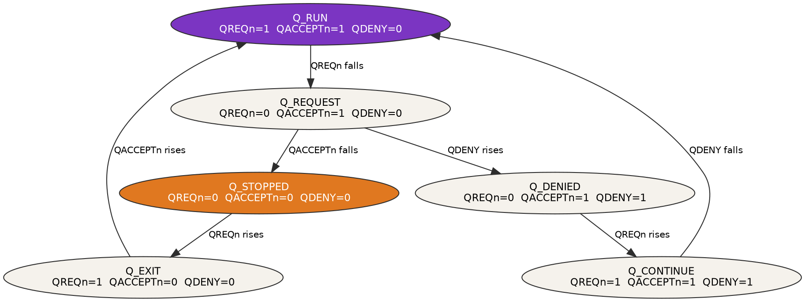

Title: AMBA low power interface: Q-Channel and P-Channel explained
Date: 2026-05-19
Category: Engineering
Tags: AMBA, LPI, SoC, Low Power, Q-Channel, P-Channel, Hardware, Embedded
Slug: amba-lpi-q-channel-p-channel
Author: Morgan Prior
Summary: A practical guide to AMBA Low Power Interface handshake protocols: Q-Channel and P-Channel signal tables, state machines, timing diagrams, and design rules from ARM IHI0068.
Status: published

[]({attach}/images/Engineering/AMBA_LPI/lpi-hero-HQ.png)

Modern System on Chip (SoC) designs contain dozens of independent IP blocks, each drawing power even when inactive. The AMBA (Advanced Microcontroller Bus Architecture) Low Power Interface (LPI) provides every block with a standardized handshake protocol to coordinate safe clock and power removal. This post covers both LPI interface types, Q-Channel and P-Channel, with timing diagrams and state machines drawn from the ARM IHI0068 specification.

## Why low-power handshaking matters

Every IP block on a System on Chip (SoC) draws power even when it sits idle. Clock gating and power gating are the primary tools for reducing that static power drain. Clock gating stops the clock to a block without removing its power rail. Power gating removes the power rail entirely for deeper power savings. Both techniques corrupt internal state if the controller applies them while the block has outstanding transactions or unflushed pipelines. A handshake protocol requires the block to signal that it has finished all activity before the controller removes its clock or power. Without this handshake, the controller has no reliable way to determine whether gating is safe.

## Signal naming conventions

AMBA (Advanced Microcontroller Bus Architecture) LPI (Low Power Interface) uses a consistent naming scheme across all its interfaces. Understanding this scheme makes signal tables and timing diagrams much easier to read.

### Active-level suffixes

Signals with an `n` suffix are active low: the signal is asserted when driven to logic 0. `QREQn` (quiescence request) is active when its value is 0, meaning the controller is requesting quiescence. Driving it to 1 deasserts the request. Signals without an `n` suffix are active high: `QDENY` is asserted when its value is 1, meaning the device is denying the request.

### Width notation

Multi-bit signals carry a width specifier in brackets. `PSTATE[M-1:0]` is M bits wide, where M is implementation defined. `PACTIVE[N-1:0]` is N bits wide, with one bit per monitored power domain. Single-bit signals carry no width notation.

### Parity check suffix

Issue D of IHI0068 introduced optional parity protection. Each primary signal gains a companion check signal with the `CHK` suffix. `QREQn` pairs with `QREQCHK`, and `QACCEPTn` pairs with `QACCEPTCHK`. Each check signal carries the odd parity of its primary signal, so the XOR of a signal and its check signal is always 1 when no fault is present.

## Q-Channel: the quiescence handshake

Q-Channel (Quiescence Channel) handles the most common low-power scenario: safely stopping a device so the controller can gate its clock or power. It evolved from the AXI Low Power Interface signals `CSYSREQ`, `CSYSACK`, and `CACTIVE`, and remains backward compatible with AXI LPI devices when `QDENY` is absent.

### Q-Channel signals

Q-Channel uses four signals. The controller drives `QREQn`; the device drives the remaining three.

| Signal | Direction | Active level | Description | Introduced |
|--------|-----------|-------------|-------------|------------|
| `QREQn` | Controller to device | LOW | Requests the device to quiesce | IHI0068 B |
| `QACCEPTn` | Device to controller | LOW | Device has quiesced; clock or power gating is safe | IHI0068 B |
| `QDENY` | Device to controller | HIGH | Device cannot quiesce at this time | IHI0068 B |
| `QACTIVE` | Device to controller | HIGH | Device has pending activity | IHI0068 B |

The specification requires `QREQn` to be register-driven at the controller. `QACCEPTn` and `QDENY` must be register-driven at the device. `QACTIVE` can be a combinational OR of internal activity signals.

### Q-Channel state machine

The Q-Channel defines 6 legal states. The values of `QREQn`, `QACCEPTn`, and `QDENY` determine the current state entirely. Two paths exist: an accepted path where the device quiesces, and a denied path where the device refuses and the controller withdraws.



The state table lists every legal combination and the corresponding device status:

| State | `QREQn` | `QACCEPTn` | `QDENY` | Device status |
|-------|---------|------------|---------|---------------|
| Q_RUN | 1 | 1 | 0 | Operational |
| Q_REQUEST | 0 | 1 | 0 | Draining activity; quiescence requested |
| Q_STOPPED | 0 | 0 | 0 | Quiescent; clock or power gating is safe |
| Q_EXIT | 1 | 0 | 0 | Restoring clock or power (implementation-defined delay) |
| Q_DENIED | 0 | 1 | 1 | Device denied the request; remains operational |
| Q_CONTINUE | 1 | 1 | 1 | Controller deasserted `QREQn` after denial |

The combination `QACCEPTn=0, QDENY=1` is illegal and must never occur.

### Accepted handshake

The accepted path runs from Q_RUN through Q_REQUEST, Q_STOPPED, and Q_EXIT and back to Q_RUN. The controller asserts `QREQn` low to start the handshake. The device drains its outstanding activity, drops `QACTIVE`, then asserts `QACCEPTn` low to confirm it is quiescent. The controller can gate the clock or power during Q_STOPPED. When the controller is ready to restore the device, it deasserts `QREQn` high, entering Q_EXIT. The device responds by deasserting `QACCEPTn` high once it detects the restored clock, returning to Q_RUN.

```wavedrom
{ "signal": [
    { "name": "QREQn",    "wave": "1.0.....1...", "node": "..a.....b..." },
    { "name": "QACCEPTn", "wave": "1....0....1.", "node": "....c.....d." },
    { "name": "QDENY",    "wave": "0..........." },
    { "name": "QACTIVE",  "wave": "1...0......." },
    {},
    { "name": "State", "wave": "=.=..=..=.=.", "data": ["Q_RUN","Q_REQUEST","Q_STOPPED","Q_EXIT","Q_RUN"] }
  ],
  "edge": ["a~>c controller requests quiescence", "b~>d controller releases device"],
  "head": { "text": "Q-Channel: accepted handshake", "tick": 0 },
  "foot": { "text": "Clock or power gating is safe during Q_STOPPED (QREQn=0, QACCEPTn=0, QDENY=0)" }
}
```

### Denied handshake

The denied path branches from Q_REQUEST when the device cannot quiesce. The device asserts `QDENY` high while keeping `QACCEPTn` high, entering Q_DENIED. The controller must withdraw its request by deasserting `QREQn` high, entering Q_CONTINUE. The device then deasserts `QDENY` low, and both sides return to Q_RUN. The controller can reattempt the request after it observes Q_RUN.

```wavedrom
{ "signal": [
    { "name": "QREQn",    "wave": "1.0.....1...", "node": "..a.....b..." },
    { "name": "QACCEPTn", "wave": "1..........." },
    { "name": "QDENY",    "wave": "0....1....0.", "node": "....c.....d." },
    { "name": "QACTIVE",  "wave": "1.........0." },
    {},
    { "name": "State", "wave": "=.=..=..=.=.", "data": ["Q_RUN","Q_REQUEST","Q_DENIED","Q_CONTINUE","Q_RUN"] }
  ],
  "edge": ["a~>c device denies quiescence", "b~>d controller withdraws request"],
  "head": { "text": "Q-Channel: denied handshake", "tick": 0 },
  "foot": { "text": "Device asserts QDENY while QACCEPTn stays high; controller must deassert QREQn in response" }
}
```

### Handshake transition rules

The IHI0068 specification defines strict conditions for each signal transition. These rules prevent illegal states from being reached.

`QREQn` rules:

- `QREQn` can fall only when `QACCEPTn` is HIGH and `QDENY` is LOW (the interface is in Q_RUN).
- `QREQn` can rise when both `QACCEPTn` and `QDENY` are LOW (Q_STOPPED), or both are HIGH (Q_CONTINUE).

`QACCEPTn` rules:

- `QACCEPTn` can fall only when `QREQn` is LOW and `QDENY` is LOW.
- `QACCEPTn` can rise only when `QREQn` is HIGH and `QDENY` is LOW.

`QDENY` rules:

- `QDENY` can rise only when `QREQn` is LOW and `QACCEPTn` is HIGH.
- `QDENY` can fall only when `QREQn` is HIGH and `QACCEPTn` is HIGH.

## P-Channel: multi-state power transitions

P-Channel (Power Channel) handles power management for devices that support multiple distinct power states. Each state can have different voltages, clock frequencies, and retention configurations. Use P-Channel when Q-Channel's binary run-stop model is insufficient for the power architecture. P-Channel communicates the target state directly to the device through an implementation-defined `PSTATE` encoding, rather than an implicit quiesce signal.

### P-Channel signals

P-Channel uses 5 signals. The controller drives `PSTATE` and `PREQ`; the device drives `PACTIVE`, `PACCEPT`, and `PDENY`.

| Signal | Direction | Active level | Width | Description | Introduced |
|--------|-----------|-------------|-------|-------------|------------|
| `PACTIVE[N-1:0]` | Device to controller | HIGH | N bits | Device activity indication; one bit per domain | IHI0068 B |
| `PSTATE[M-1:0]` | Controller to device | -- | M bits | Target power state (implementation defined) | IHI0068 B |
| `PREQ` | Controller to device | HIGH | 1 bit | Power state transition request | IHI0068 B |
| `PACCEPT` | Device to controller | HIGH | 1 bit | Device accepts the requested transition | IHI0068 B |
| `PDENY` | Device to controller | HIGH | 1 bit | Device denies the requested transition | IHI0068 B |

`PREQ` and `PSTATE` must be register-driven at the controller. `PACCEPT` and `PDENY` must be register-driven at the device. The `PSTATE` encoding is implementation defined; ARM publishes recommended values in the Power Policy Unit Specification. Only one of `PACCEPT` or `PDENY` changes per handshake transition.

### P-Channel state machine

The P-Channel defines 6 states, determined by the values of `PREQ`, `PACCEPT`, and `PDENY`. The normal path transitions from P_STABLE through P_REQUEST and P_ACCEPT before returning to P_STABLE. The denied path branches from P_REQUEST and returns via P_CONTINUE.


| State | `PREQ` | `PACCEPT` | `PDENY` | Description |
|-------|--------|-----------|---------|-------------|
| P_STABLE | 0 | 0 | 0 | Idle; device is in its current power state |
| P_REQUEST | 1 | 0 | 0 | Controller requests a transition to `PSTATE` |
| P_ACCEPT | 1 | 1 | 0 | Device accepts; transition is in progress |
| P_COMPLETE | 0 | 1 | 0 | Controller deasserts `PREQ`; transitional state |
| P_DENIED | 1 | 0 | 1 | Device denies the requested transition |
| P_CONTINUE | 0 | 0 | 1 | Controller returns `PREQ` low after denial; transitional state |

### Accepted transition

The controller sets `PSTATE` to the target state before asserting `PREQ` high. The device samples `PSTATE` when it detects `PREQ` rising. When the device is ready to transition, it asserts `PACCEPT` high. The controller responds by deasserting `PREQ` low, entering P_COMPLETE. When the transition completes, the device deasserts `PACCEPT` low and both sides return to P_STABLE.

```wavedrom
{ "signal": [
    { "name": "PREQ",    "wave": "0.1.....0...", "node": "..a.....b..." },
    { "name": "PACCEPT", "wave": "0....1....0.", "node": "....c.....d." },
    { "name": "PDENY",   "wave": "0..........." },
    { "name": "PSTATE",  "wave": "=.=.........", "data": ["IDLE", "SLEEP"] },
    { "name": "PACTIVE", "wave": "1...0......." },
    {},
    { "name": "State", "wave": "=.=..=..=.=.", "data": ["P_STABLE","P_REQUEST","P_ACCEPT","P_COMPLETE","P_STABLE"] }
  ],
  "edge": ["a~>c controller requests SLEEP state", "b~>d controller confirms transition done"],
  "head": { "text": "P-Channel: accepted handshake", "tick": 0 },
  "foot": { "text": "PSTATE must be stable before PREQ is asserted" }
}
```

### Denied transition

If the device cannot accept the requested transition, it asserts `PDENY` high instead of `PACCEPT`. The controller must respond by deasserting `PREQ` low, entering P_CONTINUE. The device then deasserts `PDENY` low, and both sides return to P_STABLE. The controller can reattempt the transition with the same or a different `PSTATE` value.

```wavedrom
{ "signal": [
    { "name": "PREQ",    "wave": "0.1.....0...", "node": "..a.....b..." },
    { "name": "PACCEPT", "wave": "0..........." },
    { "name": "PDENY",   "wave": "0....1....0.", "node": "....c.....d." },
    { "name": "PSTATE",  "wave": "=.=.........", "data": ["IDLE", "SLEEP"] },
    { "name": "PACTIVE", "wave": "1..........." },
    {},
    { "name": "State", "wave": "=.=..=..=.=.", "data": ["P_STABLE","P_REQUEST","P_DENIED","P_CONTINUE","P_STABLE"] }
  ],
  "edge": ["a~>c device denies transition", "b~>d controller withdraws request"],
  "head": { "text": "P-Channel: denied handshake", "tick": 0 },
  "foot": { "text": "Only one of PACCEPT or PDENY changes per handshake transition" }
}
```

## Choosing between Q-Channel and P-Channel

Q-Channel covers the majority of clock gating and simple power gating use cases. P-Channel is appropriate when a device supports multiple defined power states that require explicit enumeration. The ARM recommendation is to use Q-Channel where it is sufficient and to introduce P-Channel only for IP blocks with complex power policies.

| Criterion | Q-Channel | P-Channel |
|-----------|-----------|-----------|
| Number of power states | 2: run or quiescent | Many; implementation defined |
| Target state communicated to device | None; quiescence is implicit | Via `PSTATE` encoding |
| Backward compatible with AXI Low Power Interface (LPI) | Yes (without `QDENY`) | No |
| Complexity | Low | Higher |
| Typical use | Clock gating, simple power gating | Retention states, multi-voltage domains, complex power policy |

## Parity protection: Issue D additions

Issue D of IHI0068 (published September 2021) added optional parity protection to both Q-Channel and P-Channel. Each primary signal gains a companion check signal with a `CHK` suffix. For example, `QREQn` pairs with `QREQCHK`, and `QACCEPTn` pairs with `QACCEPTCHK`. Each check signal carries the odd parity of its primary signal, so the XOR of any signal and its check signal equals 1 when no fault is present. Parity protection is optional; systems without fault-detection requirements can omit the check signals.

### Q-Channel parity signals

| Primary signal | Check signal | Direction |
|----------------|-------------|-----------|
| `QREQn` | `QREQCHK` | Controller to device |
| `QACCEPTn` | `QACCEPTCHK` | Device to controller |
| `QDENY` | `QDENYCHK` | Device to controller |
| `QACTIVE` | `QACTIVECHK` | Device to controller |

### P-Channel parity signals

| Primary signal | Check signal | Direction |
|----------------|-------------|-----------|
| `PACTIVE[N-1:0]` | `PACTIVECHK[N-1:0]` | Device to controller |
| `PSTATE[M-1:0]` | `PSTATECHK[M-1:0]` | Controller to device |
| `PREQ` | `PREQCHK` | Controller to device |
| `PACCEPT` | `PACCEPTCHK` | Device to controller |
| `PDENY` | `PDENYCHK` | Device to controller |

## Backward compatibility with AXI LPI

AXI Low Power Interface (LPI) predates IHI0068 and uses three signals: `CSYSREQ`, `CSYSACK`, and `CACTIVE`. Q-Channel is the direct replacement and maps to these signals as follows:

| AXI LPI signal | Q-Channel equivalent | Notes |
|----------------|---------------------|-------|
| `CSYSREQ` | `QREQn` | Controller drives both |
| `CSYSACK` | `QACCEPTn` | Device drives both |
| `CACTIVE` | `QACTIVE` | Device drives both |
| (none) | `QDENY` | Tie `QDENY` LOW at the controller when connecting to an AXI LPI device |

When connecting a Q-Channel controller to an AXI LPI device that has no `QDENY` port, tie `QDENY` LOW at the controller. This removes the denied path and reduces the interface to the backward-compatible subset.

## Summary

AMBA Low Power Interface (LPI) provides two complementary handshake protocols for coordinating safe clock and power gating on System on Chip (SoC) designs. Q-Channel handles run-stop quiescence with 4 signals and 6 states, making it well suited to clock gating and straightforward power gating. P-Channel handles multi-state power transitions where the controller communicates the target state directly using an implementation-defined `PSTATE` encoding. Both interfaces follow strict transition rules to prevent illegal states. Issue D of IHI0068 added optional parity check signals to both interfaces for functional safety applications. The full specification is available from the ARM Documentation Service as [IHI0068D](https://documentation-service.arm.com/documentation/ihi0068/d?lang=en&rev=0).
