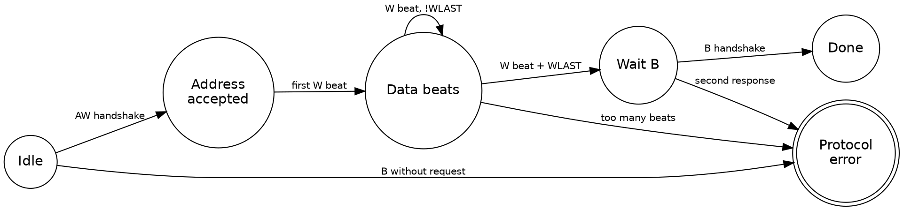

Title: SoC Intermediate 01: AXI4 protocol deep dive
Date: 2026-08-02
Category: Engineering
Tags: SoC, Hardware, Computer Architecture, Electronics, Embedded Systems, ARM, AMBA, AXI, AXI4, Bus Protocols, Verification
Slug: soc-intermediate-01-axi4-protocol-deep-dive
Author: morganp
Summary: The mechanisms behind AXI4 throughput and the bugs each one creates: burst encoding, transaction identifiers, out-of-order completion, outstanding transaction tracking, quality of service signalling, and the handshake rules that hand-written bridges break most often.
Status: published

[]({attach}/images/SoC/ArticleI01/00-axi4-hero-HQ.png)

*Series: Intermediate SoC Design | Article 1 of 10*

---

## Introduction

This article explains how the AXI4 protocol achieves high throughput, and why
that same design makes AXI4 hard to debug. It is written for engineers who
already know the five channels and now have to build, integrate, or debug a
real interface.

AXI is the Advanced eXtensible Interface, part of the AMBA family from ARM.
AXI4 connects the high-bandwidth blocks of a system on chip: processors,
direct memory access engines, graphics processors, display controllers,
memory controllers, and coherent interconnects. The
[introductory article on interconnects]({filename}../2026-04-09_SoC_Article_06_Interconnects_and_Bus_Protocols/2026-04-09_SoC_Article_06_Interconnects_and_Bus_Protocols.md)
described AXI as five independent channels with a valid and ready handshake.
This article goes further, into bursts, transaction identifiers, ordering,
backpressure, quality of service, and protocol compliance.

AXI is not a bus. It is a distributed flow-control contract between managers,
interconnects, subordinates, buffers, bridges, and clock converters. Every one
of those components can break the contract independently.

Note: this article uses the current AMBA terms manager and subordinate. Older
documents and much existing code use master and slave for the same roles. The
signal names are identical in both.

---

## The five channels revisited

AXI4 separates read traffic and write traffic into five independent channels.
Each channel carries its own handshake and makes progress on its own schedule.

[]({attach}/images/SoC/ArticleI01/01-five-channels-HQ.png)

| Channel | Name | Direction |
|---|---|---|
| `AW` | Write address | Manager to subordinate |
| `W` | Write data | Manager to subordinate |
| `B` | Write response | Subordinate to manager |
| `AR` | Read address | Manager to subordinate |
| `R` | Read data | Subordinate to manager |

A transfer occurs only on a rising clock edge where `VALID` and `READY` are
both high. That single rule governs every channel.

AXI decouples the address channels from the data channels deliberately. A
manager can send several write addresses before the subordinate accepts all
the write data. A subordinate can delay responses while it continues to accept
new addresses. This decoupling is the source of AXI throughput.

The cost of decoupling is bookkeeping. A correct design tracks every
outstanding transaction, because the protocol never promises that two channels
stay aligned.

---

## The valid and ready contract

The valid and ready handshake carries two discipline rules that hand-written
interfaces break more often than any other part of the protocol.

The first rule constrains the source. A source must not wait for `READY`
before it asserts `VALID`. If the source has a transfer available, it asserts
`VALID` immediately. A design that waits for `READY` first can deadlock
against a destination that waits for `VALID`.

The second rule constrains the payload. Once `VALID` is high, the payload must
stay stable until the transfer completes. The destination is free to assert
and deassert `READY` at any time, and that freedom is how backpressure travels
back through the system.

```wavedrom
{
  "signal": [
    {"name": "ACLK",    "wave": "P........."},
    {"name": "AWVALID", "wave": "0.1...0..."},
    {"name": "AWREADY", "wave": "0...10...."},
    {"name": "AWADDR",  "wave": "x.2...x...", "data": ["A0"]}
  ],
  "head": {"text": "The address holds stable across the stall, and the transfer occurs in the single cycle where AWVALID and AWREADY are both high"}
}
```

If the payload changes while `VALID` is high and `READY` is low, the
destination can capture corrupted information. The failure is intermittent,
because it appears only when the destination applies backpressure at the
moment the source changes its data.

---

## Burst types and addressing

A burst moves several data beats from one address phase. AXI4 supports three
burst types, selected by the `AxBURST` field.

[]({attach}/images/SoC/ArticleI01/02-burst-types-HQ.png)

| Burst | Behaviour | Typical use |
|---|---|---|
| `FIXED` | The address stays constant for every beat | A first in, first out data port |
| `INCR` | The address increments by the beat size | A normal memory copy |
| `WRAP` | The address increments, then wraps at an aligned boundary | A cache line refill |

Two fields encode the shape of the burst. `AxLEN` holds the beat count minus
one, so the transfer carries `AxLEN + 1` beats. `AxSIZE` holds the base 2
logarithm of the beat width, so each beat carries `2^AxSIZE` bytes.

```
Example: 4-beat INCR burst

  ARADDR = 0x8000_1000
  ARLEN  = 3          -> 4 beats
  ARSIZE = 3          -> 8 bytes per beat
  ARBURST= INCR

  Beat addresses:
    0x8000_1000
    0x8000_1008
    0x8000_1010
    0x8000_1018
```

### Wrapped bursts and cache line refills

A wrapped burst keeps every beat inside one naturally aligned region. Caches
use this to fetch the word the processor stalled on first, then collect the
rest of the line.

The wrap boundary is the total burst size, which is the beat count multiplied
by the beat width. When the address reaches that boundary, it returns to the
start of the aligned region rather than crossing into the next one.

```wavedrom
{
  "signal": [
    {"name": "ACLK",   "wave": "P........."},
    {"name": "RVALID", "wave": "0.1...0..."},
    {"name": "RREADY", "wave": "1........."},
    {"name": "RADDR",  "wave": "x.2345x...", "data": ["0x1008","0x100C","0x1000","0x1004"]},
    {"name": "RLAST",  "wave": "0....10..."}
  ],
  "head": {"text": "A 4-beat WRAP burst of 4 bytes per beat starting at 0x1008, wrapping at the 16-byte boundary"}
}
```

The address `RADDR` is shown for illustration. AXI does not carry an address
on the read data channel, because the manager already knows the address from
the read address phase.

---

## Anatomy of a write transaction

A write completes only when all three write-side channels finish their work.
The subordinate accepts the address, accepts every data beat, and returns a
response.

```wavedrom
{
  "signal": [
    {"name": "ACLK",    "wave": "P............"},
    {"name": "AWVALID", "wave": "0.10........."},
    {"name": "AWREADY", "wave": "0.10........."},
    {"name": "AWADDR",  "wave": "x.2x.........", "data": ["A"]},
    {},
    {"name": "WVALID",  "wave": "0...1....0..."},
    {"name": "WREADY",  "wave": "0...1.0.10..."},
    {"name": "WDATA",   "wave": "x...23..4x...", "data": ["D0","D1","D2"]},
    {"name": "WLAST",   "wave": "0.......10..."},
    {},
    {"name": "BVALID",  "wave": "0..........10"},
    {"name": "BREADY",  "wave": "1............"},
    {"name": "BRESP",   "wave": "x..........2x", "data": ["OKAY"]}
  ],
  "head": {"text": "A three-beat write burst with two cycles of data backpressure between the second and third beats"}
}
```

The address phase and the data phase are independent. The manager can present
write data before, during, or after the address handshake completes.

Many broken subordinates assume that `AW` and `W` arrive together. The
assumption survives a simple testbench, then fails against a real
interconnect that reorders the two channels through separate buffers.

`WLAST` marks the final data beat. A subordinate that counts beats without
checking `WLAST` cannot detect a manager that sends the wrong number.

---

## Anatomy of a read transaction

A read uses fewer channels than a write. One address phase produces one or
more read data beats, and the final beat carries `RLAST`.

```wavedrom
{
  "signal": [
    {"name": "ACLK",    "wave": "P..........."},
    {"name": "ARVALID", "wave": "0.10........"},
    {"name": "ARREADY", "wave": "0.10........"},
    {"name": "ARADDR",  "wave": "x.2x........", "data": ["A"]},
    {"name": "ARLEN",   "wave": "x.2x........", "data": ["3"]},
    {},
    {"name": "RVALID",  "wave": "0....1...0.."},
    {"name": "RREADY",  "wave": "1..........."},
    {"name": "RDATA",   "wave": "x....2345x..", "data": ["D0","D1","D2","D3"]},
    {"name": "RLAST",   "wave": "0.......10.."}
  ],
  "head": {"text": "A read burst returning four beats, with RLAST marking the final beat"}
}
```

The read response travels in the `RRESP` field of each beat rather than on a
separate channel. A burst can therefore report an error on one beat and
success on another.

---

## Transaction identifiers and ordering

Transaction identifiers let a manager keep several requests in flight at once.
The `AWID` and `ARID` fields tag requests, and the `BID` and `RID` fields tag
the matching responses.

[]({attach}/images/SoC/ArticleI01/03-out-of-order-HQ.png)

Two ordering rules follow from the identifiers:

- Transactions that share an identifier must complete in the order the manager issued them.
- Transactions with different identifiers can complete in any order, if the interconnect and the subordinate support it.

```
Out-of-order read completion

  Manager issues:
    ARID=4, address in DRAM, row miss, slow
    ARID=7, address in SRAM, fast

  Interconnect can return:
    RID=7 first
    RID=4 later

  For two requests that both use ARID=4:
    responses return in issue order
```

This rule is what lets a memory controller reorder requests around DRAM bank
conflicts. DRAM is dynamic random access memory, and a row miss costs tens of
nanoseconds that a reordered request can hide.

The identifier is not an address and not a priority. It is the manager's
statement about which of its own requests can complete out of order. A manager
that reuses one identifier for everything forbids all reordering, and loses
the performance that reordering provides.

---

## Tracking outstanding transactions

Every AXI4 component keeps state for the transactions it has started and not
yet finished. The decoupled channels make this bookkeeping mandatory rather
than optional.

A manager tracks its own outstanding requests. An interconnect tracks routing
state so responses reach the right manager. A subordinate that accepts several
requests tracks the responses it still owes.

```
Read outstanding table

  Slot  ID  Source manager  Target subordinate  Beats left  Status
  ----  --  --------------  ------------------  ----------  ---------
  0     3   CPU0            DDR                 8           waiting
  1     8   DMA             SRAM                1           returning
  2     4   GPU             DDR                 16          waiting
```

Five questions decide whether the bookkeeping is correct:

1. **Depth:** How many outstanding reads and writes each interface supports.
2. **Scope:** Whether the limits apply per manager, per subordinate, or globally.
3. **Interleaving:** Whether any component still expects write data interleaving.
4. **Errors:** How error responses reach the originating manager, and whether the counters still balance afterwards.
5. **Reset:** Whether a reset during an outstanding transaction leaves a counter or a route table entry stale.

The third answer is fixed by the standard, and it simplifies subordinate
design. AXI3 permitted write data interleaving, so a subordinate could receive
beats from two write bursts mixed together. AXI4 removed it.

---

## Response codes

Every AXI4 transaction reports a result. The result travels in `BRESP` for
writes and `RRESP` for reads.

| Response | Meaning |
|---|---|
| `OKAY` | The access succeeded |
| `EXOKAY` | An exclusive access succeeded |
| `SLVERR` | The target received the request and failed it |
| `DECERR` | Address decode failed, usually an unmapped address |

The interconnect generates `DECERR`, not the target peripheral. An unmapped
address has no target peripheral to generate anything, so the decode logic
answers on its behalf.

A system that returns nothing for an unmapped address hangs instead of
reporting a fault. This is one of the most common integration defects, and a
single read from an unmapped address detects it.

---

## Quality of service signalling

The `AxQOS` field lets a manager mark the relative urgency of a transaction.
Quality of service, abbreviated QoS, is a 4-bit value carried on both AXI4
address channels.

[]({attach}/images/SoC/ArticleI01/04-qos-arbitration-HQ.png)

A display controller fetching pixels for the next scanline needs low latency,
because late pixels tear the image. A background copy engine can wait. The
`AxQOS` field is how the manager states the difference.

The field is advisory. It changes nothing unless the interconnect or the
memory controller implements an arbitration policy that reads it.

```
QoS-aware arbitration

  High urgency:  display scanout read   AxQOS=0xF
  Medium:        CPU cache refill       AxQOS=0x8
  Low:           background DMA copy    AxQOS=0x2

  Arbiter decision considers:
    QoS class
    starvation counter
    target availability
    outstanding limit
```

A policy where the highest value always wins starves the lower classes.
Starved traffic holds buffers, full buffers apply backpressure, and
backpressure can deadlock the system that the priority scheme was meant to
protect. Production arbiters combine priority with an aging counter or a
guaranteed bandwidth share.

---

## Choosing between AXI4 and AXI4-Lite

AXI4-Lite is a subset of AXI4 intended for control and status registers. It
removes the features that a register bank never uses.

- Every transfer is a single beat.
- The burst fields are absent.
- The transaction identifier fields are absent.
- The resulting subordinate is smaller and far quicker to verify.

Use AXI4-Lite for register banks. Use full AXI4 for high-throughput data
movement. Attaching a large register block to full AXI4 gains nothing and
costs verification effort, unless system integration forces the choice.

---

## How AXI fails in practice

AXI failures usually appear as a hang rather than an error. A stalled
handshake produces no exception, no trap, and no log entry.

[]({attach}/images/SoC/ArticleI01/05-debug-flow-HQ.png)

The common root causes are:

- `VALID` deasserts before the destination asserts `READY`
- The payload changes while the transfer is stalled
- `WLAST` is missing, early, or late
- A subordinate assumes `AW` and `W` arrive in the same cycle
- An outstanding counter underflows or overflows
- A response identifier does not match any outstanding request
- An interconnect frees a route table entry before the final beat
- An unmapped access returns nothing instead of `DECERR`
- A clock domain bridge drops a beat under backpressure

The fastest way to diagnose any of these is to capture all five channels
around the stall. Then ask one question: which channel shows `VALID` high with
`READY` low, and which component owes the next move.

That question converts a system hang into a single accountable interface. The
component holding `READY` low is either waiting for something legitimate or
has lost track of its own state.

---

## A protocol monitor for the write channel

A small monitor catches most write channel violations before they reach
silicon. It watches the handshakes and flags any sequence the protocol
forbids.



The three transitions into the error state cover the failures that cost the
most debug time. A response without a request means the identifier tracking is
broken somewhere upstream. Too many beats means a beat counter disagrees with
`AWLEN`. A second response means two components both think they own the
transaction.

---

## Design checklist

Work through these decisions before the first line of interface code:

1. Define the maximum outstanding reads and writes for every manager.
2. Decide which managers use multiple transaction identifiers, and how many.
3. Size every buffer for worst-case backpressure, not for average throughput.
4. Add protocol assertions at every custom AXI boundary in the design.
5. Map the full address space so that unmapped accesses return `DECERR`.
6. Keep AXI4-Lite register blocks single-beat and strongly ordered.
7. Capture all five channels in the waveform setup used for hang debug.

---

## Summary

AXI4 performance comes from decoupling: independent channels, burst transfers,
backpressure, transaction identifiers, and out-of-order completion. Each of
those mechanisms raises throughput, and each one demands discipline in return.

That discipline covers handshake stability, outstanding transaction tracking,
response ordering, and error handling. Most AXI failures are not a
misunderstanding of one signal. They come from assuming that two independent
channels stay aligned when the protocol explicitly permits them to drift
apart.

---

*Next: Intermediate Article 02, Cache Coherency Protocols*
