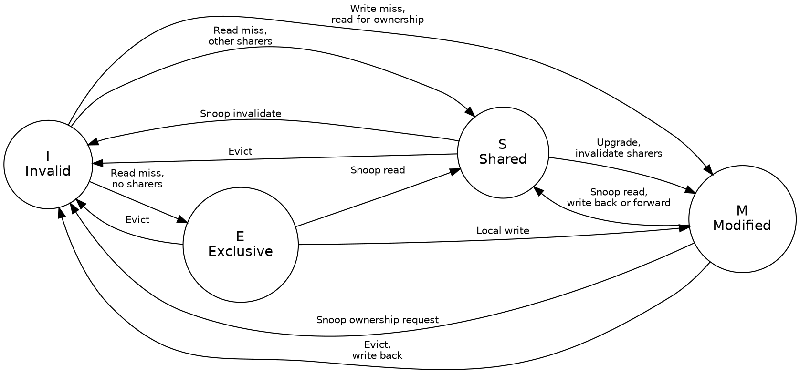
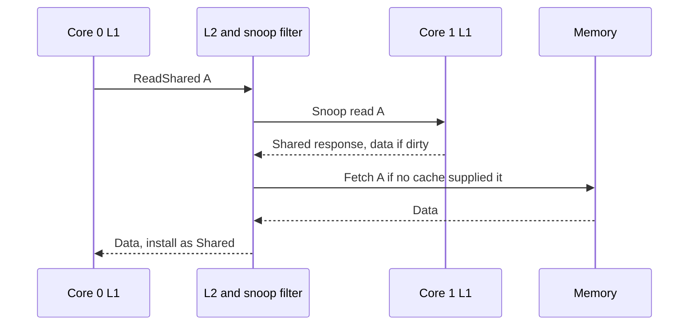

Title: SoC Intermediate 02: Cache coherency protocols
Date: 2026-08-06
Category: Engineering
Tags: SoC, Hardware, Computer Architecture, Electronics, Multicore, Caches, MESI, Coherency, ARM, Verification
Slug: soc-intermediate-02-cache-coherency-protocols
Author: morganp
Summary: Why two threads with separate counters can run slower than one thread, and the coherency machinery that explains it: the single-writer rule, MESI states, read-for-ownership, snooping, directories, snoop filters, and the cache line granularity that no amount of reading the source code reveals.
Status: published

[]({attach}/images/SoC/ArticleI02/00-coherency-hero-HQ.png)

*Series: Intermediate SoC Design | Article 2 of 10*

---

## Two counters that will not scale

Here is a loop that counts events. It runs in about 2 seconds.

```c
struct {
    long hits;
} stats[2];

// thread 0 runs: for (...) stats[0].hits++;
// thread 1 runs: for (...) stats[1].hits++;
```

You split it across two threads, one counter each. The threads share no
variables. There is no lock, no atomic, no memory barrier, and no bug that any
code review would catch. Each thread touches its own element and nothing else.

It now takes 6 seconds. Adding a core made the program three times slower.

Nothing in that code explains the result. The explanation lives one layer down,
in the hardware that keeps caches agreeing with each other. This article covers
that machinery: what it guarantees, how it works, and why it occasionally
punishes correct-looking code. It targets engineers building or integrating
multicore hardware, and the systems programmers who live with the result.

---

## Coherence is not consistency

Two terms sound interchangeable and are not. Getting them confused makes every
later discussion harder.

Coherence concerns one address at a time. If one core writes address `X`, every
other core eventually sees that write to `X`, and nobody keeps using a stale
copy. Cache controllers and the interconnect implement it.

Memory consistency concerns ordering between different addresses. It defines
what software can assume about the order of loads and stores to `X` and `Y`.
Barriers and acquire and release semantics live here. The instruction set
architecture defines the model, and cores, store buffers, and the coherency
fabric enforce it together.

A useful split: coherence is hardware keeping a promise about one location.
Consistency is the contract the hardware offers software about many locations.
This article is about coherence.

---

## The single-writer rule

Every coherent system rests on one invariant. Learn this and most of the
protocol becomes predictable.

```
For any cache line:

  Many caches may hold clean, readable copies.
  Only one cache may hold a dirty, writable copy.
```

[]({attach}/images/SoC/ArticleI02/01-single-writer-HQ.png)

Readers are cheap and can be plentiful. Writers are exclusive. When a core
wants to write a line that other caches hold, it must first take ownership and
remove every other copy.

That removal step is the source of most coherency traffic, most coherency
latency, and the performance mystery in the opening section.

---

## The four states of a cache line

MESI is the classic state machine for a cache line, named for its four stable
states. Each cache tracks a state per line, not per variable.

| State | Meaning |
|---|---|
| Modified | This cache holds the only valid copy, and it differs from memory |
| Exclusive | This cache holds the only valid copy, and it matches memory |
| Shared | This cache holds a clean copy, and other caches might hold it too |
| Invalid | This cache line holds nothing usable |



Exclusive is the state that repays study. A line arrives in Exclusive when a
core reads it and no other cache holds it. The copy is clean, so no writeback
is needed, but the core already has sole ownership. A later write moves it to
Modified with no bus traffic at all.

Without Exclusive, every first write to a freshly read line would need an
invalidate transaction that has nobody to invalidate. That is why the state
exists, and why protocols that omit it perform worse on private data.

Real designs add transient states on top of these four. A line waiting for
invalidate acknowledgements is neither Shared nor Modified, and the
implementation needs somewhere to put it.

---

## What happens on a read miss

A read miss is the simplest coherent transaction, and it introduces every
component involved.



The snoop filter decides who hears the request. It knows which caches might
hold the line, so it sends the snoop only to those, rather than to everyone.

If another cache holds the line in Modified, that cache owns the newest data
and memory is stale. It either writes the line back and lets memory answer, or
forwards the data directly to the requester. Direct forwarding, called cache to
cache transfer, is faster and most modern fabrics do it.

---

## Taking ownership before a write

A core cannot write a line it shares. It first issues a read-for-ownership,
which fetches the data and invalidates every other copy in one transaction.

```wavedrom
{
  "signal": [
    {"name": "clk",          "wave": "P........."},
    {"name": "Core request", "wave": "x2.......x", "data": ["RFO A"]},
    {"name": "Snoop inv",    "wave": "x.2.2....x", "data": ["Core1","Core2"]},
    {"name": "Snoop ack",    "wave": "x...2.2..x", "data": ["Ack1","Ack2"]},
    {"name": "Data grant",   "wave": "x......2.x", "data": ["A owned"]},
    {"name": "Line state",   "wave": "x2.....2.x", "data": ["I/S","M"]}
  ],
  "head": {"text": "Read-for-ownership: the line reaches Modified only after every invalidate is acknowledged"}
}
```

Read the last two rows together. The line state changes to Modified only after
both acknowledgements arrive. Until then the requesting core holds a promise,
not ownership.

That ordering is the single-writer rule expressed in silicon. A design that
transitions early creates a window where two caches both believe they can
write, and the resulting corruption appears only under precise timing.

The cost is visible in the diagram. Every write to a shared line pays for a
round trip to every sharer before it can proceed.

---

## Snooping: every cache hears everything

The direct way to keep caches agreeing is to let them all listen to the same
coherence traffic.

[]({attach}/images/SoC/ArticleI02/02-snooping-HQ.png)

Every cache observes every read, invalidate, and ownership request, and each
one checks whether it holds the line. The model holds few surprises during
bring-up, and latency is low because there is no lookup step before the
broadcast.

It stops scaling for three reasons:

- Snoop traffic grows with the product of core count and request rate
- Every broadcast wakes caches that do not hold the line, which wastes power
- One structure that every cache must observe becomes hard to close timing on

Snooping suits four cores. It does not suit thirty-two.

---

## Directories: telling only the caches that care

A directory records which caches might hold each line. The fabric consults it
and sends targeted snoops instead of broadcasting.

[]({attach}/images/SoC/ArticleI02/03-directory-HQ.png)

```
Directory entry for cache line A

  Tag:       A[PA tag]
  Owner:     Core3, when Modified
  Sharers:   Core0=1 Core1=0 Core2=1 Core3=0
  State:     Shared
```

A read from Core 1 now disturbs Core 0 and Core 2 only. Core 3 never sees the
request, so its cache stays quiet and its power stays down.

The costs are real. The directory needs storage proportional to the memory it
covers, which is why designs track only cached lines rather than all of memory.
Race handling also becomes harder, because the directory itself is a shared
structure that can be stale while a transaction is in flight.

---

## Snoop filters and the asymmetry of being wrong

A snoop filter is a compact directory whose job is avoiding pointless snoops.
It does not have to be precise, but it does have to be conservative in one
specific direction.

```
Conservative snoop filter rule:

  "Not present"   -> the line is definitely not in that cache.
  "Maybe present" -> the fabric sends a snoop to check.
```

The two ways of being wrong are not equivalent, and the difference matters more
than any other property of the structure.

A false positive says a cache might hold a line it does not hold. The fabric
sends a snoop, the cache answers that it has nothing, and the system loses a
little time and power. The result stays correct.

A false negative says a cache does not hold a line it actually holds. The
fabric skips the snoop, a stale copy survives an invalidate, and two caches
disagree about memory. The result is silent data corruption.

Treat a false negative as a correctness bug of the highest severity. It is not
a performance tuning question.

---

## The hardware does not share variables

Return to the two counters. The threads shared no variables, and that was true.
It was also irrelevant.

Coherency does not track variables. It has no idea that `stats[0].hits` and
`stats[1].hits` are different objects, because it never sees objects. It tracks
cache lines, typically 64 bytes, and a line is the smallest thing it can own,
share, or invalidate.

[]({attach}/images/SoC/ArticleI02/04-false-sharing-HQ.png)

```
One 64-byte cache line

  offset:  +0            +8                        +63
           [stats[0]]    [stats[1]]    [ ... rest of line ... ]
            ^ thread 0    ^ thread 1

  Thread 0 writes -> takes the line Modified, invalidates thread 1
  Thread 1 writes -> takes the line Modified, invalidates thread 0
  Thread 0 writes -> takes the line Modified, invalidates thread 1
```

Both counters sit in one line. Every write by either thread must take exclusive
ownership of that line, which means invalidating the other core's copy. The
line ping-pongs between the two caches, and each write pays a full coherency
round trip instead of hitting in L1.

This is false sharing. The name is precise: the threads share nothing at the
level of the source code, and everything at the level the hardware operates on.
No amount of reading the C source reveals it, because the C source does not
mention the unit that matters.

It is a software performance bug with a hardware cause, and neither layer is
wrong. The hardware is honouring the single-writer rule exactly as specified.

---

## When accelerators join the domain

Direct memory access engines and accelerators read and write memory without
executing any of the cache maintenance instructions a core would. Systems
handle this in one of three ways.

[]({attach}/images/SoC/ArticleI02/05-dma-coherency-HQ.png)

1. **Non-coherent:** Software cleans caches before a transfer out and invalidates them after a transfer in. The hardware is cheap, and a single missed maintenance operation corrupts the transfer.
2. **Input output coherent:** The engine participates in the coherency fabric for selected transactions, so its reads snoop the caches. Software stops needing maintenance for those buffers.
3. **Fully coherent:** The accelerator holds coherent copies itself, through a protocol such as ACE or CHI, and behaves like another core in the domain.

Each step up the list gains programmability and costs fabric complexity and
verification effort. Most bugs in this area come from the first option, where a
missing cache maintenance operation produces stale data that appears only when
timing shifts.

State the coherency domain boundaries explicitly in the specification. Every
engineer integrating a block needs to know which side of the boundary it sits
on.

---

## Atomics need the same ownership

Locks, reference counters, and queue indices all need read-modify-write
sequences that no other core can interleave with. Coherency supplies the
mechanism.

```
Atomic increment

  1. The core acquires the line with exclusive intent.
  2. The fabric prevents another core taking ownership unobserved.
  3. The core writes the updated value.
  4. If another core did intervene, the operation fails and software retries.
```

Exclusive monitors, load-reserved and store-conditional pairs, and far atomics
executed near memory are all built on this foundation. The coherence protocol
provides ownership, and the instruction set defines what software sees.

Contended atomics are expensive for the same reason false sharing is expensive.
Every attempt moves a line between caches.

---

## Why coherency bugs hide

Coherency bugs need specific interleavings, so they survive a great deal of
testing before appearing.

- Two cores racing for ownership of one line
- An eviction colliding with an inbound snoop
- A dirty line forwarded while its writeback is still pending
- A snoop filter entry replaced at the wrong moment
- Barrier ordering combined with outstanding writes
- A transfer reading memory that a cache still owns

None of these appear in a single-core test, and few appear in a directed
multicore test that runs the same order every time. Verification therefore
combines four approaches:

- Protocol checkers that watch the invariants continuously
- Randomised traffic to reach interleavings nobody predicted
- Formal properties for local invariants such as single-writer
- Directed tests for the race classes already known

---

## Design checklist

Decide these before the first line of coherent RTL:

1. Define the coherency domain boundaries in the specification.
2. Classify every requester as coherent, input output coherent, or non-coherent.
3. Keep stable line state and transient transaction state separate in the RTL.
4. Assert the single-writer invariant continuously, not only in directed tests.
5. Treat any snoop filter false negative as a correctness failure.
6. Measure false sharing and lock contention as part of performance sign-off.
7. Verify cache maintenance against real transfer buffers, not synthetic ones.

---

## Padding, and how to check

The fix for the opening example is one line. Give each counter its own cache
line:

```c
struct {
    long hits;
} __attribute__((aligned(64))) stats[2];
```

The program returns to 2 seconds, and the memory cost is 56 wasted bytes per
counter. That trade is almost always worth taking for data written by different
threads.

To find the problem rather than guess at it, use `perf c2c`. It reports cache
line contention directly, and names both the offending line and the offsets
within it:

```bash
perf c2c record ./your_program
perf c2c report
```

Worth running once on anything threaded that scales worse than it should. The
counters that fight are rarely the ones anybody suspects.

---

*Previous: [Article I-01: AXI4 protocol deep dive]({filename}../2026-08-02_SoC_Intermediate_01_AXI4_Deep_Dive/2026-08-02_SoC_Intermediate_01_AXI4_Deep_Dive.md)*
*Next: [Article I-03: Pipeline design and hazards]({filename}../2026-08-16_SoC_Intermediate_03_Pipeline_Hazards/2026-08-16_SoC_Intermediate_03_Pipeline_Hazards.md)*
