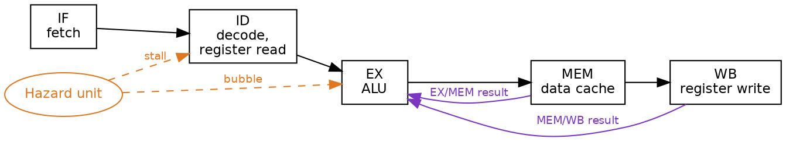
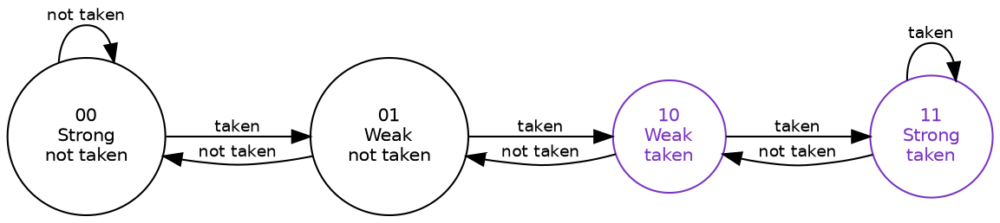
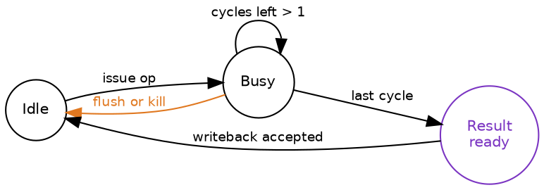

Title: SoC Intermediate 03: Pipeline design and hazards
Date: 2026-08-16
Category: Engineering
Tags: SoC, Hardware, Computer Architecture, Electronics, RISC-V, Pipelines, Branch Prediction, RTL, Verification
Slug: soc-intermediate-03-pipeline-design-and-hazards
Author: morganp
Summary: Why adding a pipeline stage can make a processor slower, and the hazard machinery that decides the outcome: forwarding paths, load-use stalls, branch prediction and flush, structural conflicts, multi-cycle units, and the valid bits that keep exceptions precise.
Status: published

[]({attach}/images/SoC/ArticleI03/00-pipeline-hero-HQ.png)

*Series: Intermediate SoC Design | Article 3 of 10*

---

## The stage that made it slower

The timing report said the execute stage was the critical path. You split it in
two, added a pipeline register, and closed timing at 1.3 GHz instead of 1.2. An
extra eight per cent of clock, for one register stage and a week of work.

Three of the four benchmarks gained around eight per cent, exactly as the
frequency did. The fourth, a pointer-heavy workload full of branches that go
whichever way the data feels like, lost four per cent. Same RTL, same compiler,
same test, faster clock, less work done.

This article is about pipeline hazards: the conflicts that appear the moment
instructions overlap, the hardware that resolves them, and the reason stage
count is such a fraught number. It targets engineers designing or verifying a
processor pipeline, and anyone reading a microarchitecture manual and wondering
why nobody simply builds a forty-stage machine.

---

## What overlapping actually buys

Classic reduced instruction set computer (RISC) pipelines are usually explained
with five stages, and the explanation is worth keeping because every later
complication attaches to one of them.

| Stage | Name | Work |
|---|---|---|
| IF | Instruction fetch | Read instruction memory or the instruction cache |
| ID | Decode and register read | Decode the opcode, read the register file |
| EX | Execute | Arithmetic logic unit operation or address calculation |
| MEM | Memory | Data memory or data cache access |
| WB | Write back | Write the result to the register file |

A single instruction still takes five cycles from fetch to writeback. Nothing
about pipelining makes one instruction faster. What it changes is how many
instructions can be in progress at the same time.

```wavedrom
{
  "signal": [
    {"name": "clk", "wave": "P..........."},
    {"name": "I0",  "wave": "23232xxxxxxx", "data": ["IF","ID","EX","MEM","WB"]},
    {"name": "I1",  "wave": "x23232xxxxxx", "data": ["IF","ID","EX","MEM","WB"]},
    {"name": "I2",  "wave": "xx23232xxxxx", "data": ["IF","ID","EX","MEM","WB"]},
    {"name": "I3",  "wave": "xxx23232xxxx", "data": ["IF","ID","EX","MEM","WB"]}
  ],
  "head": {"text": "Once the pipeline is full, one instruction completes every cycle"}
}
```

Latency is five cycles. Throughput approaches one instruction per cycle. Every
stage boundary you add shortens the critical path between registers, which is
why the timing report kept suggesting more of them.

The diagram above is also a lie of omission. It shows four instructions that
have nothing to do with each other. Real code is not like that.

---

## Three ways instructions collide

An instruction in a pipeline is no longer isolated. It may need a value, a
decision, or a piece of hardware that an older instruction has not finished
with. Those conflicts are pipeline hazards, and they come in three kinds.

- **Data hazards.** An instruction needs a value that is not available yet.
- **Control hazards.** The next program counter depends on a branch or an
  exception that has not resolved yet.
- **Structural hazards.** Two stages want the same piece of hardware in the
  same cycle.

Everything else in this article is the disciplined handling of those three,
without producing wrong results and without stalling more than necessary.

---

## Data hazards and the bypass network

Take the shortest dependent pair in any instruction set:

```asm
add x3, x1, x2     // x3 = x1 + x2
sub x5, x3, x4     // needs x3 immediately
```

The `add` writes `x3` in WB, in cycle 4. The `sub` reads its operands in ID, in
cycle 2, and needs them in EX in cycle 3. Left alone, the `sub` reads the old
value of `x3` and quietly computes the wrong answer.

Waiting is one answer, and it costs three cycles on a pattern that appears in
almost every basic block. The better answer is that the value already exists.
It sits in the EX/MEM pipeline register at the end of cycle 3, fully computed.
It is simply not in the register file yet.

Forwarding, also called bypassing, routes that result straight back to the
input of the execute stage instead of waiting for writeback.



Each execute-stage operand becomes a multiplexer choosing between three
sources: the register file value, the result of the immediately preceding
instruction sitting in EX/MEM, and the result of the instruction before that
sitting in MEM/WB. Priority matters. If both bypass sources match, the younger
one wins, because it holds the more recent value.

With those two paths in place, back-to-back arithmetic dependencies cost
nothing at all. This is the single highest-value structure in an in-order
pipeline, and it is why a naive stall-on-dependency design performs so badly by
comparison.

---

## The one it cannot fix

Forwarding works because the value exists somewhere earlier than the register
file. Loads break that assumption.

```asm
lw  x3, 0(x1)
add x5, x3, x4
```

The load data arrives from the data cache at the end of MEM, in cycle 3. The
dependent `add` wants it in EX, also in cycle 3, and no wire runs backwards in
time. One cycle of stall is unavoidable.

```wavedrom
{
  "signal": [
    {"name": "clk",   "wave": "P..........."},
    {"name": "lw",    "wave": "23232xxxxxxx", "data": ["IF","ID","EX","MEM","WB"]},
    {"name": "add",   "wave": "x239232xxxxx", "data": ["IF","ID","STALL","EX","MEM","WB"]},
    {"name": "stall", "wave": "0..10......."}
  ],
  "head": {"text": "The load-use hazard: one cycle of stall, then forward from MEM/WB"}
}
```

The pipeline holds IF and ID in place for a cycle and injects a bubble into EX.
After the stall, the ordinary MEM/WB bypass path delivers the value and the
`add` proceeds.

Detecting it is a comparison between the instruction in ID and the load already
in EX:

```verilog
assign load_use_hazard =
    ex_is_load &&
    (ex_rd != 5'd0) &&
    ((ex_rd == id_rs1) || (ex_rd == id_rs2));

assign stall_if          = load_use_hazard;
assign stall_id          = load_use_hazard;
assign insert_bubble_ex  = load_use_hazard;
```

The `ex_rd != 5'd0` term earns its place. On RISC-V, register `x0` reads as
zero and discards writes, so a load into `x0` produces no value anybody can
depend on. Without the check, every discarded load stalls a following
instruction that reads `x0`, which is a common idiom. Whatever your instruction
set, find its equivalent and prove it does not create phantom hazards.

Compilers know about this stall and schedule an independent instruction into
the gap when they can find one. When they cannot, the cost is real, and it
scales with how many cycles late the load data is.

---

## Control hazards and the cost of guessing

A branch changes the program counter, and the pipeline has already fetched past
it. In a five-stage design the condition resolves in EX, by which point two
younger instructions are in flight.

Waiting for the branch is the honest option and the slow one. It costs two
cycles on roughly one instruction in five. Resolving the branch earlier in ID
helps, at the price of a comparator on the critical path and a new forwarding
problem for the values being compared.

Every high-performance pipeline takes the third option: guess, and clean up
when the guess is wrong.

```wavedrom
{
  "signal": [
    {"name": "clk",        "wave": "P..........."},
    {"name": "branch",     "wave": "23232xxxxxxx", "data": ["IF","ID","EX","MEM","WB"]},
    {"name": "wrong path", "wave": "x239xxxxxxxx", "data": ["IF","ID","FLUSH"]},
    {"name": "wrong path", "wave": "xx29xxxxxxxx", "data": ["IF","FLUSH"]},
    {"name": "redirect",   "wave": "xxxx23232xxx", "data": ["IF","ID","EX","MEM","WB"]},
    {"name": "mispredict", "wave": "0..10......."}
  ],
  "head": {"text": "Misprediction resolved in EX: two instructions flushed, fetch redirected"}
}
```

Two fetched instructions become bubbles. Note what determines that number: it
is the distance between the fetch stage and the stage where the branch
resolves. Not the total pipeline depth, and not the branch itself.

---

## Predictors, and why two bits

A static predictor guesses from the instruction alone. Backward branches are
assumed taken and forward branches not taken, which is a decent guess because
backward branches are usually loops. It costs almost nothing and is right about
two thirds of the time.

Dynamic prediction learns from what the branch did before. The smallest useful
structure is a two-bit saturating counter per branch.



The second bit is the whole point. A loop that runs a hundred times and exits
once would, with a one-bit predictor, mispredict twice per execution of the
loop: once on the exit, and once again on the next entry, because the single
bit was flipped by that exit. The two-bit counter absorbs the anomaly, drops
from strong to weak, and keeps predicting taken.

Real branch prediction units go much further, with global history, tagged
geometric-length tables, branch target buffers, and return address stacks. They
all rest on the same trade: storage and complexity in exchange for a lower
misprediction rate, because misprediction is the thing that costs cycles.

When the guess is wrong, the younger instructions have to disappear:

```verilog
assign flush_if_id = branch_resolved && branch_mispredict;
assign flush_id_ex = branch_resolved && branch_mispredict;
assign next_pc     = branch_mispredict ? branch_target : pc_plus_4;
```

A flush turns wrong-path instructions into bubbles. It must also suppress every
side effect they could have had: register writes, memory writes, control and
status register updates, and any outstanding request already issued to a
multi-cycle unit. A flush that clears the valid bit but leaves a store enable
asserted is a memory corruption bug, and it will only appear when the branch
and the store line up in one specific way.

---

## What the extra stage actually bought

Now the opening result. Return to that pointer-heavy benchmark, and put numbers
against the two designs.

Cycles per instruction (CPI) starts at 1.0 for a full pipeline and gets worse
from there. On this workload, a quarter of instructions are branches, a fifth
of those branches are mispredicted because the data decides them, and loads
feed a dependent instruction immediately about half the time.

| Contribution | Five-stage | Six-stage |
|---|---|---|
| Base | 1.00 | 1.00 |
| Branch mispredict penalty | 3 cycles, 0.15 | 5 cycles, 0.25 |
| Load-use stall | 1 cycle, 0.075 | 2 cycles, 0.15 |
| Cache misses and other | 0.10 | 0.10 |
| **CPI** | **1.325** | **1.50** |
| Clock | 1.2 GHz | 1.3 GHz |
| **Instructions per second** | **906 M** | **867 M** |

The extra register stage did exactly what it was asked to do. It shortened the
critical path and the clock went up. It also moved branch resolution one stage
further from fetch and put the load data one cycle further from the consumer,
so every mistake got more expensive at the same time.

Here is the reframe. A pipeline stage costs nothing while the pipeline is
right, and costs the entire pipeline when it is wrong. You are not buying
throughput with depth. You are buying frequency, and paying for it with the
penalty on every event that discards work.

[]({attach}/images/SoC/ArticleI03/01-depth-penalty-HQ.png)

That explains the split in the results. The three benchmarks that gained were
predictable ones, where the pipeline is right almost all the time and depth is
nearly free. The one that lost was the one that is wrong constantly, where
depth is charged on every mistake.

It also explains the shape of the industry. The deepest commercial pipelines
appeared alongside the most elaborate branch predictors ever built, and that is
not a coincidence. Depth is only affordable if you are right.

---

## Structural hazards

The third class is the most mundane and the easiest to design out, if you find
it before tape-out. A structural hazard is hardware oversubscription: two
stages wanting one resource in one cycle.

[]({attach}/images/SoC/ArticleI03/02-structural-hazard-HQ.png)

The classic examples:

- One memory port serving both instruction fetch and data access, so every load
  or store stalls a fetch. This is the reason for separate instruction and data
  caches.
- A single register-file write port with two instructions completing at once,
  which happens as soon as any operation has a different latency from the rest.
- A shared multiplier still busy with a multi-cycle operation.
- Cache miss handling resources, such as miss status holding registers, already
  fully allocated.

The remedies are duplication, banking, arbitration, or stalling one user.
Choosing to stall is legitimate, and choosing it by accident is not. Every
resource with more than one potential claimant needs a documented arbitration
policy, including what happens when the loser is starved.

---

## Units that take their time

Multipliers, dividers, and floating-point units do not fit the one-cycle
execute model. They need their own small state machine, and the pipeline needs
to know when the result is coming.



The amber edge is the one that gets forgotten. If a branch flush or an
exception can kill an operation while the unit is mid-calculation, the unit
needs a valid bit or a transaction tag so a stale result cannot commit three
cycles later against a program counter that no longer exists. Divider results
arriving after the flush that should have killed them is a bug class of its
own, and it is invisible until a divide happens to sit just before an
unpredictable branch.

---

## Precise exceptions

Software expects an exception to look instantaneous: every older instruction
complete, no younger instruction having changed any architectural state, and a
program counter that says exactly where to resume. The hardware, meanwhile, has
five instructions in flight and has been speculating for the last three cycles.

[]({attach}/images/SoC/ArticleI03/03-commit-point-HQ.png)

Even an in-order pipeline has to work at this:

- A faulting load must not be followed by a younger register write.
- Wrong-path instructions must not perform stores.
- Control and status register writes must be ordered with respect to
  exceptions.
- The flush must clear every side-effect enable, not just the valid bits.
- If two instructions fault in the same cycle, the older one wins, always.

Out-of-order processors solve this with a reorder buffer and an explicit commit
stage. In-order pipelines solve it with valid bits and a clearly designated
point past which effects become visible. The mechanism differs, the rule does
not: pick one place where speculation ends, and let nothing escape it early.

---

## Design checklist

Settle these before writing the datapath, because retrofitting any of them is
painful:

1. Put a valid bit beside every pipeline register and treat it as the only
   thing that makes a stage's contents real.
2. Name the exact stage that commits register writes, memory writes, and
   control register side effects. Write it in the specification.
3. Add forwarding paths only where the value genuinely exists in time, and
   check each one against the timing report before committing to it.
4. Prove the zero register, and any other write-discarding destination, cannot
   create a false hazard.
5. Treat branch flush, exception flush, and debug halt as three cases of one
   mechanism, and verify all three.
6. Give every multi-cycle unit a kill path, and test that a result cannot
   commit after the instruction that produced it was flushed.
7. Test the interactions, not the cases: a stall and a flush arriving in the
   same cycle, a load-use pair straddling a mispredicted branch, an exception
   on the instruction directly behind a stalled load.

---

## Count the penalties before adding the stage

The design question is never "how deep should the pipeline be". It is "what
does this stage add to the branch resolution distance and the load-use
distance, and what is that worth on the code we actually run".

Both numbers are countable on a whiteboard before any RTL exists. Multiply each
by how often the event happens in your workload, add them to the base CPI, and
divide the new clock frequency by the result. If that number is not comfortably
larger than the old one, the stage is not worth the week.

Point 7 of the checklist is where the real bugs live, and it is the point most
often skipped. Stall-and-flush in the same cycle is one line in a verification
plan and, judging by errata sheets, several months of somebody's life.

---

*Previous: [Article I-02: Cache coherency protocols]({filename}../2026-08-06_SoC_Intermediate_02_Cache_Coherency/2026-08-06_SoC_Intermediate_02_Cache_Coherency.md)*
*Next: [Article I-04: RTL synthesis and timing closure]({filename}../2026-08-28_SoC_Intermediate_04_Synthesis_Timing/2026-08-28_SoC_Intermediate_04_Synthesis_Timing.md)*
