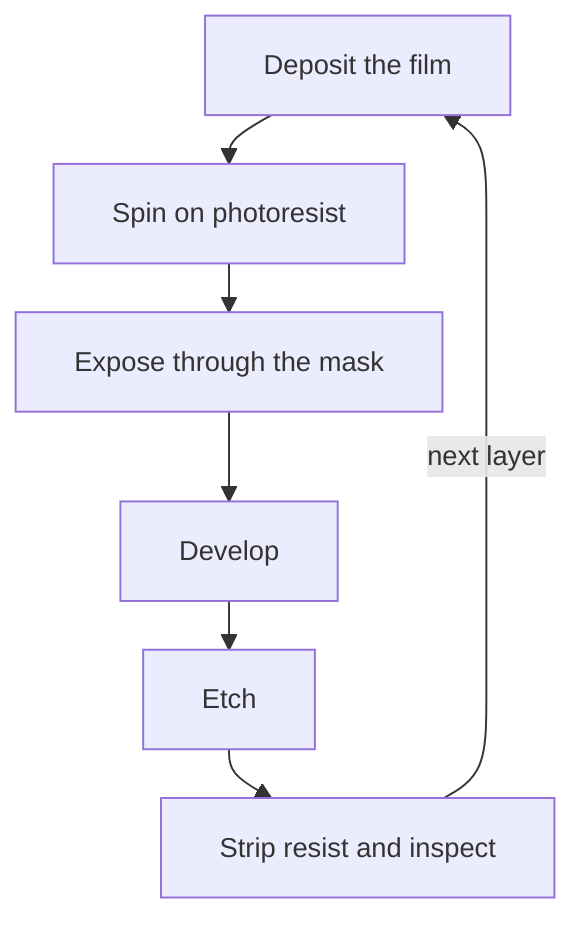

Title: Digital Design 01: Mask sets, and how a transistor gets built
Date: 2026-08-18
Category: Engineering
Tags: Digital Design, Electronics, Semiconductors, CMOS, MOSFET, Photolithography, Photomask, Fabrication, ASIC
Slug: digital-design-01-mask-sets-and-how-a-transistor-gets-built
Author: morganp
Summary: What a photomask is, the sequence of masks that turns a blank wafer into a MOSFET, why the mask count keeps climbing, the approximate cost of a mask set at each geometry from 250 nm down to 3 nm, and what an A1 metal spin costs against a B0 all-layer respin.
Status: published

*Series: Digital Design Fundamentals | Article 1*

---

## The forty pence chip

A small microcontroller in a reel of three thousand costs about forty pence. It
holds a processor, flash, RAM, a handful of timers and a bootloader, and the
supplier will happily sell you one.

The set of photomasks used to make it cost somewhere north of a quarter of a
million pounds, paid once, years ago, before a single working part existed.
Nothing about the forty pence recovers that. The forty pence is glass, gas,
electricity, packaging and test, spread over tens of millions of parts. The
quarter of a million was the price of being allowed to start.

This article is about that gap. It covers the photomask itself, the sequence of
masks that builds a metal-oxide-semiconductor field-effect transistor (MOSFET)
out of a blank wafer, why the number of masks keeps rising, the approximate cost
of a mask set at each process geometry, and what a respin costs when the first
attempt is wrong. It targets anyone
learning digital design who has been told "the transistor is a switch" and
would like to know where the switch comes from, and anyone weighing a custom
chip against a field-programmable gate array (FPGA).

---

## A mask is a stencil, and there is one per patterned layer

A chip is not carved. It is built up in layers, and every layer that needs a
pattern gets that pattern from a **photomask**: a flat plate of fused silica,
usually a 6 inch square a quarter of an inch thick, carrying an opaque chrome
image of the shapes for that one layer. Fused silica is amorphous silicon
dioxide, chosen because it is transparent at the exposure wavelength and barely
expands when the plate warms up. In the trade it is often called a quartz plate,
though it is not quartz: quartz is crystalline, fused silica is not. The mask is
glass. The wafer it prints onto is single-crystal silicon. They are not the same
material.

Three facts about the mask decide most of the economics that follow.

**It is not the same size as the chip.** In a modern scanner the mask, called a
**reticle**, is drawn four times larger than the pattern it prints. The optics
demagnify the image by four on its way to the wafer, so a 1 micrometre chrome
feature on the plate prints a 250 nanometre feature in resist. Making the plate is
therefore easier than making the chip, which is the only reason the plate can
be made at all.

**One exposure covers a small area.** The reticle field is roughly 26 mm by
33 mm at the wafer. A 300 mm wafer holds a few hundred of those fields, and the
scanner steps across the wafer exposing them one at a time. A die larger than
the reticle field cannot be printed in one shot, which is a hard ceiling on
single-die size and one of the arguments for chiplets.

**One mask means one layer, one shot.** The mask has no adjustments. Every
change to the design, however small, on whatever layer, means a new plate for
that layer. This is why a bug found after tape-out is expensive in a way that
software bugs are not.

The resolution the scanner can print follows the Rayleigh relation:

    smallest half-pitch  =  k1 x wavelength / numerical aperture

with `k1` a process factor around 0.3 in practice. Deep ultraviolet immersion
lithography uses 193 nm light and a numerical aperture of about 1.35, giving
roughly a 40 nm half-pitch in a single exposure. That number is the wall the
industry has been climbing over since 2005, and the way it climbed over is the
reason mask counts exploded. More on that below.

---

## Building an inverter's transistors, one mask at a time

The complementary metal-oxide-semiconductor (CMOS) process needs two kinds of
transistor: an **nMOS**, which conducts when its gate is high, and a **pMOS**,
which conducts when its gate is low. Both are built simultaneously on the same
wafer, and the sequence below produces one of each.

The starting material is a polished slice of single-crystal silicon, lightly
doped p-type, 300 mm across and under a millimetre thick.

**1. n-well (mask 1).** A pMOS needs to sit in n-type silicon. The n-well mask
opens windows where phosphorus or arsenic is implanted and driven in, creating
tubs of n-type material inside the p-type wafer. Every pMOS on the chip lives
in one of these.

**2. Isolation (mask 2).** Trenches are etched between the regions that will
become transistors and filled with oxide. This is **shallow trench isolation**,
and it stops neighbouring devices leaking into each other. The mask defines the
**active** areas, meaning everywhere a trench is not.

**3. Gate oxide.** A thin insulating layer is grown over the whole active area,
a few atoms thick at modern nodes. No mask: it is grown everywhere and removed
later where it is not wanted. This layer is the "oxide" in MOSFET, and the
capacitor it forms lets a voltage on the gate control the silicon
underneath without any current flowing into the gate.

**4. Gate (mask 3).** Polysilicon is deposited over the whole wafer, then
patterned. What survives is the gate electrode. The width of that stripe where
it crosses an active area is the **channel length**, historically the number a
process is named after: the 130 nm process drew a 130 nm gate.

This is the most critical mask in the set. Channel length sets drive current and
switching speed, so its dimensional control drives the entire process.

**5. Source and drain (masks 4 and 5).** Dopant is implanted on both sides of
the gate: n-type for the nMOS regions, p-type for the pMOS regions, so two
masks, each blocking the areas the other one implants. The gate itself blocks
the implant from the silicon directly beneath it, so the source and drain end up
self-aligned to the gate rather than aligned by the scanner. That trick,
introduced around 1970, removed alignment tolerance from the most sensitive
dimension on the chip and is the reason the polysilicon gate replaced the
earlier aluminium one.

At this point there are transistors, and they are connected to nothing.

**6. Contacts (mask 6).** Oxide is deposited over everything and holes are
etched down to each source, drain and gate, then filled with tungsten. These
are the plugs the wiring connects to.

**7. Metal 1 (mask 7), via 1 (mask 8), metal 2 (mask 9), and so on.** Each
metal layer is a mask, and each layer of vias joining two metals is another
mask. Modern logic processes stack ten to fifteen metal layers: the lowest are
thin and dense for wiring inside a standard cell, the highest are thick and wide
for power distribution and long-distance signals.

**8. Passivation and pads (final masks).** A protective layer over the whole
die, with openings where bond pads or bumps need to make contact with the
outside world.

Counting: two masks before the transistors exist, three to make them, one for
contacts, and then two per metal level for the rest. A simple two-metal process
lands around twelve masks. A fifteen-metal modern logic process is already past
forty before any of the complications below.

---

## What one masking step actually involves

Every one of those numbered steps expands into the same loop. The mask count
multiplies its cost and its yield risk.

Photoresist is a polymer whose solubility changes where light hits it. Expose,
develop, and the mask pattern now exists in resist on the wafer. Etch, and it
exists in the film underneath. Strip the resist, and the layer is finished.

Two consequences fall out of the loop.

A wafer visits the scanner once per mask, and the scanner is the most expensive
tool in the fab. Mask count therefore drives cycle time and wafer cost together,
not just the one-off cost of the plates. A forty-mask flow takes six to eight
weeks of processing; an eighty-mask flow takes three months or more.

Every step is an opportunity to lose the die. A single particle in one exposure
kills the chips it lands on. With eighty steps, per-step yield has to be
extraordinary before the product of them is usable, which is why fabs are
obsessive about contamination and why defect density, not lithography, usually
limits how large a die can economically be.

---

## Why the mask count keeps climbing

Single-exposure 193 nm immersion lithography stops at roughly 40 nm half-pitch,
and the industry reached that around the 32 nm node. The features kept
shrinking anyway. Three mechanisms did it, and all three cost masks.

**Multiple patterning.** Split one dense layer into two or more sparser layers,
each printable on its own, and superimpose them. Litho-etch-litho-etch (LELE)
turns one mask into two, LELELE into three. Self-aligned double and quadruple
patterning (SADP, SAQP) print a sparse grid and use deposited spacers to halve
the pitch, then need **cut masks** to remove the unwanted segments. A single
logical layer such as metal 1 can consume four or five plates at 10 nm and 7 nm.

**More structure per transistor.** A planar transistor is a stripe of poly over
a flat active area. A FinFET is a set of vertical fins, needing a fin-definition
mask and fin-cut masks. A gate-all-around nanosheet device stacks channels
vertically and adds its own patterning steps. Extra masks buy tighter electrostatic
control of the channel, which keeps the switch behaving like a switch at these
dimensions.

**Extreme ultraviolet lithography pushes the other way.** EUV uses 13.5 nm
light prints in a single exposure a pattern that deep ultraviolet needed three
or four exposures to build up, so it removes masks from the critical layers even as
it raises the cost per mask sharply. It also abandons the quartz plate. Nothing
is usefully transparent at 13.5 nm, so an EUV mask is a mirror rather than a
stencil: a low-expansion glass blank, about forty alternating molybdenum and
silicon layers to reflect the light, and a tantalum-based absorber patterned on
top. That construction is a large part of an EUV plate's price. It also explains
why 7 nm and 5 nm did not carry on doubling their mask counts: EUV collapsed several of the worst
multi-patterned layers back into one plate each.

| Node | Typical mask count | Metal layers | Masks in the metal stack | What is driving it |
|---|---|---|---|---|
| 250 nm | 20 to 24 | 4 to 5 | 8 to 10 | Planar, aluminium wiring, single exposure everywhere |
| 180 nm | 24 to 28 | 5 to 6 | 10 to 12 | More metal layers |
| 130 nm | 28 to 32 | 6 to 8 | 12 to 16 | Copper interconnect arrives |
| 90 nm | 32 to 36 | 7 to 9 | 14 to 18 | Strained silicon |
| 65 nm | 36 to 40 | 8 to 10 | 16 to 20 | Immersion lithography arrives |
| 40 nm | 40 to 45 | 9 to 11 | 18 to 22 | Immersion at the limit, more resolution enhancement |
| 28 nm | 45 to 50 | 10 to 12 | 20 to 25 | Last node before multiple patterning is unavoidable |
| 16 nm | 55 to 65 | 11 to 13 | 24 to 32 | FinFET, and double patterning on the lower metals |
| 7 nm | 75 to 85 | 13 to 15 | 32 to 42 | Multi-patterning at its worst, early EUV |
| 5 nm | 80 to 90 | 14 to 16 | 34 to 44 | EUV on many critical layers, extra device-level masks |
| 3 nm | 85 to 100 | 15 to 18 | 36 to 48 | More EUV layers, gate-all-around structures |

The metal stack is the reason the totals climb so steadily. Each metal level
needs a mask for the wires and another for the vias beneath them, so a level
costs two plates, and the lowest two or three levels need multiple patterning
at 16 nm and below. Roughly half of a modern mask set is wiring.

Treat these as ranges, not specifications. Every foundry has several flavours of
each node, and options such as extra metal layers, embedded flash, high-voltage
devices or radio-frequency passives add masks on top.

---

## Mask set cost, in round numbers

Mask cost is not published in any consistent way, and real quotes are covered by
non-disclosure. What follows are the orders of magnitude generally cited in the
public literature and in multi-project wafer programme pricing. Use them for
deciding which node to think about, and never for a purchase order.

| Node | Full mask set (A0) | Metal-only spin (A1) | Per-plate feel |
|---|---|---|---|
| 250 nm | £50k to £120k | £15k to £40k | A few thousand each, no resolution enhancement |
| 180 nm | £100k to £250k | £30k to £80k | Still cheap plates, more of them |
| 130 nm | £200k to £400k | £60k to £140k | Optical proximity correction starts to matter |
| 90 nm | £400k to £800k | £120k to £250k | Correction on most layers, phase shift on critical ones |
| 65 nm | £700k to £1.5M | £200k to £450k | Heavy resolution enhancement |
| 40 nm | £1.5M to £3M | £400k to £900k | Critical plates cost tens of thousands each |
| 28 nm | £2M to £4M | £600k to £1.2M | The value node, still popular for exactly this reason |
| 16 nm | £4M to £8M | £1.2M to £2.5M | FinFET plus double patterning |
| 7 nm | £8M to £15M | £2.5M to £5M | Mask count and plate cost rise together |
| 5 nm | £12M to £25M | £4M to £8M | EUV plates alone are six figures each |
| 3 nm | £20M to £40M | £6M to £12M | Where "who is this for" becomes the real question |

Two things drive the climb. The plates get more numerous, as the previous table
shows. And each critical plate gets more expensive, because the chrome pattern
is no longer a copy of the drawn layout: **optical proximity correction**
deliberately distorts it, adding serifs, hammerheads and scattering bars so that
the diffracted image on the wafer comes out the shape you wanted. Those
corrections are computed for every polygon on the layer, which is why a single
advanced critical mask can take days of compute and a six-figure sum before it
is written.

And the mask set is only one line in the total. Design tool licences,
intellectual property blocks, engineering time, packaging, test development and
qualification are usually larger. A 28 nm project is commonly quoted in the tens
of millions all-in; a 5 nm one in the hundreds of millions. The mask set is the
part that is easiest to point at, not the part that dominates.

**Not every project buys a set.** A **multi-project wafer** run shares one
reticle between many customers, each taking a few square millimetres, and splits
the mask cost accordingly. University and small-company shuttles at 180 nm or
130 nm come in at low tens of thousands, and open-source shuttles on a 130 nm
process have put a small design on real silicon for a few hundred. You get a few
tens of packaged parts, not a product, but for learning, for research, and for
proving an idea, prototyping never touches a full mask set.

---

## A0, A1, B0: the price of being wrong

Silicon revisions are named by a convention borrowed from the processor
vendors, and it encodes exactly the distinction the two columns above draw.

A stepping name is a letter and a digit. The letter counts base layer
revisions, meaning the transistors themselves. The digit counts metal
revisions on top of those base layers.

| Stepping | Meaning | Letter | Digit | Masks needed |
|---|---|---|---|---|
| A0 | First silicon | A, the first | 0, no metal revisions yet | Full set, every layer |
| A1 | Metal-only spin | A, unchanged | increments to 1 | Metal and via layers only |
| B0 | All-layer spin | increments to B | resets to 0 | Full set again |

The digit climbs while the transistors stay as they are: A0, A1, A2. The moment
a fix needs a different transistor rather than a different wire, the letter
increments, the digit resets, and the part becomes B0 at full mask set cost.
Metal spins on the new base layers then start again at B1.

A **metal-only spin** works because the fault is in the connections, not the
devices. The fab holds partly processed wafers at the point where the
transistors are finished and the wiring has not started, a stage usually called
the wafer bank. A new set of metal and via plates goes on top of banked
material, so an A1 pays for a fraction of the plates and skips a fraction of the
processing.

Two consequences follow, and both are decisions taken long before the bug
exists.

**It has to be designed for.** A metal fix can only rewire gates that are
already on the die. Teams scatter spare cells across the floorplan, or use a
gate-array style fabric, precisely so that an engineering change order has
something to connect. Without that, every fix is a B0.

**The time matters more than the money.** An all-layer spin repeats the full
flow: ten to fourteen weeks at an advanced node, six to eight at a mature one,
before packaged parts come back. A metal-only spin starts from banked wafers and
turns around in three to six weeks. In a market with a launch date, the schedule
usually decides the argument, not the several million pounds.

This is the real reason verification budgets look the way they do. The
alternative to finding a bug in simulation is a number from one of those two
columns, plus a quarter of a year.

---

## The thing the price tag is actually measuring

The natural reading of that table is that advanced silicon is expensive. Turned
around, it says something closer to the truth.

Cost per transistor has fallen for fifty years. Cost per **design** has risen
for the same fifty years. The mask set is not the price of a chip. It is the
price of the decision to make a chip that is different from every other chip,
paid before you know whether the design is correct.

Every structural feature of the industry follows from those two curves crossing.
System on chip integration exists because once you are paying for a mask set,
adding more function to the same die is nearly free, while a second die means a
second set. FPGAs exist because someone else already paid for the mask set and
sells you a share of it. Chiplets exist because splitting a system lets the
parts that need 3 nm go there while the parts that do not stay on 28 nm and keep
their cheap masks. Mature nodes stay busy for decades because a design that fits
in 130 nm has no reason to pay 5 nm mask costs. The forty pence microcontroller
is a mask set from years ago, fully amortised, still printing.

---

## Before you pick a node

A short checklist for the moment this stops being theory.

- Work out the mask cost per unit at your expected volume first. A £3M mask set
  over 10,000 parts is £300 per part before anything else. Over 10 million it is
  30 pence.
- Ask whether you need the density. If the design fits comfortably in 130 nm or
  65 nm, the cheap masks and the mature yield are worth more than the transistor
  count.
- Check whether a multi-project wafer covers your prototype. Two shuttle runs
  and a full set afterwards is usually cheaper than getting a full set wrong.
- Count your metal layers. They are two masks each, they are around half the
  set, and an over-generous stack is a quiet line item.
- Decide before tape-out whether you want the option of a metal-only spin, and
  put the spare cells in to support it. That choice separates a three week A1
  from a three month B0.
- Treat tape-out as irreversible. There is no patch. Everything the verification
  and sign-off effort costs is being compared against the numbers in that table.

The masks make transistors. The next article wires two kinds of transistor into
the smallest useful circuits: the inverter, the NAND and the NOR, and the
pull-up and pull-down networks that decide why those three are the gates the
libraries are built from.

---

*Next in the series: pull-up and pull-down networks, and why a static CMOS gate is always inverting.*
