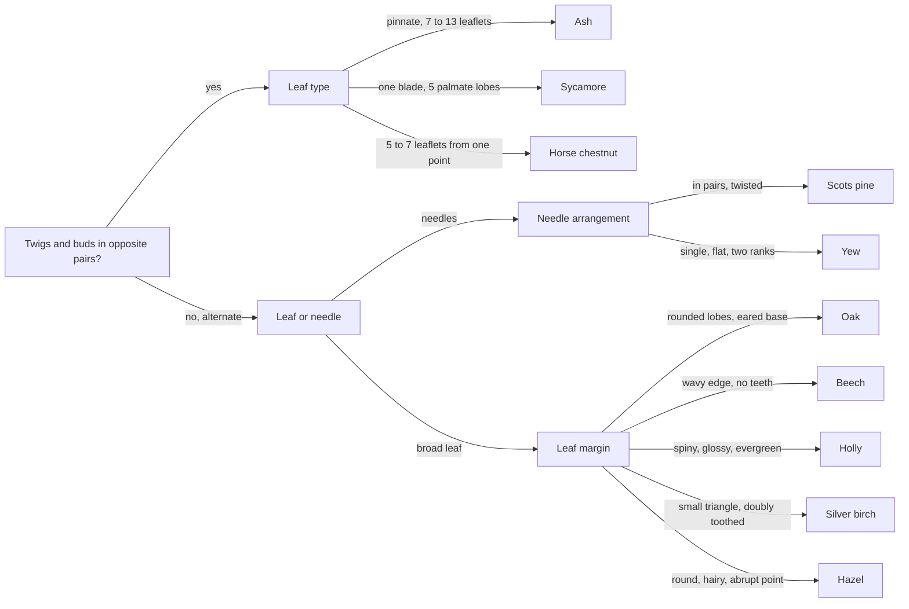

Title: Reading bark and leaves
Date: 2026-08-19
Category: Outdoor
Tags: trees, nature, bushcraft, woodwork, scouting
Slug: reading-bark-and-leaves
Author: morganp
Summary: A field key for ten common British trees built on bark and branching rather than leaves, and why the same species can carry two different bark patterns on one trunk.
Status: published

For half the year a British wood has no leaves on it. From the end of October to the middle of April, the field guide in your pocket is mostly photographs of things that are not currently present. The wood stays perfectly identifiable through January, and the people doing it cannot always tell you how.

This is a key for ten common trees, built on the features available all year, with leaf shape as confirmation rather than the starting point. It is aimed at anyone who takes a group into a wood and gets asked what that one is.

## Branching first, leaf second

Before looking at a single leaf, look at how the twigs come off the branch. Either they sit in pairs directly opposite each other, or they alternate up the twig one at a time.

Almost every British tree has alternate branching. The opposite-branching ones are a short list: maples including sycamore and field maple, ash, dogwood, the Caprifoliaceae including elder and honeysuckle, and horse chestnut. Scouting books teach it as **MADCap Horse**, and it is the single most useful thing to check first, because it removes most of a wood in one look and it works in December.

Most of that list is shrubs. Dogwood, elder and honeysuckle sit at shoulder height and never form a canopy. So when the opposite branching belongs to a full sized tree, the candidates come down to four: ash, sycamore, field maple and horse chestnut.

## What the leaf is made of

A leaf answers two questions in order. Is the blade one piece or several, and if several, how are they arranged.

**Simple** leaves are one blade on one stalk. Oak, beech, birch, hazel, holly and sycamore are all simple, however deeply the edge is cut. A sycamore leaf has five lobes but the blade never separates, so it stays one leaf.

**Compound** leaves are divided into separate leaflets, each with its own small stalk. Pinnate compound means leaflets ranged along a central stalk like a feather, which is ash. Palmate compound means leaflets radiating from one point like fingers, which is horse chestnut.

The trap is telling a compound leaf from a twig bearing simple leaves. The test is the bud: a leaflet has no bud where it joins the stalk, and a leaf always has one where it joins the twig. Follow the stalk back until you find a bud, and everything beyond that point is a single leaf.

Then the margin, which separates the simple leaves from each other. Entire means smooth, serrate means toothed, doubly toothed means large teeth carrying smaller teeth of their own, and lobed means the edge cuts deeply toward the midrib without ever reaching it.

## Why bark cracks at all

A trunk gets thicker every year. A thin sleeve of living tissue, the vascular cambium, lays down new wood on its inner face and new phloem on its outer face, so the wood you can see is only the outside of a stack that has been growing outward for decades.

Outside that sits the bark, and the outer part of the bark is dead. It is made by a second sleeve, the cork cambium, and once a layer of cork is finished it has no way of growing. So a trunk expanding underneath a rigid dead skin has two options, and different species take different ones.

**Beech, holly and hornbeam keep the original cork cambium alive.** It expands with the trunk year after year, so the surface stays continuous and smooth for the life of the tree. A beech at 200 years old has the same grey skin it had at twenty, stretched.

**Oak, ash, pine and most other trees abandon it.** New cork cambiums form in successive arcs deeper inside the bark, and each one cuts off the tissue outside it, which dies. That accumulating dead layer is the rhytidome, and it cannot stretch, so it splits. Where it splits is set by the species, and the pattern is consistent enough to name a tree from thirty metres away.

Birch does something in between. Its cork cambium makes broad flexible sheets loaded with betulin, the white waterproof compound that gives the bark its colour and lets it burn when soaking wet. The sheets part along the lenticels, the horizontal pores the trunk breathes through, which is why birch peels in horizontal strips and never vertical ones.

## The ten trees

Each plate has the leaf on the left and the bark on the right.

### Oak

Alternate branching. The leaf is widest above the middle, with four or five rounded lobes a side, almost no stalk, and two small ear shaped lobes where the blade meets the stalk. The bark carries deep vertical fissures cross linked into short blocks. Pedunculate oak has long stalked acorns and near stalkless leaves; sessile oak reverses both.

### Ash

Opposite branching. One leaf is a slender stalk carrying five or six pairs of toothed leaflets and a terminal one, so a single ash leaf can be 300 mm long. The bark is pale grey with shallow ridges meeting in a lattice of diamonds. In winter the buds are sooty black, and nothing else in Britain has them.

### Beech

Alternate branching. The leaf is a plain oval with a pointed tip, the margin gently wavy and never toothed, with straight parallel side veins running out to each wave and a fringe of silky hairs when young. The bark is smooth silvery grey and stays smooth for the life of the tree.

### Sycamore

Opposite branching. One blade, five lobes cut about halfway to the centre, coarse blunt teeth, on a long stout stalk. The bark is grey with a pink tinge, flaking away in irregular rounded plates that leave paler patches behind. The seeds are the familiar winged pairs.

### Silver birch

Alternate branching. A small triangular leaf with a broad base and doubly toothed margin, large teeth carrying smaller teeth of their own. The bark is white and papery, peeling in horizontal strips, marked with dark lenticel lines and breaking into rough black diamonds near the base. The twigs are warty and hairless, which separates it from downy birch.

### Hazel

Alternate branching. Almost circular, with an abrupt short point, a heart shaped base, and a soft downy surface puckered by impressed veins. The bark is smooth coppery brown with pale horizontal lenticels and no fissures at all. Hazel usually stands multi stemmed from old coppice, and carries catkins from January.

### Horse chestnut

Opposite branching. Five to seven leaflets radiate from one point at the top of a stout stalk, each widest near its tip. The bark is grey brown and breaks into coarse scaly plates that lift at the edges. The buds are large and sticky. It is not native, and arrived here around 1600.

### Holly

Alternate branching, and evergreen. Stiff, glossy, very dark green, with spines at the crest of each wave in the margin. Those spines are a response to browsing, so above the height a deer can reach the same tree often carries smooth edged leaves with no spines at all. The bark is smooth pale grey with scattered warty bumps. Berries appear on female trees only.

### Scots pine

Needles in pairs, 40 to 70 mm, blue green and twisted, each pair joined at the base by a small brown sheath. Counting the needles in a bundle is the test: two means Scots pine, and Britain has no other native pine. The bark runs orange pink and papery high on the trunk and grey brown in deep fissured slabs at the base.

### Yew

Needles single and flat, set in two ranks so the whole spray lies flat, and soft enough to run a hand along. The bark is red brown, peeling in thin flakes, over a trunk that is fluted and often made of several fused stems. Yew carries red arils rather than cones, and every part of the tree except the flesh of the aril is poisonous.

## The reframe

The field guides do not say this plainly. Bark pattern is not a portrait of a species. It is the record of how a dead outer layer failed under the strain of the trunk growing, and the species only sets the rule for the failure.

Age sets how far that rule has run. A young oak is nearly smooth, because it has not yet grown enough girth to break its own bark into blocks. An old silver birch is black and coarsely fissured at the base while it is still white and papery at head height, because the base has been expanding for eighty years and the upper trunk for twenty. Growth rate matters too: the same species on a wet fertile site cracks deeper than one on a dry exposed ridge, because the strain arrives faster.

So read two places on the same tree, not one. The base and the crown of a Scots pine disagree, and the disagreement is itself the identification.

## Running the key

## Winter, when there is nothing to pick

Buds are as diagnostic as leaves and they are on the tree from October. Six of these ten are settled in a second by the bud alone.

| Tree | Bud |
|---|---|
| Ash | sooty black and velvety, in opposite pairs. Nothing else in Britain is black |
| Beech | long, slender, sharply pointed, copper coloured, held out at an angle from the twig |
| Horse chestnut | large, fat, sticky to the touch, red brown |
| Sycamore | green with dark scale edges, opposite |
| Oak | small and clustered together at the very tip of the twig |
| Hazel | small, oval, blunt, green flushed red, and catkins hanging from January |

Silver birch keeps its warty hairless twigs, which separates it from downy birch. Holly, yew and Scots pine keep their leaves, so they need no winter test at all.

Ash is the sad case. Ash dieback, caused by the fungus *Hymenoscyphus fraxineus*, has been through most of the country, and many of the ash you find now are dead or dying with sparse crowns and diamond-shaped lesions on the bark. The black buds are still the giveaway.

## What the timber is for

Naming a tree matters more once you want to cut something from it.

**Ash** is the handle wood. Straight grained, tough and shock resistant, it takes repeated impact without splitting, which is why axe handles, tent pegs and tool shafts are ash. It steam bends well and seasons quickly.

**Hazel** is the greenwood staple. It grows multi-stemmed from coppice, cleaves cleanly along its length, and bends almost double when green without breaking. Hurdles, spars, bean poles and walking sticks all come from hazel, and a coppiced stool will keep producing for centuries.

**Sycamore** is pale, close grained and completely odourless, so it goes into anything that touches food. Spoons, bowls, butter pats and dairy equipment are traditionally sycamore for that reason.

**Birch** turns beautifully and plywoods well, but it rots fast in contact with the ground. The bark is the real prize: peel a loose strip from a fallen trunk and it lights from a spark even after rain.

**Oak** is the structural timber, durable outdoors for decades, and it comes with a warning. Oak is full of tannin, tannin reacts with iron, and the reaction both corrodes the fastener and stains the wood black around it. Use brass, copper or stainless in oak, and keep steel clamps off wet oak.

**Beech** turns and steam bends as well as anything, which made it the chair wood of the Chilterns, but it has almost no durability outdoors. Keep it indoors and dry.

**Yew** gives the classic self bow, because a stave cut across the boundary between heartwood and sapwood gets a compression-strong belly and a tension-strong back in one piece with no glue. Every part of the tree except the flesh of the aril is poisonous, and the dust is an irritant, so wear a mask when you sand it.

**Scots pine** is the construction softwood, and a resin-soaked stump left in the ground for years becomes fatwood, which shaves into the most reliable natural firelighter available in Britain.

**Horse chestnut** and **holly** are the two to leave standing. Horse chestnut timber is soft and weak with almost no use. Holly is white and dense enough for inlay, and it dyes black as a substitute for ebony, but the tree grows slowly enough that felling one for the sake of it is a waste.

## The two-minute routine

1. Branching. Opposite or alternate. That is your first cut.
2. Leaf. One blade or several leaflets, and how the edge is cut.
3. Bark, twice. Once at chest height, once as high up the trunk as you can see.
4. The ground. Acorns, conkers, nut shells, winged seeds and old leaf litter are all still there in February.
5. Buds, if the tree is bare.

Get into the habit of naming the tree before you look at a leaf. It is slower for the first month and much faster afterwards, and it is the only version that works in winter.
