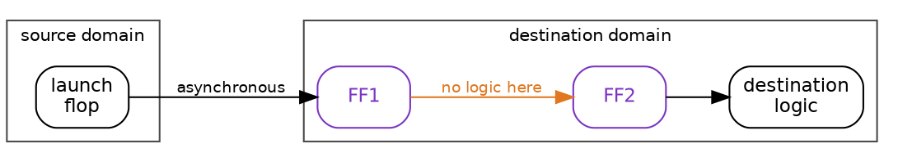
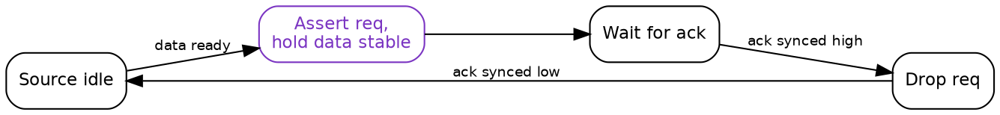
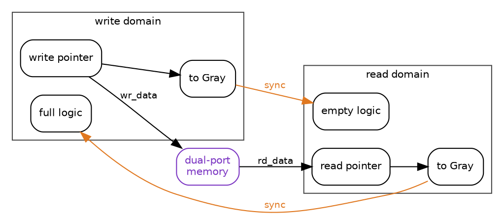
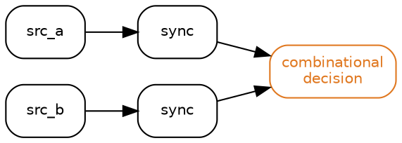

Title: SoC Intermediate 05: Clock domain crossing techniques
Date: 2026-08-24
Category: Engineering
Tags: SoC, Hardware, Electronics, RTL, CDC, Metastability, Synchronisers, FIFO, Verification, ASIC
Slug: soc-intermediate-05-clock-domain-crossing-techniques
Author: morganp
Summary: Why a bus can cross a clock domain through correct synchronisers and still deliver a value that never existed, and the structures that prevent it: metastability and the two-flop MTBF, toggle synchronisers, handshakes, Gray-coded pointers, asynchronous FIFOs, reset crossings, and reconvergence.
Status: draft

[]({static}/images/SoC/ArticleI05/00-two-domains-hero-HQ.png)

*Series: Intermediate SoC Design | Article 5 of 10*

---

## The value that never existed

The failure happened about once every eleven hours. A timestamp counter,
maintained in a 300 MHz domain and read by software running at 100 MHz, would
very occasionally return a number that was wrong by a large power of two.
Wrong, then correct again on the next read, then correct for another eleven
hours.

The crossing had been reviewed. Every bit of that counter went through a proper
two-flop synchroniser in the destination domain. The clock domain crossing
(CDC) tool reported no unsynchronised crossings anywhere in the block.

This article is about what those two flops actually buy, what they do not buy,
and how to pick the right structure for each kind of crossing. It targets
engineers writing register transfer level (RTL) code that spans more than one
clock, and anybody who has been handed a CDC report and a list of waivers and
asked whether the design is safe.

---

## Why a flip-flop can hesitate

A flip-flop is specified to capture its input reliably provided the input is
stable for a setup time before the clock edge and a hold time after it. A
signal arriving from another clock domain has no relationship to that edge and
will eventually violate the window.

When it does, the flop can enter metastability: an internal balanced state
where the output sits between valid logic levels and takes an unbounded time to
resolve one way or the other.

[]({static}/images/SoC/ArticleI05/01-metastability-HQ.png)

It does resolve. The balance is unstable, and the internal feedback amplifies
whichever way it tips, exponentially. That exponential is the entire basis of
synchroniser design, because it means the probability of still being undecided
falls off exponentially with the time you allow.

```
              e^(t_r / tau)
MTBF  =  ---------------------------
          T0 * f_clock * f_data
```

`t_r` is the time the design gives the flop to resolve before anything reads
it. `tau` and `T0` characterise the flop and come from the library. The two
frequencies set how often the opportunity to fail arises.

Put illustrative numbers in. With `tau` of 20 ps, a destination clock of
500 MHz, data changing at 10 MHz, and a single flop leaving 0.3 ns of slack for
resolution, the exponent is 15 and the mean time between failures is about half
a minute. That is not a design, it is a fault generator.

Add a second flop and the resolution time gains most of a clock period. The
exponent moves from 15 to around 115, and since `e` to the 100 is roughly ten
to the 43, the mean time between failures leaves the domain of engineering
entirely.

Two things follow, and both matter. The failure rate can be made arbitrarily
small, and it can never be made zero. Metastability is managed, not eliminated,
and the number of stages is a calculation against your library and your
frequencies, not a convention. Above roughly a gigahertz, or with a fast data
rate, three stages start to earn their place.

---

## The structure everyone knows

The two-flop synchroniser is two flip-flops in the destination domain, back to
back, with nothing combinational between them.



The amber edge is a rule, not a drawing convenience. Any combinational logic
between FF1 and FF2 consumes the resolution time the second flop exists to
provide, and a synthesis tool that is not told otherwise will happily place
some there. Real flows mark the structure explicitly, through a synchroniser
cell from the library, a naming convention the CDC tool recognises, or a
constraint that keeps the pair together.

The cost is latency, and it is worth being precise about how much.

```wavedrom
{
  "signal": [
    {"name": "dst_clk",    "wave": "P..........."},
    {"name": "src_signal", "wave": "0..1........"},
    {"name": "sync_ff1",   "wave": "0....1......"},
    {"name": "sync_ff2",   "wave": "0......1...."}
  ],
  "head": {"text": "One to two destination cycles of latency, and the transition is what survives"}
}
```

That is the correct structure for a single bit that changes slowly relative to
the destination clock: a status level, an enable, a mode bit that settles long
before anybody acts on it.

It is the wrong structure for everything else, and the rest of this article is
the everything else.

---

## Pulses that are not there long enough

A one-cycle pulse in a 300 MHz domain lasts about 3.3 ns. A destination clock
at 100 MHz looks every 10 ns. The pulse can arrive and leave between two
destination edges, and no amount of synchronisation recovers a signal that was
never present when anybody sampled.

```wavedrom
{
  "signal": [
    {"name": "src_clk",   "wave": "P..........."},
    {"name": "src_pulse", "wave": "0.10........"},
    {},
    {"name": "dst_clk",   "wave": "P...", "period": 3},
    {"name": "dst_sees",  "wave": "0...", "period": 3}
  ],
  "head": {"text": "A one-cycle pulse in the fast domain, gone before the slow clock looks"}
}
```

The fix is to stop crossing a pulse and start crossing a level. A toggle
synchroniser converts each event into a permanent change of state, which the
destination cannot miss, then converts it back into a pulse locally.

```verilog
// Source domain: each event flips the level
always_ff @(posedge src_clk or negedge src_reset_n) begin
    if (!src_reset_n)
        req_toggle <= 1'b0;
    else if (src_pulse)
        req_toggle <= ~req_toggle;
end

// Destination domain: synchronise, then edge detect
always_ff @(posedge dst_clk or negedge dst_reset_n) begin
    if (!dst_reset_n) begin
        sync1 <= 1'b0;
        sync2 <= 1'b0;
        sync3 <= 1'b0;
    end else begin
        sync1 <= req_toggle;
        sync2 <= sync1;
        sync3 <= sync2;
    end
end

assign dst_pulse = sync2 ^ sync3;
```

The third flop is not a third synchroniser stage. It is a delayed copy so the
exclusive OR can spot the edge. Two stages resolve metastability, the third
recovers the event.

This structure carries events, not data, and it has a rate limit. Events must
arrive no faster than the destination can observe separate toggles, which means
at least two or three destination clock periods apart. Push events in faster
than that and toggles cancel silently, which looks exactly like an interrupt
that occasionally does not fire.

---

## Buses, and the failure at the top

Now the counter. Each bit went through a correct two-flop synchroniser, and
each of those synchronisers did its job perfectly.

Consider the counter stepping from 0x0FFF to 0x1000. Twelve bits fall and one
bit rises, all in the same source cycle, but not at exactly the same instant:
different flops, different clock arrival, different routing, tens of
picoseconds apart. In the destination domain each synchroniser makes its own
independent decision about which side of the edge its bit landed on.

If the new value of bit 12 is captured and the old values of bits 0 to 11 are
also captured, the destination reads 0x1FFF. Not the old value, not the new
value. A number the source counter never held, and never will.

[]({static}/images/SoC/ArticleI05/02-multibit-incoherence-HQ.png)

Here is the reframe. A synchroniser does not transfer data. It protects one bit
against one flop's uncertainty, and that is the entire scope of what it does.
Nothing about it coordinates one bit with another, so the moment two bits are
supposed to mean something together, the two-flop structure has no opinion and
provides no protection.

Metastability is the part of CDC that has a standard answer. Coherency is the
part that has to be designed, crossing by crossing, and it is where the bugs
that survive to silicon come from. That is also why the CDC tool was quiet: it
was asked whether the crossings were synchronised, and they were.

It explains the eleven hours too. The bad read needs a carry across many bits
to line up with a read in the other domain, inside a window tens of
picoseconds wide. Rare, and completely inevitable given enough time. Every CDC
bug has that signature: it does not happen in simulation, it does not happen on
the bench, and it happens in the field on a schedule.

---

## Structures that preserve meaning

Once the problem is stated as coherency, the choice of structure follows from
what the signals mean together.

| What is crossing | Structure | Why |
|---|---|---|
| One slow-changing level | Two-flop synchroniser | Only metastability is at stake |
| An event or pulse | Toggle synchroniser | Turns a moment into a state |
| A register-like value, written occasionally | Request and acknowledge handshake | Data held stable while it is read |
| A counter or pointer | Gray code plus synchronisers | Only one bit changes per step |
| A stream of data | Asynchronous FIFO | Decouples rates as well as clocks |
| A value that is cheap to derive | Recompute in the destination | The best crossing is no crossing |

**Handshake.** The source presents the data and asserts request. The data does
not move until acknowledge comes back, which means the bus is stable through
every destination sample, so no synchroniser sees a changing input at all.



The round trip costs roughly two synchroniser delays in each direction, so
throughput is low. For a configuration register written once at boot that is
irrelevant, and the simplicity is worth more than the cycles.

**Gray code.** Only one bit changes between consecutive values, so the worst
case at the destination is capturing the old value or the new one. Both are
values that existed.

```verilog
assign gray = binary ^ (binary >> 1);
```

The property holds only for values that step by one. A counter that can jump,
be loaded, or be cleared to zero from an arbitrary value breaks it immediately,
and that is a real bug pattern rather than a theoretical one.

**Asynchronous FIFO.** For streaming data, the standard structure combines both
ideas: the data sits in dual-port memory and never crosses a domain at all,
while the pointers cross as Gray-coded values.



Note which way each pointer travels. The write pointer is synchronised into the
read domain to compute empty, and the read pointer into the write domain to
compute full. Both are late by a synchroniser delay, and the direction of that
staleness is what makes the design safe: full is computed from a read pointer
that may be older than reality, so the FIFO can only declare itself full early,
never late. Empty is conservative in the same direction. Getting either
comparison backwards produces a FIFO that overruns once a week.

---

## Reset is a crossing too

Reset gets forgotten because it does not look like data. It is a signal that
one domain drives and another domain's flops obey, which is the definition.

Assertion is usually asynchronous on purpose, because reset must work with no
clock running. Release is the dangerous edge: if reset deasserts near a clock
edge, some flops in a domain leave reset one cycle before others, and a state
machine can start in a state its encoding does not allow.

The standard answer is to assert asynchronously and deassert synchronously, per
domain:

```verilog
always_ff @(posedge clk or negedge arst_n) begin
    if (!arst_n) begin
        rst_sync1 <= 1'b0;
        rst_sync2 <= 1'b0;
    end else begin
        rst_sync1 <= 1'b1;
        rst_sync2 <= rst_sync1;
    end
end

assign reset_n = rst_sync2;
```

Every clock domain needs its own instance. Sharing one reset synchroniser
across domains reintroduces exactly the crossing it was built to remove.

---

## Reconvergence

The last structural trap is two signals that are synchronised correctly and
separately, then combined in destination logic.



Each synchroniser independently decides which destination cycle its signal
arrived in. If the two source signals are related, and a one-cycle skew between
them describes a state the source never occupied, the destination logic acts on
a combination that does not exist. It is the multi-bit problem again, wearing
control-signal clothing, and it is harder to spot because the signals are
declared separately and often synchronised in different modules.

The rule is that anything which must be interpreted together must cross
together, through one handshake or one FIFO.

---

## Tools, and what a waiver means

CDC tools are structural analysers. They find crossings, classify them, and
flag the unsafe shapes: unsynchronised multi-bit buses, combinational logic
inside synchronisers, reconvergent paths, clock multiplexers, generated clocks,
and reset crossings. On a large SoC they will find thousands, most benign.

That volume is what makes waivers dangerous. A waiver reading "known crossing"
records only that somebody looked. A waiver should carry the argument: why the
crossing is safe, what property makes it safe, and what change would break it.

The parallel with the previous article in this series is exact. A timing
exception hides a real path from static timing analysis; a CDC waiver hides a
real crossing from CDC analysis. Both are written once, by someone who
understood the design at that moment, and both stay in the file long after the
RTL around them has changed.

Simulation will not cover the gap. Standard simulation samples on ideal edges
and shows none of this. Randomising clock ratios and injecting synchroniser
delay in the model finds a useful fraction, and formal CDC analysis finds more,
but the structural argument for each crossing is what actually makes the design
safe.

---

## CDC checklist

1. Enumerate every clock, including generated, divided, gated, and
   multiplexed ones, before enumerating crossings.
2. Match each crossing to its semantics: level, event, register value, pointer,
   stream, or reset. Write the choice down next to the code.
3. Reserve the two-flop synchroniser for single-bit levels, and calculate the
   stage count against library `tau` and the real frequencies rather than
   assuming two is always enough.
4. Never synchronise the bits of a bus independently, and treat any bus
   arriving at more than one synchroniser as a bug until proven otherwise.
5. Give every clock domain its own reset synchroniser and check the deassertion
   edge specifically.
6. Bundle related control signals into one crossing so reconvergence cannot
   invent states.
7. Confirm the FIFO full and empty comparisons use the pointer that makes each
   one conservative.
8. Require a written argument on every waiver, with an owner, and re-derive it
   whenever the surrounding RTL changes.

---

## Ask what each crossing means

The useful question at a CDC review is not "is this crossing synchronised". It
is "what do these signals mean together, and what structure preserves that".

The counter needed a handshake or a Gray code, and it got two flops per bit
because two flops per bit is what CDC looks like in most people's heads. The
review asked the wrong question, the tool answered the question it was given,
and the design shipped with a fault that arrived on a timetable.

Every crossing in a design has an answer to the meaning question. It is worth
writing that answer in a comment beside the code, because the next person to
touch it will otherwise see two flops, recognise the shape, and assume the
thinking was done.

---

*Previous: [Article I-04: RTL synthesis and timing closure]({filename}../2026-08-28_SoC_Intermediate_04_Synthesis_Timing/2026-08-28_SoC_Intermediate_04_Synthesis_Timing.md)*
*Next: Intermediate Article 06, SoC verification with UVM*
