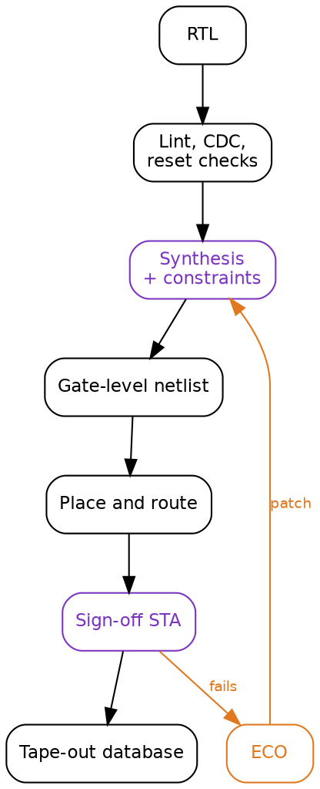
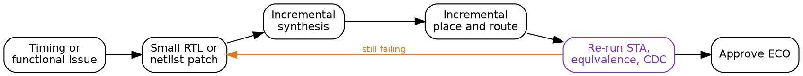

Title: SoC Intermediate 04: RTL synthesis and timing closure
Date: 2026-08-28
Category: Engineering
Tags: SoC, Hardware, Electronics, RTL, Synthesis, Static Timing Analysis, SDC, Timing Closure, ASIC, FPGA
Slug: soc-intermediate-04-rtl-synthesis-and-timing-closure
Author: morganp
Summary: Why a design can pass sign-off timing and still fail in silicon, and the machinery that decides it: what synthesis optimises, what static timing analysis actually proves, SDC exceptions and the damage they hide, reading a timing report, RTL versus tool fixes, and multi-corner multi-mode closure.
Status: published

[]({attach}/images/SoC/ArticleI04/00-closure-hero-HQ.png)

*Series: Intermediate SoC Design | Article 4 of 10*

---

## The report was green

Sign-off timing passed. Worst negative slack across every corner was positive,
by a comfortable margin on setup and a thin margin on hold. It had been the
hardest block in the project, and it was finally done. Somebody put a chart in
the review deck showing the slack climbing out of the red over six weeks.

The chip came back and mostly worked. In the cold chamber, one part in a few
hundred returned bad data from a configuration register, but only when the
register was written while a particular unrelated interface was active. Nobody
could reproduce it in simulation, because in simulation the design is exactly
as correct as the day it was signed off.

This article is about synthesis and timing closure: what the tools genuinely
prove, what they only appear to prove, and where the gap between the two
usually opens up. It targets engineers writing register transfer level (RTL)
code that has to meet a frequency target, and anybody who has inherited a
constraint file and is wondering how much of it to trust.

---

## What synthesis is being asked to do

Synthesis maps RTL onto standard cells from a technology library: flip-flops
and latches, combinational gates, arithmetic structures, clock gating cells,
and in low-power flows the isolation and retention cells that survive a
powered-down domain.

It does that mapping while trying to satisfy your constraints and minimise
area, power, and delay. The word to notice is *your*. The tool has no
independent notion of what the design is supposed to do at speed. It optimises
against the constraint file, and if the constraint file is wrong it will
produce an efficient, well-optimised implementation of the wrong intent.



Two stages on that path are marked in purple because they are the only two that
read the constraints. Everything downstream inherits whatever those two were
told.

---

## What static timing analysis proves

Static timing analysis (STA) checks every path in the design without
simulating a single input vector. It builds a graph from register clock pins,
combinational arcs through cells, net delays extracted after routing, clock
tree delays and skew, library setup and hold requirements, and your
constraints.

For a path to work, the data launched by one edge has to arrive and settle
before the edge that captures it:

```
launch edge + clock-to-Q + data path delay + setup time
    <=
capture edge + useful skew - uncertainty
```

Hold is the same relationship read from the other end. The data must not arrive
so early that it overwrites the value the capture flip-flop is still reading
from the previous edge.

```wavedrom
{
  "signal": [
    {"name": "launch clk",   "wave": "P......."},
    {"name": "capture clk",  "wave": "P......."},
    {"name": "data at D",    "wave": "x..2...x", "data": ["new value"]},
    {"name": "setup window", "wave": "x...3x..", "data": ["stable"]},
    {"name": "hold window",  "wave": "x.4x....", "data": ["stable"]}
  ],
  "head": {"text": "Setup closes the window before the capture edge, hold holds it open after"}
}
```

The two failures have opposite personalities, and each is worst at the corner
that is kindest to the other.

| Failure | Meaning | Worst at | Common fixes |
|---|---|---|---|
| Setup | Data arrives too late | Slow silicon, low voltage, high temperature | Reduce logic depth, resize cells, pipeline, improve placement |
| Hold | Data arrives too early | Fast silicon, high voltage, low temperature | Add delay cells, adjust clock skew, correct the constraint |

Setup failures are a performance problem: run the part slower and they go away.
Hold failures are not. A hold violation is broken at every frequency, including
zero, which is why a hold bug in silicon is usually a respin and a setup bug
is usually a de-rated data sheet.

---

## The constraint file is the specification

Most ASIC and FPGA flows describe timing intent in Synopsys Design Constraints
(SDC) syntax. A minimal block might start like this:

```tcl
# Primary clock: 1 GHz
create_clock -name core_clk -period 1.000 [get_ports core_clk]

# External interface timing, relative to that clock
set_input_delay  0.250 -clock core_clk [get_ports rx_data*]
set_output_delay 0.300 -clock core_clk [get_ports tx_data*]

# Jitter and analysis margin
set_clock_uncertainty 0.050 [get_clocks core_clk]

# Asynchronous reset assertion is not a functional timing path
set_false_path -from [get_ports reset_n]
```

Five commands, and every one of them is a claim about the world outside the
block. The period claims what the clock generator will produce. The input delay
claims when the upstream block launches. The uncertainty claims how much jitter
the phase-locked loop contributes. The false path claims that reset assertion
never needs to be captured on a specific edge.

None of those claims are checked by anything. They are inputs.

That is the reason a constraint file deserves the same review a piece of RTL
gets: an owner, a version history, a comment on every non-obvious line, and a
reviewer who is allowed to ask "how do you know?".

---

## Exceptions, and the damage they hide

Three SDC commands exist to tell STA to relax. All three are legitimate. All
three are also the standard way to make a report turn green without changing a
gate.

**A false path** says the path is not real and should not be analysed. A
configuration register that only changes during reset, a scan-mode path that is
inactive functionally, a test observation output nobody samples at speed.

**A multicycle path** says the path is real but has more than one clock period
to complete.

```tcl
# Data launched by stage_a is captured by stage_b two cycles later
set_multicycle_path 2 -setup \
    -from [get_cells stage_a_reg*] \
    -to   [get_cells stage_b_reg*]

# The hold check has to move with it
set_multicycle_path 1 -hold \
    -from [get_cells stage_a_reg*] \
    -to   [get_cells stage_b_reg*]
```

That second command gets left out, and leaving it out is worse than not writing
the exception at all. A setup relaxation without the matching
hold adjustment tells the tool the data may arrive a cycle late, while still
requiring it not to arrive early relative to the original edge. The tool will
happily insert delay to satisfy a hold check that was never the real
requirement, or fail to insert it where it was.

A multicycle constraint is only true if the destination register genuinely
cannot capture every cycle. That means an enable, and the enable has to be
provably sparse:

```wavedrom
{
  "signal": [
    {"name": "clk",         "wave": "P..........."},
    {"name": "stage_a_reg", "wave": "x2...3...4..", "data": ["A0","A1","A2"]},
    {"name": "capture_en",  "wave": "0.10..10..10"},
    {"name": "stage_b_reg", "wave": "x..2...3...4", "data": ["A0","A1","A2"]}
  ],
  "head": {"text": "The multicycle claim is only true while capture_en stays this sparse"}
}
```

If a later revision adds a bypass mode that asserts `capture_en` every cycle,
the RTL change is one line, the constraint is still in the file, and the timing
report still passes.

**A clock group** says two clocks have no known phase relationship:

```tcl
set_clock_groups -asynchronous \
    -group [get_clocks cpu_clk] \
    -group [get_clocks periph_clk]
```

This is the most misread of the three. It does not make the crossing safe. It
does not add a synchroniser. It tells STA to stop analysing a relationship that
was never meaningful, and the correctness of the crossing is now entirely the
job of clock domain crossing (CDC) analysis and the synchronisers in the RTL.
Declaring the group and skipping the CDC review removes the only check that was
looking.

---

## The gap

Static timing analysis never tells you whether the chip works. It tells you
whether the implementation matches the constraints. Those are the same
statement only to the extent that the constraints are true, and nothing in the
flow verifies that they are.

[]({attach}/images/SoC/ArticleI04/01-map-and-terrain-HQ.png)

Read the failure at the top of the article again with that in mind. The
configuration register had a `set_false_path` on it, added early, when the
register really was written only during reset. Two years later a feature landed
that reprogrammed it at runtime while the interface was live. The RTL review
covered the new write path. Nothing in the flow re-examined the exception,
because an exception is not code, it produces no warning, and it fails silently
by making a real path invisible.

That is the shape of nearly every timing bug that reaches silicon. Not a path
the tool got wrong, but a path the tool was told not to look at.

Which is why the useful question during a closure review is not "what is the
worst negative slack". It is "how many paths are we not analysing, who decided
that, and is the reason still true".

```tcl
# Worth running, and reviewing line by line, before every sign-off
report_exceptions -ignored
report_disable_timing
report_clock_properties
```

An exception with no comment and no owner should be treated as a bug until
somebody re-derives the argument for it.

---

## Reading a report

When a path genuinely fails, the report tells you what kind of problem it is,
provided you read past the slack number.

```
Startpoint: u_decode/op_reg[3]
Endpoint:   u_execute/alu_result_reg[17]
Path group: core_clk
Slack:      -0.083 ns

  clock-to-Q              0.061
  decode mux              0.142
  compare                 0.188
  operand mux             0.221
  adder                   0.364
  route                   0.177
  setup                   0.043
  required                1.000
```

The distribution matters more than the total. Here the logic dominates and no
single cell is pathological, which means this is a microarchitecture problem
and cell sizing will not save it. A different failure profile would call for a
different response:

| What dominates | What it usually means | Where to fix it |
|---|---|---|
| Many small logic stages | Logic depth | RTL: split the chain, add a stage |
| One large cell delay | Weak drive, high fanout | Tools: sizing, buffering, cloning |
| Routing delay | Placement or floorplan | Physical: placement constraints, partitioning |
| Clock skew or uncertainty | Clock tree or margin | Clock tree synthesis, useful skew |
| Required time surprises you | The constraint is wrong | The SDC |

Check that last row first. It is the cheapest to fix and the most embarrassing
to find late. If the required time is not the
number you expected, stop looking at the data path.

---

## Fixing it in RTL

The fixes available in RTL are the ones that change how much work sits between
two registers:

- Register the output of a wide multiplexer rather than the input of the next
  stage's logic.
- Split long add, compare, and select chains, especially where a comparison
  result selects an operand for an addition in the same cycle.
- Avoid the accidental priority encoder. A `case` with overlapping conditions
  or a long `if / else if` chain in a datapath synthesises into a serial
  structure, and one-hot control costs area but flattens the delay.
- Duplicate a high-fanout control register into local copies near its
  consumers, rather than asking the tool to buffer one signal across the block.
- Move work across an existing stage boundary before adding a new one, since
  the free rebalance is always better than the stage that costs a cycle of
  latency.

The pattern behind all five is the same: timing closure is easy when the
microarchitecture already has clean stage boundaries, and the [earlier article on pipeline
hazards]({filename}../2026-08-16_SoC_Intermediate_03_Pipeline_Hazards/2026-08-16_SoC_Intermediate_03_Pipeline_Hazards.md)
is the reason those boundaries are not free to add later.

---

## Fixing it in the tools

Implementation tools have their own set of moves: cell sizing, buffer
insertion, logic restructuring, register retiming, placement constraints,
useful skew, and clock tree adjustment.

They are genuinely powerful, and retiming in particular can rebalance logic
across register boundaries in ways that would be tedious by hand. But they all
work within the structure the RTL gave them. No amount of sizing will fit two
cycles of logic into a one-cycle budget, and a path that needs a
microarchitecture change will keep coming back on every run, slightly
differently each time, consuming a week per iteration.

The tell is a path that oscillates. Fix it, and it closes, and something
adjacent opens. That is not a tool failure. That is a design that has no slack
anywhere in a region, and the tool is moving a fixed shortage around.

---

## Every corner, every mode

A single timing run is one point in a space the chip has to survive all of.

```
Slow silicon, low voltage, high temperature   -> setup worst case
Fast silicon, high voltage, low temperature   -> hold worst case
Functional, scan, retention, low-power modes  -> different constraints each
```

Multiply the process, voltage, and temperature corners by the operating modes
and the analysis views multiply with them. The sign-off question is not "does
the design meet timing", it is "does every mode meet timing at every corner it
can be in".

[]({attach}/images/SoC/ArticleI04/02-corners-modes-HQ.png)

Two practical consequences. First, a corner nobody enabled is a corner nobody
checked, so the list of analysis views is itself a review item. Second,
low-temperature inversion means the fast corner is not simply "everything is
quicker": at modern nodes some cells get slower at low voltage as temperature
drops, so the intuition that cold silicon is fast silicon is not reliable and
the corner list has to come from the library characterisation, not from
reasoning.

---

## The ECO loop

Late fixes go in as an engineering change order: a small, surgical patch to a
design that is otherwise finished.



The purple node carries the risk. An ECO is small in the netlist and unbounded
in what it can invalidate: timing on adjacent paths, logical equivalence
against the RTL, CDC structures, power intent, and any software-visible
behaviour that verification signed off weeks earlier. Every ECO needs the full
check set re-run, and the discipline that makes late ECOs survivable is keeping
them small enough that the re-run is credible.

---

## Closure checklist

1. Give the constraint file an owner and a version history, and review it like
   RTL.
2. List every exception in the design with a one-line justification and the
   name of the person who made the argument.
3. Re-derive those justifications whenever the RTL around them changes, because
   nothing else will.
4. Pair every `-setup` multicycle with its matching `-hold`, and prove the
   capture enable is as sparse as the constraint claims.
5. Treat `set_clock_groups -asynchronous` as a note to STA, never as a CDC
   solution, and check the synchronisers separately.
6. Track worst negative slack and total negative slack per path group, since a
   single bad path and a thousand marginal ones need different responses.
7. Confirm the analysis view list covers every corner and mode the part can
   actually be in, including the ones only test or retention can reach.
8. Re-run lint, CDC, logical equivalence, and STA after every ECO, without
   exception, however small the patch.

---

## Ask what is not being analysed

The number at the top of the timing report tells you how the paths under
analysis are doing. It says nothing at all about the paths that were removed
from analysis, and those are the ones with a history of reaching silicon.

Before the next sign-off, dump the exception list and read it end to end. On a
mature design it will be longer than you expect, and some fraction of it will
be constraints written by people who have left, against RTL that has since
changed, for reasons nobody recorded. That fraction is your actual risk, and it
is countable in an afternoon.

---

*Previous: [Article I-03: Pipeline design and hazards]({filename}../2026-08-16_SoC_Intermediate_03_Pipeline_Hazards/2026-08-16_SoC_Intermediate_03_Pipeline_Hazards.md)*
*Next: Intermediate Article 05, Clock domain crossing techniques*
