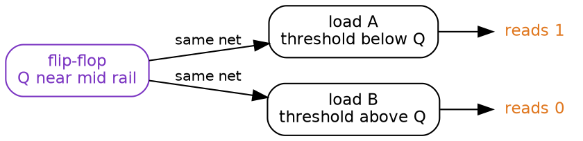
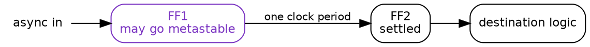

Title: Digital Design 03: Metastability
Date: 2026-08-29
Category: Engineering
Tags: Digital Design, Electronics, CMOS, Flip-Flops, Metastability, Synchronisers, CDC
Slug: digital-design-03-metastability
Author: morganp
Summary: Why a flip-flop can stop between the rails, why two gates reading that voltage can disagree with each other, and why the bug that follows never reproduces.
Status: published

[]({attach}/images/DigitalDesign/Article03/00-metastability-hero-HQ.png)

*Series: Digital Design Fundamentals | Article 3*

---

The board runs for six days. On the seventh, the status register reports a state
the state machine cannot reach, the firmware takes a branch that was never meant
to execute, and the watchdog resets the part. Simulation has run the same
sequence ten million times and never produced it. Attaching a scope to the
suspect net makes the fault stop for a fortnight.

This article explains where that state came from. Two routes lead to it: an
input from another clock domain, and a synchronous path that failed timing
closure. Both end at the same condition, a setup or hold requirement that was
not met at the sampling edge. It is for anyone who writes register transfer
level code and has been told to put two flip-flops on an asynchronous input
without being told what the second flip-flop is for.

---

## A decision with no margin

A flip-flop is a decision element with gain. At the sampling edge it captures
the difference between its input and its own switching threshold, then amplifies
that difference until the output reaches a rail.

The captured difference sets how long the amplification takes. An input that
settled a nanosecond early presents almost the full supply, and one pass through
the internal loop is enough. An input that moved a few picoseconds before the
edge presents a few millivolts, and the same loop needs several passes to build
those millivolts up to a rail.

That difference has no lower limit. Data crossing the threshold close enough to
the clock edge leaves the flip-flop microvolts to amplify, or less, and the
amplification then starts from microvolts.

[]({attach}/images/DigitalDesign/Article03/01-settling-margin-HQ.png)

Distance from the threshold grows as `V0 e^(t / tau)`, where `V0` is the
captured margin and `tau` is the settling time constant. Time to reach a rail
therefore depends on the logarithm of the margin, so a margin ten times smaller
costs only about 2.3 more time constants. Waiting buys a great deal and never
buys certainty.

While the output is still climbing it sits between the rails. That is
metastability. Not a broken circuit, but an amplifier part way through a
decision.

---

## Where the clock edge lands

Setup time and hold time describe a window around the clock edge in which the
input has to be stable. An input that changes inside that window is the input
that leaves almost no margin to amplify.

```wavedrom
{
  "signal": [
    {"name": "CLK",            "wave": "p......."},
    {"name": "D",              "wave": "0.1....."},
    {"name": "Q, clean sample","wave": "0..1...."},
    {"name": "Q, metastable",  "wave": "0..x1..."}
  ],
  "head": {"text": "An input changing inside the aperture"}
}
```

Two situations put a real design in that window. The first is a signal with no
fixed relationship to the sampling clock: another clock domain, a button, a
sensor. The second is a fully synchronous path that failed timing closure, where
static timing analysis has already reported a violated setup or hold
requirement.

The two look different in a report and identical at the flip-flop. Both are the
same condition, a setup or hold requirement not met at the sampling edge.

---

## One wire, two answers

Settling time is not the only hazard, and the next one does not depend on it at
all. A flip-flop output is a wire, and a wire goes to more than one place.

While the output sits near mid rail, every gate on that net is reading it. Each
has its own switching threshold, set by the ratio of its pull-up and pull-down
networks, and those thresholds are not identical. Process variation moves them,
different cell types have different ones by design, and different loads mean the
reads do not happen at the same instant.



One node, one instant, two answers. Neither gate is faulty and neither reading
is wrong. The wire did not carry a logic value for them to agree about.

That is the failure, and metastability by itself is not. A flip-flop sitting at
mid rail with nothing reading it costs some current and resolves. The damage
starts when that voltage reaches two places and the two places disagree.

Downstream registers then hold values that cannot occur together. A one-hot
state machine ends a cycle with two bits high, so two decodes match at once. A
handshake ends with both ends believing the other holds the token. None of those
states appear in the encoding, in the assertions or in the coverage report. The
register transfer level model cannot represent a wire that two readers disagree
about, so simulation never produces them.

The bug that results is rare, random, and moves when observed. A scope probe
adds capacitance and shifts the timing. Temperature and supply voltage move
switching thresholds. Rebuilding the design changes placement, so the wire
delays that produced the divergence are gone and a fresh set arrives elsewhere.

---

## Two flip-flops, and why not one

The fix follows from the exponential. Give the metastable node a full clock
period to settle before anything reads it.



The first flip-flop absorbs the risk, and its output goes nowhere except the
second flip-flop, so a divergent read has nothing to diverge into. The
single-load rule matters as much as the second stage. Fanning the first stage
out to anything else recreates the divergence the structure exists to prevent.

---

## Putting a number on it

Mean time between failures, or MTBF, follows from the settling time constant and
two frequencies:

    MTBF = e^(t_r / tau) / (T0 x f_clk x f_data)

`t_r` is the settling time allowed, `T0` is the width of the aperture, `f_clk`
is the destination clock frequency and `f_data` is the rate of input changes.
Only `t_r` sits in the exponent, so it dominates everything else.

Liberty timing files do not carry `tau` or `T0`. They model a cell as a
deterministic table of setup, hold and clock-to-Q, and metastability is a
probability distribution with an exponential tail. The parameters have to come
from transistor-level simulation instead. Measuring them on
`sky130_fd_sc_hd__dfxtp_1`, the real 24-transistor SkyWater cell, gives this:

| Corner | Setup | tau | T0 |
|--------|-------|-----|-----|
| ss slow | 45.6 ps | 116.8 ps | 67.4 ps |
| tt typical | 28.6 ps | 43.8 ps | 492.2 ps |
| ff fast | 20.5 ps | 21.8 ps | 1872 ps |

`tau` varies by 5.4 times across the corners, and it sits in an exponent.
Characterise at the slow corner, because that is where the latch resolves most
slowly.

Take the slow corner and put the synchroniser somewhere demanding. The
destination clock `f_clk` is 400 MHz, so its period is 2.5 ns. The asynchronous
input `f_data` changes at 10 MHz. The first stage gets half a period to settle,
and each stage after it adds a full period.

| Stages | Settling allowed | In time constants | MTBF |
|--------|------------------|-------------------|------|
| 1 | 1.25 ns | 11 | 0.16 seconds |
| 2 | 3.75 ns | 32 | 10 years |
| 3 | 6.25 ns | 54 | 2.0e10 years |

A single flip-flop fails six times a minute. The second stage moves that to
about ten years, which is a product lifetime and not a comfortable margin. The
third stage moves it to twenty billion years. Each stage is worth roughly nine
orders of magnitude, because each one adds 2.5 ns of settling and that is 21
time constants.

Slow the clock to 100 MHz and the same two-stage synchroniser reports 2.8e43
years. That is the number most designers meet, and it is why two flip-flops is
treated as automatic. The rule is safe at 100 MHz and marginal at 400 MHz, and
nothing about the flip-flop changed.

Two stages is a convention, not a law. It holds only while `tau` stays small
against the clock period. Raise the same cell to 1 GHz and two stages give half
a second, three give under an hour, and it takes five to reach 2500 years. A
130 nm cell has no business running at 1 GHz, and a process built for that speed
has a `tau` of a few picoseconds.

The measurement and the code behind those tables are at
[github.com/morganp/flipflop-mtbf](https://github.com/morganp/flipflop-mtbf).

---

## Closing

For any signal entering a clock domain from outside it, three questions:

- Does it pass through two flip-flops before anything else reads it?
- Does the first of those flip-flops drive exactly one load?
- Does anything else cross alongside it that has to stay consistent with it?

The second question is the one this article adds. A synchroniser with a fanned
out first stage looks correct in a schematic review and fails in the same way as
no synchroniser at all.

The third question is a different problem. Two flip-flops protect one bit, and
they promise nothing about a multi-bit bus, about related control signals
synchronised separately, or about a synchronous path that failed timing closure.
Those need handshakes, Gray coding, or a fix in the path itself.

---

*Previous: [Digital Design 02: Pull-up and pull-down networks]({filename}../2026-08-19_Digital_Design_02_Pull_Up_Pull_Down/2026-08-19_Digital_Design_02_Pull_Up_Pull_Down.md)*
