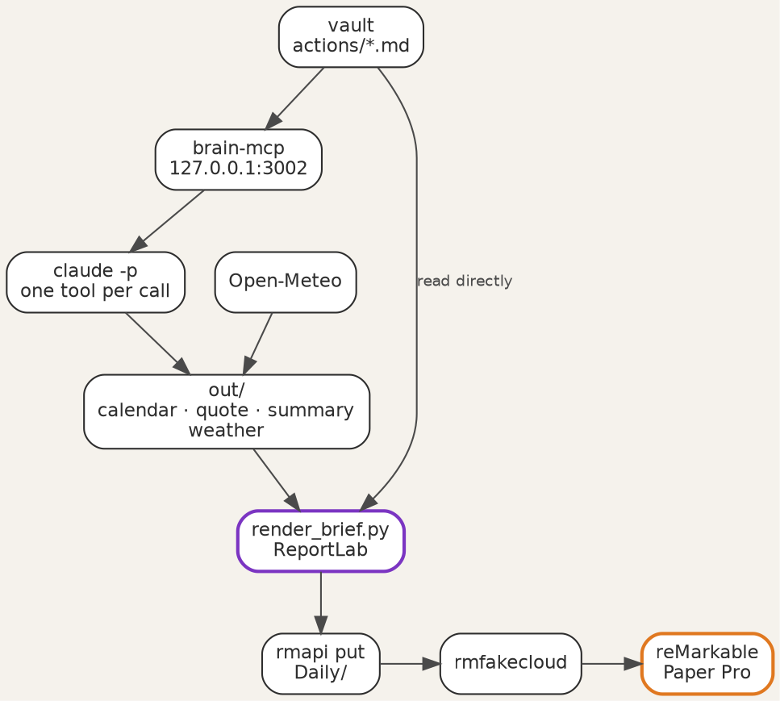
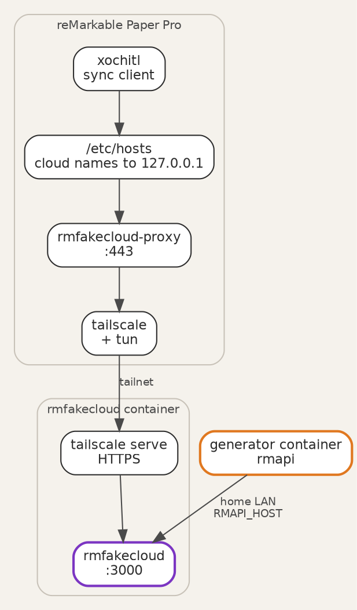

Title: A daily brief on the reMarkable
Date: 2026-09-26
Category: Hardware & Homelab
Tags: reMarkable, MCP, Claude, ReportLab, rmfakecloud, homelab
Slug: a-daily-brief-on-the-remarkable
Author: morganp
Summary: Part 2 of 3. Render the second brain vault as a printed daily brief each morning at 05:00 and deliver it to a reMarkable Paper Pro through a self-hosted rmfakecloud, with no reMarkable cloud involved.
Status: published

At five in the morning a small container renders one PDF and sends it to the
tablet. When the tablet wakes, the brief is already in its `Daily` folder. It
holds today's meetings, the tasks that need doing, the next four weeks, and ten
pages of squared paper for notes.

[]({static}/images/Homelab/SecondBrain/p2-01-hero-HQ.png)

This post builds that pipeline on top of the vault and MCP (Model Context
Protocol) server from
[part 1]({filename}/posts/2026-09-25_Giving_AI_Agents_Memory/2026-09-25_Giving_AI_Agents_Memory.md).
It targets a reMarkable Paper Pro and a Linux container on a home server. The
generator is at
[github.com/morganp/rmbriefing](https://github.com/morganp/rmbriefing).

## What the brief contains

The brief is a PDF drawn at the Paper Pro page size of 509 by 679 points. Every
page after the first is optional, and the generator leaves out any page with
nothing to show:

| Page | Contents |
|---|---|
| 1 | Date, weather, a four-week mini calendar, today's meetings and events, the task checklist, and the next 27 days |
| 2 | The one task that matters most, the quote, tasks that did not fit, the `waiting`, `soon` and `sometime` tasks, finance figures, and long-term goals |
| 3 | The full Daily Stoic reflection behind the quote |
| 4 | A legend for the areas and priority labels |
| 5 | Edits applied from yesterday's handwriting (part 3) |
| 6 to 15 | Squared note paper at 5 mm |

The task checklist groups actions under WORK, HOME and PERSONAL, using the first
tag of each action. Each row carries a checkbox, the action title and a priority
label. Page 1 holds `overdue`, `today` and `next`; the rest follow on page 2.

[]({static}/images/Homelab/SecondBrain/p2-02-brief-page1-HQ.png)

## Gathering the day

A single shell script, `generate_daily_brief.sh`, collects the inputs into an
`out/` folder and then renders. Most inputs come through the MCP server. The
script calls Claude Code in print mode, restricted to one tool, and writes the
raw tool result to a file:

```bash
claude -p "Call list_events with from=$RANGE_START and to=$RANGE_END. Output ONLY the raw tool result text verbatim, nothing else - no commentary, no markdown formatting." \
  --mcp-config '{"mcpServers":{"secondbrain":{"type":"http","url":"http://127.0.0.1:3002/mcp"}}}' \
  --allowedTools "mcp__secondbrain__list_events" \
  > "$OUT_DIR/calendar_events.txt" || true
```

The MCP server runs in the same container, so the script reaches it on the
local port without the public sign-in. The inputs are:

| Source | Tool or service | Used for |
|---|---|---|
| Calendar | `list_events`, Monday to Monday plus 34 days | Meetings, all-day events, holiday shading |
| Quote | `get_daily_stoic` | Footer box and reflection page |
| Area notes | `read_text` | Finance figures, holiday balance |
| Summary | the `daily-summary` skill | Today notes, the next 27 days, goals |
| Weather | Open-Meteo, no key needed | Header line and rain alert |
| Actions | `actions/*.md`, read from disk | The task checklist |



The checklist reads the action files directly instead of asking the model. The
files give the exact `stage` and `due` of every action, so each action gets
exactly one checkbox on each brief. The renderer derives the priority with the
rules from part 1, using the brief's own date, so a re-render of an old brief
reproduces that day's list.

## Drawing the PDF

`render_brief.py` draws every element with ReportLab canvas calls rather than a
layout engine. Direct drawing gives exact control over positions, which part 3
depends on. The fonts are the PDF base fonts, Helvetica and Times, plus the
monochrome Noto Emoji font for weather and section icons, which renders cleanly
on e-ink.

The palette is black, white and grey with one orange-red accent, `#d9401e`.
Only overdue and due-today items use the accent, so it always means "act now".
The mini calendar adds two fills: a yellow lower half for school holidays and a
blue upper half for work holidays, so one day can show both.

The checkbox is a 7 by 7 point stroked rectangle, and nothing else in the
brief draws one:

```python
def draw_checkbox(c, x, y):
    c.setStrokeColor(INK)
    c.setLineWidth(0.9)
    c.rect(x, y, 7, 7, stroke=1, fill=0)
```

Part 3 finds the checkboxes by searching the PDF for rectangles of exactly this
size, so the legend page shows its priority labels without checkboxes. The
first 2 mm of each page stays clear of the reMarkable tool menu. The note pages
leave a 54 point band at the top for the same reason.

## A private cloud for the tablet

The tablet syncs with rmfakecloud, a self-hosted replacement for the reMarkable
cloud, instead of the official service. The tablet keeps its normal sync
behaviour, and the documents stay on your own server.

| Component | Version | Runs on |
|---|---|---|
| reMarkable Paper Pro firmware | 3.27.3.0 | Tablet |
| Vellum `tun` kernel module | 1.0.2-r0 | Tablet |
| Tailscale, with `tailscale-tun` | 1.102.2-r0 | Tablet |
| rmfakecloud-proxy | 0.0.10-r2 | Tablet |
| rmfakecloud | `ddvk/rmfakecloud:latest` | Server container |
| rmapi | 0.0.35 | Generator container |

Vellum packages are built against a firmware range, so match `tun` to your
firmware: 1.0.2 covers 3.27, and 1.0.3 needs 3.28. Turn off automatic updates
on the tablet before it joins Wi-Fi, so the firmware stays inside that range.

Set up the server first:

1. Create an unprivileged Debian container with nesting enabled, and install Docker.
2. Run `ddvk/rmfakecloud` with a `JWT_SECRET_KEY` from `openssl rand -hex 32`, listening on port 3000. Leave `STORAGE_URL` unset, so the server answers on whichever address a client uses.
3. Pass `/dev/net/tun` into the container, install Tailscale, and run `tailscale serve --bg http://localhost:3000`. This gives the server an HTTPS name, `rmcloud.<tailnet>.ts.net`, with a real certificate.

Then set up the tablet:

1. Back up the tablet. Enabling developer mode factory-resets it.
2. Enable developer mode, then log in over SSH with a key.
3. Install Vellum, then run `vellum add tun=1.0.2-r0` and `vellum add tailscale tailscale-tun`.
4. Run `tailscale up` and join the same tailnet as the server.
5. Install the proxy with `install.sh install https://rmcloud.<tailnet>.ts.net`.
6. Add `<server tailnet IP> rmcloud.<tailnet>.ts.net` to `/etc/hosts`, because the proxy installer resets the tablet's DNS settings.
7. Pair the tablet from its own settings screen, using a code from the rmfakecloud web page.

The proxy redirects the reMarkable cloud names to itself and forwards them to
rmfakecloud over the tailnet. The generator container stays off the tailnet and
talks to rmfakecloud on the home network.



## Delivery and the 05:00 run

rmapi uploads the finished PDF. Register it once against rmfakecloud with a
one-time code from the server's Connect page, then always set `RMAPI_HOST`. The
rmapi configuration is not tied to a host, so a run without the variable talks
to the official cloud and replaces the saved token.

The script names each brief with the date and weekday, `20260925 Fri brief.pdf`,
and exits early if that file already exists. The upload has a fallback for a
document that is already on the tablet:

```bash
rmapi put "$PDF" Daily || rmapi put --content-only "$PDF" Daily
```

Cron runs the script as root in the generator container:

```cron
0 5 * * * /opt/rmbriefing/generate_daily_brief.sh >> /var/log/rmbrief-daily.log 2>&1
```

Cron starts with a minimal environment, so the script sets its own:
`HOME`, a `PATH` that includes `/usr/local/bin`, the rmapi configuration folder,
and the Claude Code token from `claude setup-token`, stored in `claude.env`
with mode 600.

## Build your own

1. Run the part 1 vault and MCP server, and check `list_actions` from Claude Code.
2. Clone `rmbriefing` into the same container, and run `pip install -r requirements.txt`.
3. Install the [`daily-summary` skill](https://github.com/morganp/skillbook/tree/main/daily-summary) in `~/.claude/skills/` for the user that runs cron.
4. Copy `.env.example` to `.env` and set the vault path, the MCP address, `RMAPI_HOST` and your latitude and longitude.
5. Run `examples/render-sample.sh`, which renders the sample vault, and open the PDF on your computer.
6. Set up rmfakecloud and the tablet, and push one PDF by hand with `rmapi put`.
7. Run `generate_daily_brief.sh` once by hand, then add the cron line.

Start with steps 1 to 5. The PDF is useful on any tablet or printer, and the
reMarkable delivery can follow later. Part 3 adds the return path, reading ticks
and handwritten notes on the brief back into the vault.
