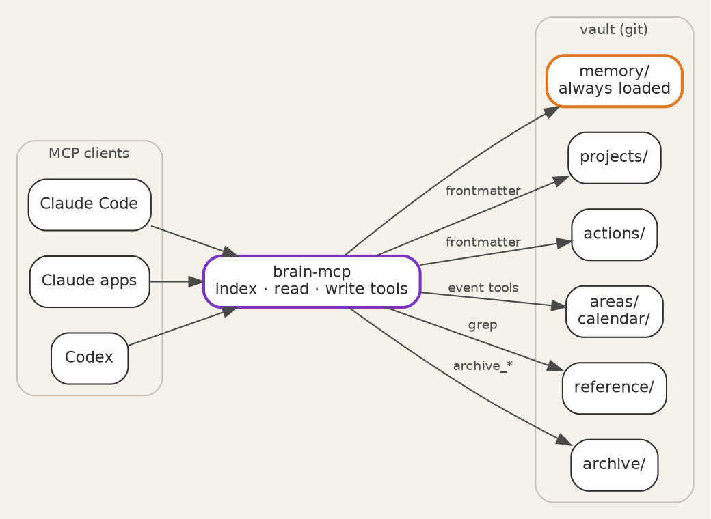

Title: Giving AI agents memory
Date: 2026-09-25
Category: Hardware & Homelab
Tags: MCP, Claude, SecondBrain, GTD, homelab
Slug: giving-ai-agents-memory
Author: morganp
Summary: Part 1 of 3. A markdown vault and a small MCP server that give any AI agent persistent memory, an action list with derived priority, and a calendar of one-off and annual events.
Status: published

Every new chat with an AI agent starts empty. You explain the project again,
list the open tasks again, and remind it that the school holidays start on
Friday. The agent is capable, but it has nowhere to keep anything between
conversations.

[]({static}/images/Homelab/SecondBrain/p1-01-hero-HQ.png)

This post builds that place: a markdown vault under git, served to the agent by
a small MCP (Model Context Protocol) server. Claude Code, the Claude apps and
Codex all connect to the same vault. Memory, tasks and dates carry over from one
conversation to the next, and from one client to another. It is part
1 of 3: part 2 turns the vault into a daily brief on a reMarkable tablet, and
part 3 reads handwriting on that brief back into the vault. Each part links its
own repository. The MCP server built here is at
[github.com/morganp/secondbrain-mcp](https://github.com/morganp/secondbrain-mcp).

## What an agent should remember

The vault holds five kinds of knowledge, and each has its own folder:

| Folder | Holds | Loaded |
|---|---|---|
| `memory/` | A short brief about you: names, paths, preferences | Every session |
| `projects/` | Active work, each with a `next_action` | Summary line on request |
| `actions/` | Single tasks and ideas | Summary line on request |
| `areas/` | Ongoing duties and long-term goals, plus the calendar | Summary line on request |
| `reference/` | Lookup knowledge: specs, notes, how-tos | Matching lines only |



The layout follows [PARA](https://fortelabs.com/blog/para/) (Projects, Areas,
Resources, Archive), with one addition.
`memory/` sits outside PARA because it describes the owner rather than any piece
of work. One question sorts a new note: facts about you that every session needs
go to memory, ongoing duties go to areas, and lookup knowledge goes to reference.
Importance plays no part in the choice.

The rule that keeps the context small is progressive disclosure. A session
starts by reading `memory/INDEX.md` and a one-line summary of each project.
The agent opens a full file only when the conversation needs it, and it searches
reference material with `grep` rather than reading it whole.

## One markdown file per item

Each project, action and area is one markdown file. The frontmatter at the top
of the file is the index, so there is no separate index file to keep in step.
An action looks like this:

```markdown
---
id: service-the-lawnmower
stage: next
tags: [home, garden]
due: 2026-10-04
created: 2026-09-25
---

# Service the lawnmower

Blade sharpening and an oil change before it goes away for winter.
```

The vault is a git repository. Every write through the server commits and pushes
the changed file. The history records each change the agent makes, and a second
machine holds a copy. A systemd timer also commits anything left behind
every 10 minutes.

## An action list the agent manages

Actions follow the GTD (Getting Things Done) stages. `next` is committed work,
`soon` is committed but not urgent, `waiting` is blocked on someone else, and
`sometime` holds ideas with no commitment. The first tag is always the area of
life: `work`, `home` or `personal`. Later tags are free topics.

The file never stores a priority. The daily brief derives one from `stage` and
`due` each time it reads the action, so the priority cannot go stale as the
dates pass. The rules apply in order, and the first match wins:

| Rule | Condition | Shown as |
|---|---|---|
| 1 | Stage is `waiting` | `waiting` |
| 2 | Due date has passed | `overdue` |
| 3 | Due today | `today` |
| 4 | Stage is `next` | `next` |
| 5 | Due within 7 days | `next` |
| 6 | Stage is `sometime` | `sometime` |
| 7 | Anything else | `soon` |

Rule 4 makes the stage a commitment: a `next` action stays at `next` whatever
its date, and an undated one has no date to limit it. Rule 5 works the other
way, pulling a `soon` or `sometime` action forward as its due date approaches.
A blocked task stays `waiting` even when overdue, because nothing on your side
can move it.

Page 1 of the brief shows `overdue`, `today` and `next`: the work you can act
on today. `waiting`, `soon` and `sometime` follow on page 2.

Two flows complete the list. Capture writes a new file from
`actions/_template.md`. Completion calls `archive_action`, which stamps the
file with an `archived:` date and moves it under `archive/actions/`. The list
and search tools skip `archive/` by default, so finished work never fills a
search result.

## Events and annual dates

The calendar lives in `areas/calendar/` as three markdown tables:

- `events.md` holds one-off events, keyed by `YYYY-MM-DD`, with an optional end date for ranges.
- `recurring_events.md` holds annual events, keyed by `MM-DD`: birthdays, anniversaries and fixed holidays.
- `archived_events.md` holds past one-off events.

The date format decides the file. `add_event` with `2026-10-17` inserts a
one-off row, and `add_event` with `10-17` inserts an annual row. The server
inserts each row in date order, so the agent never reads the table first.

`list_events` returns a window, today plus 7 days by default. It expands each
annual row into the window, including across a year end. A quarterly reminder
becomes four annual rows. Holidays that move each year, such as Easter, go in
as one-off rows.

The server can also merge Google Calendar into the same list. The adapter is
read-only, uses the `calendar.readonly` scope, and takes all-day events from
shared calendars and timed meetings from your own. When the two sources hold
the same event, the vault row wins. If Google fails, `list_events` returns the
vault events with a warning line rather than an error. Publish the Google Cloud
consent screen to Production: in Testing mode Google expires refresh tokens
after 7 days.

## The tool set

The server exposes the vault as 19 tools in three tiers of cost:

| Tier | Tools | Returns |
|---|---|---|
| Index | `list_projects`, `list_actions`, `list_areas`, `list_events`, `list` | One line per item, from frontmatter |
| Read | `read_text`, `grep`, `get_skill`, `get_daily_stoic` | One file, or matching lines |
| Write | `write_text`, `append`, `edit`, `delete`, `add_event`, `add_term`, `archive_project`, `archive_action`, `archive_area`, `archive_events` | A status line, after commit and push |

Each tool schema costs context in every session, so the set stays small and each
tool does one job. `list_actions` shows the shape of an index tool. It reads
only frontmatter, filters, and sorts undated actions last:

```javascript
const fm = parseFrontmatter(await fs.readFile(file, "utf8"));
if (!fm.id) continue;
if (stage && fm.stage !== stage) continue;
if (domain && !tags.includes(domain)) continue;
if (due_before && (!fm.due || fm.due > due_before)) continue;
rows.push({
  due: fm.due || "~", // "~" sorts after any ISO date, so undated lands last
  line: `${fm.id} | ${fm.stage || "?"} | due ${fm.due || "-"} | tags ${fm.tags || "-"} | ${rel}`,
});
```

Every path passes through `resolveInRoot()`, which refuses anything outside the
vault root.

## Teaching the agent the rules

The tools give the agent access. A `CLAUDE.md` at the vault root tells it how
to behave:

- Start each session with `list_projects` and `memory/INDEX.md`, and nothing else.
- Open one file at a time with `read_text`, and search reference material with `grep`.
- Capture a new task as an action file from the template, with the area tag first.
- Archive finished items with the archive tools, never by moving files.
- Never read or edit the calendar files directly: the event tools do the date arithmetic.

The same rules sit in `README.md` for clients that do not read `CLAUDE.md`.
Longer procedures live in a separate skills repository, and `get_skill` fetches
one on demand. A `close` skill ends a session by writing its decisions, new
tasks and project progress back into the right notes.

## Deploying it

The server is a single Node.js file that speaks MCP over standard input and
output. The deployment runs it in a Proxmox container:

1. Clone the vault and the server, and copy `mcp/.env.example` to `mcp/.env`.
2. Set `BRAIN_ROOT` to the vault path, and add the Google values if you want the calendar merge.
3. Install the systemd unit from `deploy/vault-mcp.service`, which runs the server behind supergateway on port 3002.
4. Put nginx in front to check the bearer token, with the OAuth server handling sign-in.
5. Expose nginx through a Cloudflare tunnel.
6. Connect each client to the public `/mcp` URL.

Run supergateway in stateless mode, and start the server through `exec` so
supergateway can stop each child process after its request:

```ini
ExecStart=/usr/bin/supergateway --stdio 'exec node /opt/brain/mcp/server.js' --port 3002 --outputTransport streamableHttp
```

Connect Claude Code with one command:

```bash
claude mcp add --transport http secondbrain https://brain.example.com/mcp
```

Two earlier posts cover the details.
[Building a personal MCP server]({filename}/posts/2026-06-03_building-a-personal-mcp-server.md)
walks through the tunnel, the systemd unit and the git credentials, and
[MCP server OAuth authentication]({filename}/posts/2026-06-03_mcp-server-oauth-authentication.md)
covers the sign-in flow.
[Part 2]({filename}/posts/2026-09-25_A_Daily_Brief_on_the_reMarkable/2026-09-25_A_Daily_Brief_on_the_reMarkable.md) uses this vault as the data source for a daily brief on the reMarkable.
