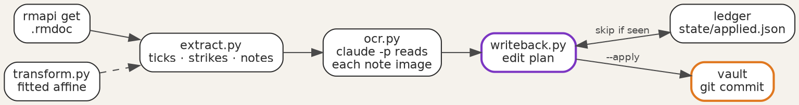

Title: Handwriting back into the second brain
Date: 2026-09-27
Category: Hardware & Homelab
Tags: reMarkable, OCR, Claude, rmscene, PyMuPDF, homelab
Slug: handwriting-back-into-the-second-brain
Author: morganp
Summary: Part 3 of 3. Read ticks, arrows and handwritten notes off the reMarkable daily brief and apply them to the second brain vault as archived tasks, new due dates and appended notes.
Status: published

Tick a checkbox on the morning brief, and by the next morning the task has moved
to the archive. Draw an arrow after a task and write `soon`, and it drops off
page 1. Write a sentence beside a task, and the sentence appears in the task's
file under a dated heading.

[]({static}/images/Homelab/SecondBrain/p3-01-hero-HQ.png)

This post builds that return path, from pen strokes on the reMarkable to edits
in the vault from
[part 1]({filename}/posts/2026-09-25_Giving_AI_Agents_Memory/2026-09-25_Giving_AI_Agents_Memory.md).
It reads the briefs that
[part 2]({filename}/posts/2026-09-25_A_Daily_Brief_on_the_reMarkable/2026-09-25_A_Daily_Brief_on_the_reMarkable.md)
delivers, and it runs at the start of the same 05:00 job. The code is at
[github.com/morganp/rmocr](https://github.com/morganp/rmocr).

## What comes back from the tablet

`rmapi get` downloads a document from rmfakecloud as an `.rmdoc` file, which is
a zip archive:

```text
<doc-id>.pdf              the original brief, byte for byte
<doc-id>.content          page order and document settings
<doc-id>/<page-id>.rm     the ink for one page, version 6 format
```

A PDF-backed document stores the pen strokes in a separate layer from the PDF.
Each `.rm` file holds only the ink, and only pages with ink have one, so there
is no need to compare the page against the original render. The rmscene library
parses the version 6 format into strokes, and each stroke is a list of points:

```python
def rm_strokes(path):
    out = []
    with open(path, "rb") as f:
        for b in read_blocks(f):
            if isinstance(b, SceneLineItemBlock):
                line = getattr(getattr(b, "item", None), "value", None)
                if line is not None and getattr(line, "points", None):
                    out.append([(p.x, p.y) for p in line.points])
    return out
```

PyMuPDF reads the PDF side: the page size, the text lines with their positions,
and the drawing commands.

## A vocabulary of ink

Four marks carry meaning on a task row. Everything else is a note:

| Ink | Effect on the action |
|---|---|
| Tick in the checkbox | Archive it, after appending any attached note |
| Arrow, then a word | Set `stage`, the area tag, or `due` |
| Words beside the row, no arrow | Append them under `## Note from brief <date>` |
| Line through the title | Report on the next brief, change nothing |

The arrow turns a word into an instruction. `work` written beside a row without
an arrow is a note; `→ work` moves the action to the work area. The instruction
words form a fixed list:

| Kind | Words | Field |
|---|---|---|
| Priority | `next`, `soon`, `sometime`, `waiting` | `stage` |
| Area | `work`, `home`, `personal` | first tag |
| Date | `2026-10-05`, `today`, `tomorrow`, `Friday`, `next Friday`, `5 Oct`, `October 5` | `due` |

A bare weekday means its next occurrence, never today, and `next Friday` means
the Friday after that. A few aliases map to the list, such as `someday` to
`sometime` and `blocked` to `waiting`. Any other word is reported and never
applied, so a misread instruction cannot demote a task.

## Calibrating pen to page

The strokes and the PDF use different coordinate systems. A calibration sheet
maps one to the other. The sheet is a blank page at the brief's size, 509 by
679 points, with five crosshairs at known positions. `calibration_sheet.py`
draws it:

```python
from reportlab.pdfgen import canvas

W, H = 509, 679
TARGETS = [("CIRCLE", 100, 100), ("TRIANGLE", 409, 100),
           ("SQUARE", 100, 579), ("HEXAGON", 409, 579),
           ("CROSS", 254.5, 339.5)]

c = canvas.Canvas("calibration.pdf", pagesize=(W, H))
for name, x, y in TARGETS:
    y = H - y                     # targets are top-left origin
    c.line(x - 10, y, x + 10, y)
    c.line(x, y - 10, x, y + 10)
    c.drawString(x + 14, y + 4, name)
c.save()
```

To calibrate a tablet:

1. Run `calibration_sheet.py --out calibration.pdf`, and push the sheet to the tablet with `rmapi put calibration.pdf`.
2. Draw the named shape centred on each crosshair, with the pen you use for the brief.
3. Fetch the document with `rmapi get`, and unzip it.
4. Run `fit.py <folder> --json-out transform.json`, and set `RM_TRANSFORM` to that file.

`fit.py` groups the strokes into five shapes and takes the centre of each. It
then solves a least-squares fit for a full affine transform, one equation per
axis:

```text
x_pdf = 0.31456127 x + 0.00032105 y + 253.1235
y_pdf = 0.00028972 x + 0.31615912 y +   1.3471
```

A full affine fit allows for a different scale on each axis, a small rotation
and an offset. On a Paper Pro the two scales differ by about 0.5%, and the
corner residuals come out below 0.5 points. Put the six coefficients in
`transform.py`, or leave them in the JSON file named by `RM_TRANSFORM`. Every later step
passes each stroke point through `to_pdf()`.

`overlay.py` draws the transformed strokes in blue over the page, with the
checkboxes outlined in red. Run it on the calibration sheet and on the first
real brief: each tick should sit inside its box.

[]({static}/images/Homelab/SecondBrain/p3-02-overlay-HQ.png)

## Assigning ink to rows

The brief draws each checkbox as a 7 by 7 point stroked rectangle, as described
in part 2. rmocr finds them in the page's drawing commands, not in the image:

```python
def checkbox_rects(page):
    """7x7 stroked squares from the content stream, in top-left origin space."""
    rx = re.compile(rb"(-?[\d.]+)\s+(-?[\d.]+)\s+(-?[\d.]+)\s+(-?[\d.]+)\s+re")
    H = page.rect.height
    out = []
    for m in rx.finditer(page.read_contents()):
        x, y, w, h = (float(g) for g in m.groups())
        if abs(w - BOX_SIZE) < BOX_TOL and abs(h - BOX_SIZE) < BOX_TOL:
            out.append([x, H - y - h, x + w, H - y])   # -> top-left origin
    return sorted(out, key=lambda r: (r[1], r[0]))
```

Each checkbox defines a row band, from the top of its box to the top of the
next box. The strokes then pass through three tests, in order:

- **Tick**: at least 4 points of ink length inside the box, padded by 2.5 points. The test measures ink length rather than a single hit, so a stroke that only crosses the box does not count.
- **Strike**: a stroke at least 25 points wide and at least four times wider than it is tall, lying across a line of printed text.
- **Note**: everything else. Strokes group into clusters within one row band when they are less than 26 points apart.

A note cluster attaches to a row when at least a quarter of its height overlaps
the row band, and when it spans no more than two rows. Vertical overlap
decides, not distance, so a note in the far margin still reaches its task. A
note that spans more rows is a free note, and it is reported rather than
written anywhere.

The row title is the printed text beside the box, including the second line of
a wrapped title. It must match the `#` heading of exactly one action file. A
title with no match, or with two, is reported and skipped, because a wrong
match would archive the wrong task.

## Reading the words

Each note cluster becomes a small image of black strokes on white. The crop
follows the cluster with a 12 point margin. The strokes render at 4 pixels per
point with the pen width of the Fineliner, and the printed page stays out of the
image.

The Claude Code CLI transcribes the image. The prompt gives the image path and
the printed row as context, and the only tool allowed is `Read`:

```python
cmd = [CLAUDE_BIN, "-p", prompt, "--allowedTools", "Read"]
p = subprocess.run(cmd, capture_output=True, text=True, timeout=timeout,
                   env=env, cwd=os.path.dirname(img_path))
```

For a note beside a task row, the prompt asks for one JSON object:

```json
{"gesture": "arrow", "text": "soon"}
```

The model decides whether an arrow is present, because a small, fast arrowhead
is easier to name than to measure. The prompt tells it to answer `none` unless
it can see an arrowhead. The `text` then goes through the instruction parser
when `gesture` is `arrow`, and becomes a note otherwise.

## Applying edits

`writeback.py` turns the results into an edit plan and prints it. By default it
changes nothing. For the page above, the plan reads:

```text
PLANNED EDITS (3)
  p1  archive renew-car-insurance (checkbox ticked)
  p1  set stage = soon on service-the-lawnmower (arrow + priority, raw 'soon')
  p1  archive submit-expenses-q3 (checkbox ticked)
```

With `--apply` it edits the action files, moves archived
actions into `archive/actions/`, and commits the result to the vault. It refuses
to run on a vault with uncommitted changes, so a writeback commit only ever
holds writeback edits.

A ledger in `state/applied.json` records each applied edit. The key is a hash of
the document, page, action, operation and content:

```python
def key(doc_id, edit):
    a = edit["action"]
    raw = "|".join([doc_id, str(edit.get("page", "")), edit["op"],
                    a.get("id", ""), _payload(edit)])
    return hashlib.sha256(raw.encode("utf-8")).hexdigest()[:20]
```

Reading the same ink twice finds the key and skips the edit. A different note
beside the same row on a later brief has a new key and applies. The next brief
then lists the applied edits, and anything that needs attention, on its
"Written back from paper" page.

## Wiring it into the 05:00 run



The writeback runs at the top of `generate_daily_brief.sh`, before the brief
renders, so today's brief already reflects yesterday's ink. It processes the
last four briefs, because the tablet may not have synced overnight; the ledger
makes each repeat free. For each brief, the script:

1. Fetches `Daily/<date> brief` with `rmapi -ni get`, and skips the day if there is none.
2. Unzips it, and skips it if there are no `.rm` files.
3. Runs `writeback.py --apply`, and continues to the next brief if it fails.
4. Pushes the vault once, if any brief produced a commit.

No failure in this stage stops the brief. A missing rmocr install, a vault with
uncommitted changes, or a failed transcription each log a line and move on.

To set it up, clone the repository to `/opt/rmocr` and create its virtual
environment:

```bash
python3 -m venv .venv
./.venv/bin/pip install -r requirements.txt
```

Then calibrate your tablet, and run `writeback.py` without `--apply` on a brief
you have written on. When the plan matches your ink, the 05:00 job applies the
next one.
